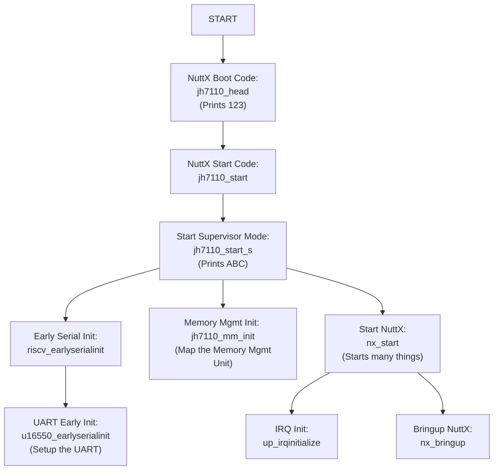

# Apache NuttX RTOS for Pine64 Ox64 64-bit RISC-V SBC (Bouffalo Lab BL808)

Read the articles...

-   ["Ox64 BL808 RISC-V SBC: Starting Apache NuttX RTOS"](https://lupyuen.github.io/articles/ox2)

-   ["Ox64 BL808 RISC-V SBC: Booting Linux and (maybe) Apache NuttX RTOS"](https://lupyuen.github.io/articles/ox64)

_What's this BL808?_ [(Datasheet)](https://github.com/bouffalolab/bl_docs/blob/main/BL808_DS/en/BL808_DS_1.2_en.pdf) [(Reference Manual)](https://github.com/bouffalolab/bl_docs/blob/main/BL808_RM/en/BL808_RM_en_1.3.pdf)

BL808 is a complex creature with 3 (Asymmetric) RISC-V Cores (linked via IPC)...

1.  D0 Core: [T-Head C906 64-bit RV64IMAFCV](https://www.t-head.cn/product/c906?lang=en) (480 MHz)

    (Multimedia Core with MIPI CSI / DSI, Neural Proc Unit)

    (Memory Mgmt Unit is Sv39, 128/256/512 TLB table entry. Same as Star64?)

1.  M0 Core: [T-Head E907 32-bit RV32IMAFCP](https://www.t-head.cn/product/e907?lang=en) (320 MHz)

    (Wireless + Peripherals Core with WiFi, BLE, BT, Zigbee, Audio)

1.  LP Core: [T-Head E902 32-bit RV32E[M]C](https://www.t-head.cn/product/e902?lang=en) (150 MHz)

    (Low Power Core)

    [(Upcoming BL606 looks similar, minus the Low Power Core)](https://en.bouffalolab.com/product/?type=detail&id=16)


[Pine64 Ox64](https://wiki.pine64.org/wiki/Ox64) is the dev board for BL808C.

(BL808C supports MIPI CSI Cameras but not MIPI DSI Displays. Maybe someday we'll see BL808D for MIPI DSI Displays)

_Is Ox64 BL808 an SBC? Or an MCU Board?_

Technically Ox64 BL808 boots 64-bit RISC-V Linux (via MicroSD), so it feels like an SBC...

- ["Booting Linux on the Pine64 Ox64 SBC"](https://adventurist.me/posts/00317)

- [OpenBouffalo Wiki](https://openbouffalo.org/index.php/Main_Page)

- [Linux Image + OpenSBI + U-Boot Bootloader for BL808](https://github.com/openbouffalo/buildroot_bouffalo)

  [(Newer version?)](https://github.com/bouffalolab/buildroot_bouffalo)

  [(OpenSBI is the BIOS for RISC-V SBCs)](https://lupyuen.github.io/articles/sbi)

- USB-C Port for Camera Module (Dual-Lane MIPI CSI)

  (USB-C is not for Flashing!)

- USB 2.0 support for USB OTG

  (On-The-Go = USB Host + USB Device)

But Ox64 BL808 also feels like an MCU Board...

- Form Factor is similar to MCU Board

- Limited Memory: 64 MB of RAM, [128 Megabits](https://pine64.com/product/128mb-ox64-sbc-available-on-december-2-2022/) (16 MB) of Flash Memory

- M0 Wireless Core is 32-bit RISC-V MCU

- UART Pins need a USB Serial Adapter for Flashing and Console I/O

- Powered by Micro USB Port

  (Micro USB is not for Flashing either!)

- Super Affordable: [$8 for a 64-bit RISC-V Board!](https://pine64.com/product/128mb-ox64-sbc-available-on-december-2-2022/)

_Ox64 BL808 sounds a little tiny for 64-bit Linux?_

Yeah 64-bit Linux runs with Limited RAM on the D0 Multimedia Core. But most Peripherals are hosted on the M0 Wireless Core: WiFi, BLE, BT, Zigbee, Audio, ...

So we flash M0 with a simple 32-bit RISC-V Firmware, to forward the Peripheral Interrupts from M0 to D0 Linux.

Here are the binaries loaded into D0 Multimedia Core and M0 Wireless Core, from [buildroot_bouffalo](https://github.com/openbouffalo/buildroot_bouffalo)...

* __d0_lowload_bl808_d0.bin__: This is a very basic bootloader that loads opensbi, the kernel and dts files into ram

* __m0_lowload_bl808_m0.bin__: This firmware runs on M0 and forwards interupts to the D0 for several peripherals

* __bl808-firmware.bin__: An image containing OpenSBI, Uboot and uboot dtb files. 

* __sdcard-*.tar.xz__: A tarball containing the rootfs for the image to be flashed to the SD card

Perhaps Ox64 BL808 might run more efficiently with a tiny 64-bit RTOS.

_Why Apache NuttX RTOS?_

It might be interesting to run Apache NuttX RTOS on both the D0 Multimedia Core and the M0 Wireless Core. Then D0 and M0 can talk over OpenAMP (Asymmetric Multi-Processing).

Let's explore...

# Flashing UART vs Serial Console

Read the article...

-   ["Ox64 BL808 RISC-V SBC: Booting Linux and (maybe) Apache NuttX RTOS"](https://lupyuen.github.io/articles/ox64)


_We need to handle TWO UART Ports on Ox64?_

Yeah don't confuse the 2 UART Ports on Ox64! Let's give the UART Ports distinctive names [(like Migi & Dali)](https://en.wikipedia.org/wiki/Migi_%26_Dali)...

1.  __Ox64 Flashing UART__: Used for Flashing Ox64

    + Flashing UART TX is __GPIO 14__ (Physical Pin 1)
    + Flashing UART RX is __GPIO 15__ (Physical Pin 2)
    + Remember to connect GND
    + Baud Rate for Normal Mode: 2,000,000 (2 Mbps)
    + Baud Rate for Flashing Mode: 230,400 (230.4 kbps)
    + BL808 UART0 is controlled by the M0 Wireless Core (OpenBouffalo Firmware)

1.  __Ox64 Serial Console__: Used for Linux Serial Console (plus OpenSBI and U-Boot Bootloader)

    + Serial Console TX is __GPIO 16__ (Physical Pin 32)
    + Serial Console RX is __GPIO 17__ (Physical Pin 31)
    + Remember to connect GND
    + Baud Rate: 2,000,000 (2 Mbps)
    + BL808 UART3 is controlled by the D0 Multimedia Core (Linux + OpenSBI + U-Boot)
    + Output is totally blank if OpenBouffalo Firmware [wasn't flashed correctly](https://github.com/openbouffalo/buildroot_bouffalo/issues/60), or if OpenSBI / U-Boot / Linux couldn't boot

NEITHER UART Port is accessible over USB-C or Micro USB. So yeah it's totally counterintuitive.

(Maybe someone can create a Stackable HAT or Breadboard, that will expose the 2 UART Ports as USB Dongles? Or a UART Switcher?)

[(__For Pre-Production Ox64:__ Physical Pins are different, but GPIOs above are correct)](https://lupyuen.github.io/images/ox64-sd.jpg)

_Why 2 Baud Rates for Flashing UART?_

When we power up Ox64 in __Normal Mode__: (Boot Button NOT pressed)

- Flashing UART Port will show us the OpenBouffalo Firmware running on M0 Wireless Core

- This M0 Firmware will forward Peripheral Interrupts to D0 Multimedia Core

- M0 Firmware is hardcoded for 2 Mbps

- Not really fun to watch. But we use this for testing our 2 Mbps USB Serial Adapter.

When we power up Ox64 in __Flashing Mode__: (Boot Button pressed)

- Ox64 is ready for Firmware Flashing by the BL DevCube GUI Tool

- Firmware Flashing supports various Baud Rates: 230.4 kbps, 2 Mbps, ...

- But 2 Mbps will fail on macOS. That's why we Flash Firmware at 230.4 kbps.

  [(Same problem when flashing BL602)](https://lupyuen.github.io/articles/flash#flash-the-firmware)

_Serial Console is always 2 Mbps?_

Yeah 2 Mbps is hardcoded in Ox64 Linux. Switching to other Baud Rates will show garbled text.

Thus our USB Serial Adapter must connect reliably to Ox64 at 2 Mbps.

Now we flash Ox64 and boot Linux...

# Flash OpenSBI and U-Boot Bootloader to Ox64 BL808

Read the article...

-   ["Ox64 BL808 RISC-V SBC: Booting Linux and (maybe) Apache NuttX RTOS"](https://lupyuen.github.io/articles/ox64)

Before booting Linux on Ox64, we flash OpenSBI + U-Boot Bootloader to D0 Multimedia Core, and the Peripheral Interrupt Firmware to M0 Wireless Core. From [buildroot_bouffalo](https://github.com/openbouffalo/buildroot_bouffalo):

* __d0_lowload_bl808_d0.bin__: This is a very basic bootloader that loads opensbi, the kernel and dts files into ram

* __m0_lowload_bl808_m0.bin__: This firmware runs on M0 and forwards interupts to the D0 for several peripherals

* __bl808-firmware.bin__: An image containing OpenSBI, Uboot and uboot dtb files. 

Here are the steps, based on the [Official Flashing Instructions](https://github.com/openbouffalo/buildroot_bouffalo#flashing-instructions)...

1.  We tested with [Pine64 Woodpecker CH340G USB Serial Adapter](https://pine64.com/product/serial-console-woodpecker-edition/) on macOS x64.

    Warning: Some USB Serial Adapters [WON'T WORK!](https://wiki.pine64.org/wiki/Ox64#Compatible_UARTs_when_in_bootloader_mode)

    Probably because we are connecting at 2 Mbps, which might be too fast for some USB Serial Adapters.

    [(Like this CP2102, which shows garbled text at 2 Mbps)](https://www.lazada.sg/products/i2037772272-s11135131253.html)

    

1.  To Test our USB Serial Adapter: Connect the USB Serial Adapter to __Ox64 Flashing UART__ (pic above)...
    + Flashing UART TX is __GPIO 14__ (Physical Pin 1)
    + Flashing UART RX is __GPIO 15__ (Physical Pin 2)
    + Remember to connect GND
    + Baud 2,000,000 (2 Mbps)

    Start the USB Serial Terminal (Flashing UART).

    Power up Ox64 via the Micro USB Port. Ox64 Green LED should light up.

    This Clickety Micro USB Cable is very handy for rebooting Ox64...

    

1.  In the USB Serial Terminal (Flashing UART), we should see the Ox64 Factory Test Firmware...

    ```text
    Build:19:50:39,Nov 20 2022
    Copyright (c) 2022 Bouffalolab team
    dynamic memory init success,heap size = 93 Kbyte 
    sig1:ffff32ff
    sig2:0000ffff
    Pong!
    Ping!
    ```

    [(Source)](https://adventurist.me/posts/00317)

    If the text appears garbled: Try a different USB Serial Adapter. (See above)

    My prototype version shows this instead...

    ```text
    Init CLI with event Driven
    start aos loop... 
    CLI RAW Data, c906
    /romfs/c906.bin not found!
    ```

    [(Source)](https://gist.github.com/lupyuen/43676407bbced733e65566879e18732b)

1.  Pre-Flash Check: Set BL808 board to programming mode
    + Remove the microSD Card
    + Press and Hold BOOT Button
    + Unplug and replug the Micro USB Port
    + Release BOOT button
    + Ox64 Green LED should turn on

    In the USB Serial Terminal (Flashing UART), we should see this...

    ```text
    .
    ```

    Yep Ox64 is ready for flashing!

1.  Now we prepare to flash:

    Disconnect the USB Serial Terminal (to release the Flashing UART)

    Set BL808 board to programming mode
    + Remove the microSD Card
    + Press and Hold BOOT Button
    + Unplug and replug the Micro USB Port
    + Release BOOT button
    + Ox64 Green LED should turn on

1.  We download the Ox64 Binaries...

    - [bl808-linux-pine64_ox64_full_defconfig.tar.gz](https://github.com/openbouffalo/buildroot_bouffalo/releases/download/v1.0.1/bl808-linux-pine64_ox64_full_defconfig.tar.gz) 

    From the latest Ox64 Linux Release...

    - [openbouffalo/buildroot_bouffalo (Release v1.0.1)](https://github.com/openbouffalo/buildroot_bouffalo/releases/tag/v1.0.1)

    Unzip the download and we should see this...

    ```bash
    → ls -l firmware
       7340032  bl808-firmware.bin
         31360  d0_lowload_bl808_d0.bin
         65760  m0_lowload_bl808_m0.bin
      43859444  sdcard-pine64_ox64_full_defconfig.img.xz    
    ```

1.  We'll run BouffaloLab DevCube for Flashing BL808.

    Only Ubuntu x64, macOS and Windows are supported.

    TODO: How to flash BL808 on Arm64 SBCs and Pinebook Pro? Sigh. See [bflb-iot-tool / bflb-mcu-tool](https://wiki.pine64.org/wiki/Ox64#Alternative:_Open-Source_Flashing)

1.  Download Bouffalo Lab DevCube 1.8.3 from...

    [openbouffalo.org/static-assets/bldevcube/BouffaloLabDevCube-v1.8.3.zip](https://openbouffalo.org/static-assets/bldevcube/BouffaloLabDevCube-v1.8.3.zip)

    [(1.8.4 and later won't work)](https://github.com/openbouffalo/buildroot_bouffalo/issues/60)

    May need to Grant Execute Permission...

    ```bash
    cd BouffaloLabDevCube-v1.8.3
    chmod +x BLDevCube-macos-x86_64
    ./BLDevCube-macos-x86_64
    ```

1.  Run DevCube, select "BL808", and switch to "MCU" page

1.  M0 Group: Group0

    Image Addr: 0x58000000
    
    PATH: Select "m0_lowload_bl808_m0.bin"

1.  D0 Group: Group0

    Image Addr: 0x58100000
    
    PATH: Select "d0_lowload_bl808_d0.bin"

1.  Set UART Rate to 230400.

    Don't set to 2000000, it will fail on macOS!

    [(Same problem when flashing BL602)](https://lupyuen.github.io/articles/flash#flash-the-firmware)

1.  Click "Create & Download" and wait until it's done

    [(See the log)](https://gist.github.com/lupyuen/125e15be5ed1e034bed33d16ed496d87)

1.  Switch to "IOT" page

1.  Enable 'Single Download'

    Set Address to 0x800000
    
    Select "bl808-firmware.bin"

1.  Set UART Rate to 230400.

    Don't set to 2000000, it will fail on macOS!

    [(Same problem when flashing BL602)](https://lupyuen.github.io/articles/flash#flash-the-firmware)

1.  Click "Create & Download" again and wait until it's done

    [(See the log)](https://gist.github.com/lupyuen/e8c0aca0ebd0f1eae034b0996a5b3ec3)

1.  Start the USB Serial Terminal (Flashing UART at 2 Mbps).

    Unplug and replug the Micro USB Port.

    (Don't press the Boot Button!)

1.  On the USB Serial Terminal (Flashing UART) we should see...

    ```text
    [I][] Powered by BouffaloLab
    [I][] Build:11:52:22,Mar  6 2023
    [I][] Copyright (c) 2023 OpenBouffalo team
    [I][] Copyright (c) 2022 Bouffalolab team
    [I][] =========== flash cfg ==============
    [I][] jedec id   0xEF6018
    [I][] mid            0xEF
    [I][] iomode         0x04
    [I][] clk delay      0x01
    [I][] clk invert     0x01
    [I][] read reg cmd0  0x05
    [I][] read reg cmd1  0x35
    [I][] write reg cmd0 0x01
    [I][] write reg cmd1 0x31
    [I][] qe write len   0x01
    [I][] cread support  0x00
    [I][] cread code     0xFF
    [I][] burst wrap cmd 0x77
    [I][] sector size:   0x04
    [I][] =====================================
    [I][] dynamic memory init success,heap size = 156 Kbyte 
    [I][MAIN] Starting Mailbox Handlers
    [I][MBOX] Forwarding Interupt SDH (33) to D0 (0x58008bbc)
    [I][MBOX] Forwarding Interupt GPIO (60) to D0 (0x58008d0e)
    [I][MAIN] Running...
    [I][MBOX] Mailbox IRQ Stats:
    [I][MBOX] .Peripheral SDH (33): 0
    [I][MBOX] .Peripheral GPIO (60): 0
    [I][MBOX] Unhandled Interupts: 0 Unhandled Signals 0
    ```

    [(Source)](https://gist.github.com/lupyuen/52ccdf076ae294db26e837e6ffc4bafb)

    Yep we have flashed the OpenBouffalo Firmware successfully!

    

1.  Connect our USB Serial Adapter to __Ox64 Serial Console__: (pic above)
    + Serial Console TX is __GPIO 16__ (Physical Pin 32)
    + Serial Console RX is __GPIO 17__ (Physical Pin 31)
    + Remember to connect GND
    + Baud 2,000,000 (2 Mbps)

    Start the USB Serial Terminal (Serial Console).

    Unplug and replug the Micro USB Port.

    (Don't press the Boot Button!)

1.  On the USB Serial Terminal (Serial Console) we should see...

    ```text
    U-Boot 2023.04-rc2 (Mar 06 2023 - 11:48:40 +0000)
    Card did not respond to voltage select! : -110
    BOOTP broadcast
    Retry time exceeded; starting again
    ```

    [(Source)](https://gist.github.com/lupyuen/0b1a98781e86ba11c5538eb1e3058718)

    Which is OK because U-Boot Bootloader is waiting for a microSD Card. 

1.  If nothing appears...

    Check that we are using [Bouffalo Lab DevCube 1.8.3](https://openbouffalo.org/static-assets/bldevcube/BouffaloLabDevCube-v1.8.3.zip)

    [(1.8.4 and later won't work)](https://github.com/openbouffalo/buildroot_bouffalo/issues/60)

    In BL Dev Cube, UART Rate (for MCU and IoT) should be 230400.

    Don't set to 2000000, it will fail on macOS!

    [(Same problem when flashing BL602)](https://lupyuen.github.io/articles/flash#flash-the-firmware)

Let's load Ox64 Linux into a microSD Card...

# Boot Linux on Ox64 BL808


Read the article...

-   ["Ox64 BL808 RISC-V SBC: Booting Linux and (maybe) Apache NuttX RTOS"](https://lupyuen.github.io/articles/ox64)

Now that D0 Multimedia Core is flashed with OpenSBI and U-Boot Bootloader, we're ready to boot Linux on microSD!

Based on the [Official Flashing Instructions](https://github.com/openbouffalo/buildroot_bouffalo#flashing-instructions)...

1.  Look for the microSD Image that we downloaded earlier...

    ```text
    sdcard-pine64_ox64_full_defconfig.img.xz
    ```

    Uncompress the file to get...

    ```text
    sdcard-pine64_ox64_full_defconfig.img
    ```

1.  Flash the uncompressed image to your microSD card.

    You can use [Balena Etcher](https://github.com/balena-io/etcher), GNOME Disks or `dd`.

1.  Insert the microSD Card into Ox64. (Pic above)

    

1.  Connect our USB Serial Adapter to __Ox64 Flashing UART__: (pic above)
    + Flashing UART TX is __GPIO 14__ (Physical Pin 1)
    + Flashing UART RX is __GPIO 15__ (Physical Pin 2)
    + Remember to connect GND
    + Baud 2,000,000 (2 Mbps)

    Start the USB Serial Terminal (Flashing UART).

    Unplug and replug the Micro USB Port.

    (Don't press the Boot Button!)

1.  On the USB Serial Terminal (Flashing UART) we should see the same thing as earlier...

    ```text
    [I][MAIN] Starting Mailbox Handlers
    [I][MBOX] Forwarding Interupt SDH (33) to D0 (0x58008bbc)
    [I][MBOX] Forwarding Interupt GPIO (60) to D0 (0x58008d0e)
    [I][MAIN] Running...
    [I][MBOX] Mailbox IRQ Stats:
    [I][MBOX] .Peripheral SDH (33): 0
    [I][MBOX] .Peripheral GPIO (60): 0
    [I][MBOX] Unhandled Interupts: 0 Unhandled Signals 0
    ```

    [(Source)](https://gist.github.com/lupyuen/52ccdf076ae294db26e837e6ffc4bafb)

    

1.  Connect our USB Serial Adapter to __Ox64 Serial Console__: (pic above)
    + Serial Console TX is __GPIO 16__ (Physical Pin 32)
    + Serial Console RX is __GPIO 17__ (Physical Pin 31)
    + Remember to connect GND
    + Baud 2,000,000 (2 Mbps)

    Start the USB Serial Terminal (Serial Console).

    Unplug and replug the Micro USB Port.

    (Don't press the Boot Button!)

1.  On the USB Serial Terminal (Serial Console) we should see...

    ```text
    [I][] Powered by BouffaloLab
    [I][] Build:11:52:04,Mar  6 2023
    [I][] Copyright (c) 2023 OpenBouffalo team
    [I][] Copyright (c) 2022 Bouffalolab team
    [I][] dynamic memory init success,heap s[I][LowLoad] D0 start...
    [I][LowLoad] low_load start... 
    [I][LowLoad] Header at 0x5d5ff000
    [I][LowLoad] Section dtb(1) - Start 0x5d5ff100, Size 14314
    [I][LowLoad] Copying DTB to 0x51ff8000...0x51ffb7ea
    [I][LowLoad] Done!
    [I][LowLoad] Section OpenSBI(2) - Start 0x5d60f100, Size 109864
    [I][LowLoad] Copying OpenSBI to 0x3ef80000...0x3ef9ad28
    [I][LowLoad] Done!
    [I][LowLoad] Section Kernel(3) - Start 0x5d62f100, Size 315597
    [I][LowLoad] Uncompressing Kernel to 0x50000000...
    [I][LowLoad] Done!
    [I][LowLoad] CRC: 00000000
    [I][LowLoad] load time: 61306 us 
    [I][LowLoad] ing PMP
    [I][LowLoad] Booting OpenSBI at 0x000000003ef80000 with DTB at 0x51ff8000
    ...
    OpenSBI v1.2
    Platform Name             : Pine64 Ox64 (D0)
    Platform Features          medeleg
    Platform HART Count       : 1
    Platform IPI Device       : aclint-mswi
    Platform Timer Device     : aclint-mtimer @ 1000000Hz
    Platform Console Device   : bflb_uart
    Platform HSM Device       : ---
    Platform PMU Device       : ---
    Platform Reboot Device    : ---
    Platform Shutdown Device  : ---
    Firmware Base             : 0x3ef80000
    Firmware Size             : 200 KB
    Runtime SBI Version       : 1.0
    ...

    U-Boot 2023.04-rc2 (Mar 06 2023 - 11:48:40 +0000)
    DRAM:  64 MiB
    Core:  36 devices, 17 uclasses, devicetree: board
    MMC:   mmc@20060000: 0
    Loading Environment from FAT... Unable to read "uboot.env" from mmc0:2... 
    ...
    Starting kernel ...
    Linux version 6.2.0 (runner@fv-az587-938) (riscv64-unknown-linux-gnu-gcc (Xuantie-900 linux-5.10.4 glibc gcc Toolchain V2.6.1 B-20220906) 10.2.0, GNU ld (GNU Binutils) 2.35) #1 Mon Mar  6 11:17:27 UTC 2023
    ...
    Welcome to Buildroot
    ox64 login: 
    ```

    [(See the Complete Log)](https://gist.github.com/lupyuen/3035a70d52d2d1d529e96f5292f54210)

    [(Watch the Video on YouTube)](https://youtu.be/UJ_7DyHnfDA)

    Yep Linux is running on Ox64 yay! (Pic below)

1.  If nothing appears...

    Check that we are using [Bouffalo Lab DevCube 1.8.3](https://openbouffalo.org/static-assets/bldevcube/BouffaloLabDevCube-v1.8.3.zip)

    [(1.8.4 and later won't work)](https://github.com/openbouffalo/buildroot_bouffalo/issues/60)

    In BL Dev Cube, UART Rate (for MCU and IoT) should be 230400.

    Don't set to 2000000, it will fail on macOS!

    [(Same problem when flashing BL602)](https://lupyuen.github.io/articles/flash#flash-the-firmware)

1.  If we see...

    ```text
    U-Boot 2023.04-rc2 (Mar 06 2023 - 11:48:40 +0000)
    Card did not respond to voltage select! : -110
    BOOTP broadcast
    Retry time exceeded; starting again
    ```

    [(Source)](https://gist.github.com/lupyuen/0b1a98781e86ba11c5538eb1e3058718)

    Check that the microSD Card is inserted correctly. (Pic above)

1.  TODO: TFTP Boot over Ethernet


Comment by [@gamelaster](https://x.com/gamelaster/status/1719073156281798755?s=20)...

> "This is not hardware specific, but flasher specific. With blisp, I was able to get faster flashing working, but this is Apple's quirk. Or maybe not? Because FreeBSD need same quirks and exact buffer sizes as Apple."

Comment by [@madushan1000](https://x.com/madushan1000/status/1719069431580524720?s=20)...

> "You can also use u-boot. https://github.com/openbouffalo/u-boot/releases/tag/bl808-2023-02-19 
You can also get rid of mailbox, but you will have to build the kernel yourself https://github.com/openbouffalo/linux/tree/bl808/all"

# Forward Peripheral Interrupts

Read the article...

-   ["Ox64 BL808 RISC-V SBC: Booting Linux and (maybe) Apache NuttX RTOS"](https://lupyuen.github.io/articles/ox64)

TODO

```text
[I][MAIN] Starting Mailbox Handlers
[I][MBOX] Forwarding Interupt SDH (33) to D0 (0x58008bbc)
[I][MBOX] Forwarding Interupt GPIO (60) to D0 (0x58008d0e)
[I][MAIN] Running...
[I][MBOX] Mailbox IRQ Stats:
[I][MBOX] .Peripheral SDH (33): 0
[I][MBOX] .Peripheral GPIO (60): 0
[I][MBOX] Unhandled Interupts: 0 Unhandled Signals 0
```

[(Source)](https://gist.github.com/lupyuen/52ccdf076ae294db26e837e6ffc4bafb)

SDH: SD Card (SDIO) Host Controller (BL808 RM Page 561)

IRQ 60: GPIO_INT0 (IRQ_NUM_BASE+44) GPIO Interrupt (BL808 RM Page 44)

[GPIO_INT0_IRQn](https://github.com/bouffalolab/bl808_linux/blob/main/bl_mcu_sdk_bl808/drivers/bl808_driver/regs/bl808.h#L123)

[SDH is IRQ 33: SDH_IRQn](https://github.com/bouffalolab/bl808_linux/blob/main/bl_mcu_sdk_bl808/drivers/bl808_driver/regs/bl808.h#L96)

IRQ_NUM_BASE is 16 (BL808 RM Page 45)

[m0_lowload](https://github.com/openbouffalo/OBLFR/tree/master/apps/m0_lowload)

[d0_lowload](https://github.com/openbouffalo/OBLFR/tree/master/apps/d0_lowload)

[Forward GPIO Interrupt](https://github.com/openbouffalo/OBLFR/blob/master/components/mailbox/src/oblfr_mailbox.c#L127-L135)

[Forward SDH Interrupt](https://github.com/openbouffalo/OBLFR/blob/master/components/mailbox/src/oblfr_mailbox.c#L95-L103)

[Setup SDH Interrupt](https://github.com/openbouffalo/OBLFR/blob/master/components/mailbox/src/oblfr_mailbox.c#L238C1-L257)

Other Interrupts (unused)
- [UART2](https://github.com/openbouffalo/OBLFR/blob/master/components/mailbox/src/oblfr_mailbox.c#L103-L111)
- [USB](https://github.com/openbouffalo/OBLFR/blob/master/components/mailbox/src/oblfr_mailbox.c#L111-L119)
- [EMAC](https://github.com/openbouffalo/OBLFR/blob/master/components/mailbox/src/oblfr_mailbox.c#L119-L127)

# Inspect the Linux Image for Ox64 BL808

Read the article...

-   ["Ox64 BL808 RISC-V SBC: Booting Linux and (maybe) Apache NuttX RTOS"](https://lupyuen.github.io/articles/ox64)

_Will Apache NuttX RTOS boot on Ox64 BL808?_

Let's examine the Linux Kernel Image for Ox64, and we replicate the same format for NuttX. (Which is how we ported NuttX to 64-bit RISC-V Star64 JH7110 SBC)

We download the Ox64 Binaries...

- [bl808-linux-pine64_ox64_full_defconfig.tar.gz](https://github.com/openbouffalo/buildroot_bouffalo/releases/download/v1.0.1/bl808-linux-pine64_ox64_full_defconfig.tar.gz) 

From the latest Ox64 Linux Release...

- [openbouffalo/buildroot_bouffalo (Release v1.0.1)](https://github.com/openbouffalo/buildroot_bouffalo/releases/tag/v1.0.1)

Unzip it and mount the SD Card Image...

```bash
→ ls -l sdcard-pine64_ox64_full_defconfig     
-  13,154,816  Image
-       4,012  bl808-pine64-ox64.dtb
-       4,106  bl808-sipeed-m1s.dtb
-         350  boot-m1s.scr
-         352  boot-pine64.scr
-         352  boot.scr
d          96  extlinux
```

Dump the `Image` as hex...

```bash
→ hexdump sdcard-pine64_ox64_full_defconfig/Image
0000000 4d 5a 6f 10 20 08 01 00 00 00 20 00 00 00 00 00
0000010 00 80 cd 00 00 00 00 00 00 00 00 00 00 00 00 00
0000020 02 00 00 00 00 00 00 00 00 00 00 00 00 00 00 00
0000030 52 49 53 43 56 00 00 00 52 53 43 05 40 00 00 00
```

The Linux Kernel Image begins with this __RISC-V Linux Image Header__...

-   [__"Boot Image Header in RISC-V Linux"__](https://www.kernel.org/doc/html/latest/riscv/boot-image-header.html)

Here are the decoded bytes...

1.  __code0__: Executable code

    (4 bytes, offset `0x00`)

    ```text
    4d 5a 6f 10 
    ```

1.  __code1__: Executable code 

    (4 bytes, offset `0x04`)

    ```text
    20 08 01 00 
    ```

1.  __text_offset__: Image load offset, little endian

    (8 bytes, offset `0x08`)

    ```text
    00 00 20 00 00 00 00 00
    ```

1.  __image_size__: Effective Image size, little endian 

    (8 bytes, offset `0x10`)

    ```text
    00 80 cd 00 00 00 00 00
    ```

1.  __flags__: Kernel flags, little endian 

    (8 bytes, offset `0x18`)

    ```text
    00 00 00 00 00 00 00 00
    ```

1.  __version__: Version of this header (_MinL_ _MinM_ `.` _MajL_ _MajM_)

    (4 bytes, offset `0x20`)

    ```text
    02 00 00 00
    ```

1.  __res1__: Reserved

    (4 bytes, offset `0x24`)

    ```text
    00 00 00 00
    ```

1.  __res2__: Reserved

    (8 bytes, offset `0x28`)

    ```text
    00 00 00 00 00 00 00 00
    ```

1.  __magic__: Magic number, little endian, "RISCV\x00\x00\x00" 
    
    (8 bytes, offset `0x30`)

    ```text
    52 49 53 43 56 00 00 00
    ```

1.  __magic2__: Magic number 2, little endian, "RSC\x05" 

    (4 bytes, offset `0x38`)

    ```text
    52 53 43 05
    ```

1.  __res3__: Reserved for PE COFF offset

    (4 bytes, offset `0x3C`)
    
    ```text
    40 00 00 00
    ```

Our NuttX Kernel shall __recreate this RISC-V Linux Image Header__. (Total `0x40` bytes)

(Or U-Boot Bootloader might refuse to boot NuttX)

Header Values are exactly the same as Star64. (Except the Image Size and Executable Code, since the Jump Address is different)

Thus we simply reuse the code from NuttX Star64!

# Linux Device Tree for Ox64 BL808

Read the article...

-   ["Ox64 BL808 RISC-V SBC: Booting Linux and (maybe) Apache NuttX RTOS"](https://lupyuen.github.io/articles/ox64)

TODO: Dump the Device Tree

```text
dtc \
  -o bl808-pine64-ox64.dts \
  -O dts \
  -I dtb \
  bl808-pine64-ox64.dtb
```

Here's the Decompiled Device Tree: [bl808-pine64-ox64.dts](bl808-pine64-ox64.dts)

TODO: Transmit to UART3 at 0x30002000. Reuse the BL602 UART Driver for NuttX.

```text
serial@30002000 {
  compatible = "bflb,bl808-uart";
  reg = <0x30002000 0x1000>;
  interrupts = <0x14 0x04>;
  clocks = <0x04>;
  status = "okay";
  phandle = <0x0a>;
};
```

[(Source)](https://github.com/lupyuen/nuttx-ox64/blob/main/bl808-pine64-ox64.dts#L89-L96)

TODO: Forward the Interrupts from M0 Wireless Core to D0 Multimedia Core via Mailbox / IPC (Where are the addresses documented?)

```text
mailbox@30005000 {
  compatible = "bflb,bl808-ipc";
  reg = <
    0x30005000 0x20 
    0x30005020 0x20 
    0x2000a800 0x20 
    0x2000a820 0x20
  >;
  interrupts = <0x36 0x04>;
  interrupt-controller;
  #interrupt-cells = <0x03>;
  #mbox-cells = <0x02>;
  status = "okay";
  phandle = <0x03>;
};
```

[(Source)](https://github.com/lupyuen/nuttx-ox64/blob/main/bl808-pine64-ox64.dts#L118-L127)

TODO: Print Debug Logs with OpenSBI

# Boot Apache NuttX RTOS on Ox64 BL808

Read the article...

-   ["Ox64 BL808 RISC-V SBC: Starting Apache NuttX RTOS"](https://lupyuen.github.io/articles/ox2)

_What happens if we boot Star64 NuttX on Ox64 BL808?_

Let's find out!

```bash
## Download and build NuttX for Star64
git clone --branch ox64 https://github.com/lupyuen2/wip-pinephone-nuttx nuttx
git clone --branch ox64 https://github.com/lupyuen2/wip-pinephone-nuttx-apps apps
cd nuttx
tools/configure.sh star64:nsh
make

## Export the Binary Image to nuttx.bin
riscv64-unknown-elf-objcopy \
  -O binary \
  nuttx \
  nuttx.bin

## TODO: Prepare the microSD for Ox64 Linux
## https://lupyuen.github.io/articles/ox64#boot-linux-on-ox64

## Copy and overwrite the `Image` file on the microSD for Ox64 Linux
cp nuttx.bin Image
cp Image "/Volumes/NO NAME"
diskutil unmountDisk /dev/disk2
```

We boot NuttX on Ox64 via microSD... But Ox64 shows absolutely nothing!

```text
Retrieving file: /extlinux/../Image
append: root=PARTLABEL=rootfs rootwait rw rootfstype=ext4 console=ttyS0,2000000 loglevel=8 earlycon=sbi
Retrieving file: /extlinux/../bl808-pine64-ox64.dtb
## Flattened Device Tree blob at 51ff8000
   Booting using the fdt blob at 0x51ff8000
Working FDT set to 51ff8000
   Loading Device Tree to 0000000053f22000, end 0000000053f25fab ... OK
Working FDT set to 53f22000
Starting kernel ...
```

[(Source)](https://gist.github.com/lupyuen/8134f17502db733ce87d6fa8b00eab55)

We're hoping that NuttX would crash and OpenSBI could print a meaningful Stack Trace. But nope! NuttX was probably stuck in a loop waiting for Star64 UART.

Let's print to the Ox64 Serial Console in the NuttX Boot Code (in RISC-V Assembly)...

# Print to Ox64 Serial Console in NuttX Boot Code

Read the article...

-   ["Ox64 BL808 RISC-V SBC: Starting Apache NuttX RTOS"](https://lupyuen.github.io/articles/ox2)

_How to print to the Ox64 Serial Console in the NuttX Boot Code? (RISC-V Assembly)_

When we compare the BL808 and BL602 Reference Manuals, we discover that BL808 UART works the same way as BL602.

This is how the BL602 UART Driver prints to the Serial Console: [bl602_serial.c](https://github.com/apache/nuttx/blob/master/arch/risc-v/src/bl602/bl602_serial.c#L704-L725)

```c
#define BL602_UART_FIFO_WDATA_OFFSET 0x000088  /* uart_fifo_wdata */
#define BL602_UART_FIFO_WDATA(n) (BL602_UART_BASE(n) + BL602_UART_FIFO_WDATA_OFFSET)

static void bl602_send(struct uart_dev_s *dev, int ch) {
  ...
  // Wait for FIFO to be empty
  while ((getreg32(BL602_UART_FIFO_CONFIG_1(uart_idx)) & \
    UART_FIFO_CONFIG_1_TX_CNT_MASK) == 0);
  // Write output to FIFO
  putreg32(ch, BL602_UART_FIFO_WDATA(uart_idx));
}
```

So for BL808, we simply write the character to...

- UART3 Base Address: 0x30002000 (from the Linux Device Tree earlier)

- Offset: 0x88

[Based on Star64 Debug Code](https://lupyuen.github.io/articles/nuttx2#print-to-qemu-console), we code this in RISC-V Assembly...

```text
/* Load UART3 Base Address to Register t0 */
li  t0, 0x30002000

/* Load `1` to Register t1 */
li  t1, 0x31
/* Store byte from Register t1 to UART3 Base Address, Offset 0x88 */
sb  t1, 0x88(t0)

/* Load `2` to Register t1 */
li  t1, 0x32
/* Store byte from Register t1 to UART3 Base Address, Offset 0x88 */
sb  t1, 0x88(t0)

/* Load `3` to Register t1 */
li  t1, 0x33
/* Store byte from Register t1 to UART3 Base Address, Offset 0x88 */
sb  t1, 0x88(t0)
```

We insert the above code into the NuttX Boot Code: [jh7110_head.S](https://github.com/lupyuen2/wip-pinephone-nuttx/blob/ox64/arch/risc-v/src/jh7110/jh7110_head.S#L69-L87)

Now NuttX prints to the Serial Console yay! (Pic below)

```text
Starting kernel ...
123
```

[(Source)](https://gist.github.com/lupyuen/1f895c9d57cb4e7294522ce27fea70fb)

OpenSBI boots on Ox64 with Hart ID 0 (instead of 1), so we remove this code...

```text
 /* We assume that OpenSBI has passed Hart ID (value 1) in Register a0.
   * But NuttX expects Hart ID to start at 0, so we subtract 1.
   */
  /* Previously: addi a0, a0, -1 */
```

[(Source)](https://github.com/lupyuen2/wip-pinephone-nuttx/blob/ox64/arch/risc-v/src/jh7110/jh7110_head.S#L89-L93)


# Update the NuttX Boot Address for Ox64 BL808

Read the article...

-   ["Ox64 BL808 RISC-V SBC: Starting Apache NuttX RTOS"](https://lupyuen.github.io/articles/ox2)

_What is the Linux Boot Address for Ox64 BL808?_

From the [U-Boot Settings](https://gist.github.com/lupyuen/30df5a965fabf719cc52bf733e945db7)...

```bash
kernel_addr_r=0x50200000
```

Let's update the Boot Address in NuttX: [ld.script](https://github.com/lupyuen2/wip-pinephone-nuttx/blob/ox64/boards/risc-v/jh7110/star64/scripts/ld.script#L20-L27)

```text
MEMORY
{
  kflash (rx) : ORIGIN = 0x50200000, LENGTH = 2048K   /* w/ cache */
  ksram (rwx) : ORIGIN = 0x50400000, LENGTH = 2048K   /* w/ cache */
  pgram (rwx) : ORIGIN = 0x50600000, LENGTH = 4096K   /* w/ cache */
  ramdisk (rwx) : ORIGIN = 0x50A00000, LENGTH = 6M   /* w/ cache */
}
```

TODO: Use up to 64 MB, the total RAM Size on Ox64

We make the same changes to the NuttX Config: [nsh/defconfig](https://github.com/lupyuen2/wip-pinephone-nuttx/blob/ox64/boards/risc-v/jh7110/star64/configs/nsh/defconfig)

```text
CONFIG_RAM_START=0x50200000
CONFIG_RAM_SIZE=1048576
CONFIG_ARCH_PGPOOL_PBASE=0x50600000
CONFIG_ARCH_PGPOOL_VBASE=0x50600000
CONFIG_ARCH_PGPOOL_SIZE=4194304
```

And the Memory Mapping: [jh7110_mm_init.c](https://github.com/lupyuen2/wip-pinephone-nuttx/blob/ba093f2477f011ec7c5351eaba0a3002add02d6b/arch/risc-v/src/jh7110/jh7110_mm_init.c#L47-L50)

```c
/* Map the whole I/O memory with vaddr = paddr mappings */
#define MMU_IO_BASE     (0x00000000)
#define MMU_IO_SIZE     (0x50000000)
```

TODO: What's the RAM Disk Address? It's missing from [U-Boot Settings](https://gist.github.com/lupyuen/30df5a965fabf719cc52bf733e945db7)

```c
/* Ramdisk Load Address from U-Boot */
#define RAMDISK_ADDR_R  (0x46100000)
```

[(Source)](https://github.com/lupyuen2/wip-pinephone-nuttx/blob/ox64/arch/risc-v/src/jh7110/jh7110_mm_init.c#L43-L45)

NuttX shows the same output as earlier, no change...

```text
Starting kernel ...
123
```

[(Source)](https://gist.github.com/lupyuen/1f895c9d57cb4e7294522ce27fea70fb)

Let's fix the NuttX UART Driver...

# Fix the NuttX UART Driver for Ox64 BL808

Read the article...

-   ["Ox64 BL808 RISC-V SBC: Starting Apache NuttX RTOS"](https://lupyuen.github.io/articles/ox2)

_NuttX on Ox64 has been awfully quiet. How to fix the UART Driver so that NuttX can print things?_

Ox64 is still running on the JH7110 UART Driver (16550). Let's make a quick patch so that we will see something on the Ox64 Serial Console...

We hardcode the UART3 Base Address (from above) and FIFO Offset for now: [uart_16550.c](https://github.com/lupyuen2/wip-pinephone-nuttx/blob/ox64/drivers/serial/uart_16550.c#L1698-L1716)

```c
// Write one character to the UART (polled)
static void u16550_putc(FAR struct u16550_s *priv, int ch) {

  // Hardcode the UART3 Base Address and FIFO Offset
  *(volatile uint8_t *) 0x30002088 = ch; ////

  // Previously:
  // while ((u16550_serialin(priv, UART_LSR_OFFSET) & UART_LSR_THRE) == 0);
  // u16550_serialout(priv, UART_THR_OFFSET, (uart_datawidth_t)ch);
}
```

(Yeah the UART Buffer might overflow, we'll fix later)

We skip the reading and writing of other UART Registers, because we'll patch them later: [uart_16550.c](https://github.com/lupyuen2/wip-pinephone-nuttx/blob/ox64/drivers/serial/uart_16550.c#L604-L632)

```c
// Read UART Register
static inline uart_datawidth_t u16550_serialin(FAR struct u16550_s *priv, int offset) {
  return 0; ////
  // Commented out the rest
}

// Write UART Register
static inline void u16550_serialout(FAR struct u16550_s *priv, int offset, uart_datawidth_t value) {
  // Commented out the rest
}
```

And we won't wait for UART Ready, since we're not accessing the Line Control Register: [uart_16550.c](https://github.com/lupyuen2/wip-pinephone-nuttx/blob/ox64/drivers/serial/uart_16550.c#L633-L670)

```c
// Wait until UART is not busy. This is needed before writing to Line Control Register.
// Otherwise we will get spurious interrupts on Synopsys DesignWare 8250.
static int u16550_wait(FAR struct u16550_s *priv) {
  // Nopez! No waiting for now
  return OK; ////
}
```

Now NuttX prints our very first Stack Dump on Ox64 yay!

```text
Starting kernel ...
123
ABC
riscv_exception: EXCEPTION: Load access fault. MCAUSE: 0000000000000005, EPC: 0000000050208086, MTVAL: 000000000c002104
riscv_exception: PANIC!!! Exception = 0000000000000005
_assert: Current Version: NuttX  12.0.3 93a92a7-dirty Nov  5 2023 11:27:46 risc-v
_assert: Assertion failed panic: at file: common/riscv_exception.c:85 task: Idle_Task process: Kernel 0x50200e28
up_dump_register: EPC: 0000000050208086
up_dump_register: A0: 000000000c002104 A1: ffffffffffffffff A2: 0000000000000001 A3: 0000000000000003
up_dump_register: A4: ffffffffffffffff A5: 8000000200046000 A6: 0000000000000000 A7: fffffffffffffff8
up_dump_register: T0: 00000000502000a8 T1: 0000000000000007 T2: 656d616e2d64746d T3: 0000000050407b10
up_dump_register: T4: 0000000050407b08 T5: 0000000053f23fff T6: 0000000053f33870
up_dump_register: S0: 0000000000000000 S1: 0000000050400140 S2: 0000000000000001 S3: 8000000200046002
up_dump_register: S4: 0000000050400070 S5: 00000000000001b6 S6: 0000000000000000 S7: 0000000000000000
up_dump_register: S8: 0000000053f7a15c S9: 0000000053fcf2e0 S10: 0000000000000001 S11: 0000000000000003
up_dump_register: SP: 0000000050407a00 FP: 0000000000000000 TP: 0000000000000000 RA: 0000000050204064
```

[(Source)](https://gist.github.com/lupyuen/36b8c47abc2632063ca5cdebb958e3e8)

Let's look up the RISC-V Exception Code Address 0x50208086 in our RISC-V Disassembly...

```text
EXCEPTION: Load access fault 
MCAUSE: 0000000000000005 
EPC:    0000000050208086 
MTVAL:  000000000c002104
```

And the offending Data Address 0xc002104. (Which looks very familiar!)


# Platform-Level Interrupt Controller for Ox64 BL808

Read the article...

-   ["Ox64 BL808 RISC-V SBC: Starting Apache NuttX RTOS"](https://lupyuen.github.io/articles/ox2)

_Why did NuttX crash with this RISC-V Exception?_

```text
EXCEPTION: Load access fault 
MCAUSE: 0000000000000005 
EPC:    0000000050208086 
MTVAL:  000000000c002104
```

NuttX crashed when it tried to access invalid Data Address 0xc002104 from Code Address 0x50208086.

We look up Code Address 0x50208086 in our NuttX Disassembly...

```text
000000005020807a <modifyreg32>:
up_irq_save():
/Users/Luppy/ox64/nuttx/include/arch/irq.h:689
    5020807a:	4789                	li	a5,2
    5020807c:	1007b7f3          	csrrc	a5,sstatus,a5
modifyreg32():
/Users/Luppy/ox64/nuttx/arch/risc-v/src/common/riscv_modifyreg32.c:52
{
  irqstate_t flags;
  uint32_t   regval;

  flags   = spin_lock_irqsave(NULL);
  regval  = getreg32(addr);
    50208080:	4118                	lw	a4,0(a0)
/Users/Luppy/ox64/nuttx/arch/risc-v/src/common/riscv_modifyreg32.c:53
  regval &= ~clearbits;
    50208082:	fff5c593          	not	a1,a1
/Users/Luppy/ox64/nuttx/arch/risc-v/src/common/riscv_modifyreg32.c:52
  regval  = getreg32(addr);
    50208086:	2701                	sext.w	a4,a4
```

Which comes from here: [riscv_modifyreg32.c](https://github.com/lupyuen2/wip-pinephone-nuttx/blob/ox64/arch/risc-v/src/common/riscv_modifyreg32.c#L38-L57)

```c
 // Atomically modify the specified bits in a memory mapped register
void modifyreg32(uintptr_t addr, uint32_t clearbits, uint32_t setbits) {
  irqstate_t flags;
  uint32_t   regval;

  flags   = spin_lock_irqsave(NULL);
  // Crashes here because `addr` is invalid...
  regval  = getreg32(addr);
  regval &= ~clearbits;
  regval |= setbits;
  putreg32(regval, addr);
  spin_unlock_irqrestore(NULL, flags);
}
```

It's trying to modify a Memory-Mapped Register, and crashed.

_But what Memory-Mapped Register?_

The offending Data Address 0xc002104 actually comes from Star64 PLIC! (Platform-Level Interrupt Controller)

```c
// From https://github.com/lupyuen2/wip-pinephone-nuttx/blob/ox64/arch/risc-v/src/jh7110/hardware/jh7110_memorymap.h#L30
#define JH7110_PLIC_BASE    0x0c000000

// From https://github.com/lupyuen2/wip-pinephone-nuttx/blob/ox64/arch/risc-v/src/jh7110/hardware/jh7110_plic.h#L34-L49
/* Interrupt Priority */
#define JH7110_PLIC_PRIORITY  (JH7110_PLIC_BASE + 0x000000)

/* Hart 1 S-Mode Interrupt Enable */
#define JH7110_PLIC_ENABLE1   (JH7110_PLIC_BASE + 0x002100)
#define JH7110_PLIC_ENABLE2   (JH7110_PLIC_BASE + 0x002104)

/* Hart 1 S-Mode Priority Threshold */
#define JH7110_PLIC_THRESHOLD (JH7110_PLIC_BASE + 0x202000)

/* Hart 1 S-Mode Claim / Complete */
#define JH7110_PLIC_CLAIM     (JH7110_PLIC_BASE + 0x202004)
```

The PLIC Base Address is different for BL808, let's change it.

_What's the PLIC Base Address in Ox64 BL808?_

PLIC Base Address is 0xe0000000, according to the Linux Device Tree: [bl808-pine64-ox64.dts](https://github.com/lupyuen/nuttx-ox64/blob/main/bl808-pine64-ox64.dts#L129-L138)

```text
interrupt-controller@e0000000 {
  compatible = "thead,c900-plic";
  reg = <0xe0000000 0x4000000>;
  interrupts-extended = <0x06 0xffffffff 0x06 0x09>;
  interrupt-controller;
  #address-cells = <0x00>;
  #interrupt-cells = <0x02>;
  riscv,ndev = <0x40>;
  phandle = <0x01>;
};
```

TODO: Why isn't this documented in [XuanTie OpenC906 User Manual](https://occ-intl-prod.oss-ap-southeast-1.aliyuncs.com/resource/XuanTie-OpenC906-UserManual.pdf)?

So we change the PLIC Base Address for Ox64: [jh7110_memorymap.h](https://github.com/lupyuen2/wip-pinephone-nuttx/blob/ox64/arch/risc-v/src/jh7110/hardware/jh7110_memorymap.h#L30)

```c
#define JH7110_PLIC_BASE    0xe0000000
```

TODO: Enable Scheduler Debug

# Handle RISC-V Exceptions in NuttX

Read the article...

-   ["Ox64 BL808 RISC-V SBC: Starting Apache NuttX RTOS"](https://lupyuen.github.io/articles/ox2)

Now NuttX crashes at a different place, with IRQ 15...

```text
123ABC
nx_start: Entry
up_irqinitialize: a
up_irqinitialize: b
up_irqinitialize: c
riscv_dispatch_irq: irq=15
irq_unexpected_isr: ERROR irq: 15
_assert: Current Version: NuttX  12.0.3 910bfca-dirty Nov  6 2023 15:23:11 risc-v
_assert: Assertion failed panic: at file: irq/irq_unexpectedisr.c:54 task: Idle_Task process: Kernel 0x50200e50
```

[(Source)](https://gist.github.com/lupyuen/11b8d4221a150f10afa3aa5ab5e50a4c)

_What's IRQ 15?_

From [XuanTie OpenC906 User Manual](https://occ-intl-prod.oss-ap-southeast-1.aliyuncs.com/resource/XuanTie-OpenC906-UserManual.pdf) (Page 21):

> "Exception Vector ID 15: A store/atomic instruction page error exception."

This RISC-V Exception says that we tried to write to an invalid Data Address. And failed.

_Where did it crash?_

Based on our log, NuttX crashes before setting the PLIC!

From [jh7110_irq.c](https://github.com/lupyuen2/wip-pinephone-nuttx/blob/8f318c363c80e1d4f5788f3815009cb57b5ff298/arch/risc-v/src/jh7110/jh7110_irq.c#L42-L85)

```c
// Init the IRQs
void up_irqinitialize(void) {
  _info("a\n");////

  /* Disable S-Mode interrupts */
  _info("b\n");////
  up_irq_save();

  /* Disable all global interrupts */
  _info("c\n");////
  // Crashes here!
  putreg32(0x0, JH7110_PLIC_ENABLE1);
  putreg32(0x0, JH7110_PLIC_ENABLE2);

  /* Colorize the interrupt stack for debug purposes */
  ...

  /* Set irq threshold to 0 (permits all global interrupts) */
  _info("e\n");////
  putreg32(0, JH7110_PLIC_THRESHOLD);

  /* Attach the common interrupt handler */
  _info("f\n");////
  riscv_exception_attach();
```

_But it's a RISC-V Exception! Shouldn't NuttX dump this as a proper exception?_

See the `riscv_exception_attach()` above? It happens AFTER the crash! This means NuttX hasn't properly initialised the Exception Handlers, when the crash happened.

Let's init the Exception Handlers earlier: [jh7110_irq.c](https://github.com/lupyuen2/wip-pinephone-nuttx/blob/ox64/arch/risc-v/src/jh7110/jh7110_irq.c#L42-L85)

```c
// Init the IRQs
void up_irqinitialize(void) {
  _info("a\n");////

  /* Disable S-Mode interrupts */
  _info("b\n");////
  up_irq_save();

  /* Attach the common interrupt handler */
  _info("f\n");////
  // Init the Exception Handlers here
  riscv_exception_attach();

  /* Disable all global interrupts */
  _info("c\n");////
  // Crashes here!
  putreg32(0x0, JH7110_PLIC_ENABLE1);
  putreg32(0x0, JH7110_PLIC_ENABLE2);
```

`riscv_exception_attach()` will handle all RISC-V Exceptions, including Store/AMO Page Fault (IRQ 15): [riscv_exception.c](https://github.com/lupyuen2/wip-pinephone-nuttx/blob/ox64/arch/risc-v/src/common/riscv_exception.c#L89-L142)

```c
// Attach standard exception with suitable handler
void riscv_exception_attach(void) {
  // Handle Store/AMO Page Fault (IRQ 15)
  irq_attach(RISCV_IRQ_STOREPF, riscv_exception, NULL);
```

Now we see the Store/AMO Page Fault Exception!

```text
up_irqinitialize: c
riscv_dispatch_irq: irq=15
riscv_exception: 
EXCEPTION: Store/AMO page fault
MCAUSE: 000000000000000f
EPC:    0000000050207e6a
MTVAL:  00000000e0002100
```

[(Source)](https://gist.github.com/lupyuen/85db0510712ba8c660e10f922d4564c9)

Code Address is 0x50207e6a, from our PLIC Code...

```text
/Users/Luppy/ox64/nuttx/arch/risc-v/src/chip/jh7110_irq.c:62
  putreg32(0x0, JH7110_PLIC_ENABLE1);
    50207e64:	700017b7          	lui	a5,0x70001
    50207e68:	0786                	slli	a5,a5,0x1
    50207e6a:	1007a023          	sw	zero,256(a5) # 70001100 <__ramdisk_end+0x1e601100>
```

The offending Data Address is 0xe0002100. Which is our BL808 PLIC!

# Add PLIC to I/O Memory Map

Read the article...

-   ["Ox64 BL808 RISC-V SBC: Starting Apache NuttX RTOS"](https://lupyuen.github.io/articles/ox2)

_But is 0xe0002100 accessible?_

Ah we forgot to add it to the I/O Memory Map! Let's fix it: [jh7110_mm_init.c](https://github.com/lupyuen2/wip-pinephone-nuttx/blob/b244f85065ecc749599842088f35f1b190466429/arch/risc-v/src/jh7110/jh7110_mm_init.c#L47-L50)

```c
/* Map the whole I/O memory with vaddr = paddr mappings */
#define MMU_IO_BASE     (0x00000000)
#define MMU_IO_SIZE     (0xf0000000)
```

(Doesn't look right, but we'll fix later)

Now NuttX boots further! And tries to register IRQ 57 for the Star64 UART Interrupt...

```text
up_irqinitialize: c
up_irqinitialize: d
up_irqinitialize: e
up_irqinitialize: g
irq_attach: irq=17, isr=0x50207eee
up_enable_irq: irq=17
uart_register: Registering /dev/console
uart_register: Registering /dev/ttyS0
irq_attach: irq=57, isr=0x502041fe
up_enable_irq: irq=57
riscv_dispatch_irq: irq=5
riscv_exception: 
EXCEPTION: Load access fault
MCAUSE: 0000000000000005
EPC:    0000000050208342
MTVAL:  00000000e0002104
```

[(Source)](https://gist.github.com/lupyuen/ade5ff1433812fb675ff06f805f7339f)

But it crashes while accessing the PLIC at another address: 0xe0002104.

_Are we tired of PLIC yet?_

Yeah let's fix PLIC later. The entire UART Driver will be revamped anyway, including the UART Interrupt.

Let's disable the UART Interrupt for now: [uart_16550.c](https://github.com/lupyuen2/wip-pinephone-nuttx/blob/ox64/drivers/serial/uart_16550.c#L902-L958)

```c
// Attach the UART Interrupt for Star64
static int u16550_attach(struct uart_dev_s *dev) {
  // Don't attach the interrupt
  // Previously: ret = irq_attach(priv->irq, u16550_interrupt, dev);

  // Don't enable the interrupt
  // Previously: up_enable_irq(priv->irq);
```

# Fail to Load Initial RAM Disk

Read the article...

-   ["Ox64 BL808 RISC-V SBC: Starting Apache NuttX RTOS"](https://lupyuen.github.io/articles/ox2)

Now NuttX boots even further yay! But crashes in the NuttX Bringup...

```text
up_irqinitialize: c
up_irqinitialize: d
up_irqinitialize: e
up_irqinitialize: g
irq_attach: irq=17, isr=0x50207e64
up_enable_irq: irq=17
uart_register: Registering /dev/console
uart_register: Registering /dev/ttyS0
work_start_lowpri: Starting low-priority kernel worker thread(s)
_assert: Current Version: NuttX  12.0.3 b244f85-dirty Nov  6 2023 17:35:34 risc-v
_assert: Assertion failed ret >= 0: at file: init/nx_bringup.c:283 task: AppBringUp process: Kernel 0x5020107e
```

[(Source)](https://gist.github.com/lupyuen/ab640bcb3ba3a19834bcaa29e43baddf)

Because it couldn't map the Initial RAM Disk: [nx_bringup.c](https://github.com/lupyuen2/wip-pinephone-nuttx/blob/ox64/sched/init/nx_bringup.c#L276-L284)

```c
/* Mount the file system containing the init program. */
ret = nx_mount(CONFIG_INIT_MOUNT_SOURCE, CONFIG_INIT_MOUNT_TARGET,
  CONFIG_INIT_MOUNT_FSTYPE, CONFIG_INIT_MOUNT_FLAGS,
  CONFIG_INIT_MOUNT_DATA);
DEBUGASSERT(ret >= 0);
```

That's because we haven't loaded the Initial RAM Disk! Let's fix this later.

# NuttX Boot Flow for Ox64 BL808

Right-click to show NuttX Source Code...



aaa --> aaa["aaa \n (aaa)"]
click aaa href "aaa" "aaa" _blank

[__IRQ Init: up_irqinitialize__](https://github.com/lupyuen2/wip-pinephone-nuttx/blob/ox64/arch/risc-v/src/jh7110/jh7110_irq.c#L41C1-L103) calls...

- [__Attach RISC-V Exceptions: riscv_exception_attach__](https://github.com/lupyuen2/wip-pinephone-nuttx/blob/ox64/arch/risc-v/src/common/riscv_exception.c#L89-L142) (to attach the RISC-V Exception Handlers) and...

  [__Init NuttX: up_initialize__](https://github.com/lupyuen2/wip-pinephone-nuttx/blob/ox64/arch/risc-v/src/common/riscv_initialize.c#L70-L132) (see below)

[__Init NuttX: up_initialize__](https://github.com/lupyuen2/wip-pinephone-nuttx/blob/ox64/arch/risc-v/src/common/riscv_initialize.c#L70-L132) calls...

- [__Serial Init: riscv_serialinit__](https://github.com/lupyuen2/wip-pinephone-nuttx/blob/ox64/arch/risc-v/src/jh7110/jh7110_start.c#L164-L168) which calls...

- [__UART Init: u16550_serialinit__](https://github.com/lupyuen2/wip-pinephone-nuttx/blob/ox64/drivers/serial/uart_16550.c#L1747-L1775)

  (To register "/dev/console" and "/dev/ttyS0")

[__Bringup NuttX: nx_bringup__](https://github.com/lupyuen2/wip-pinephone-nuttx/blob/ox64/sched/init/nx_bringup.c#L373-L462) calls...

- [__Create Init Thread: nx_create_initthread__](https://github.com/lupyuen2/wip-pinephone-nuttx/blob/ox64/sched/init/nx_bringup.c#L330-L369) (to create "AppBringUp" thread) which calls...

- [__Start Application: nx_start_application__](https://github.com/lupyuen2/wip-pinephone-nuttx/blob/ox64/sched/init/nx_bringup.c#L212-L304) which calls...

- [__Mount RAM Disk: nx_mount__](https://github.com/lupyuen2/wip-pinephone-nuttx/blob/ox64/fs/mount/fs_mount.c#L260-L514)


Read the article...

-   ["Ox64 BL808 RISC-V SBC: Starting Apache NuttX RTOS"](https://lupyuen.github.io/articles/ox2)

_What happens exactly when NuttX boots on Ox64?_

In this article, NuttX has booted plenty of code on Ox64. Here's the flow of the __NuttX Code that boots on Ox64__...

[__NuttX Boot Code: jh7110_head__](https://github.com/lupyuen2/wip-pinephone-nuttx/blob/ox64/arch/risc-v/src/jh7110/jh7110_head.S#L41-L156) prints "123" and calls...

- [__NuttX Start Code: jh7110_start__](https://github.com/lupyuen2/wip-pinephone-nuttx/blob/ox64/arch/risc-v/src/jh7110/jh7110_start.c#L129-L159) which calls...

- [__Start Supervisor Mode: jh7110_start_s__](https://github.com/lupyuen2/wip-pinephone-nuttx/blob/ox64/arch/risc-v/src/jh7110/jh7110_start.c#L82-L129) which prints "ABC" and calls...

- [__Early Serial Init: riscv_earlyserialinit__](https://github.com/lupyuen2/wip-pinephone-nuttx/blob/ox64/arch/risc-v/src/jh7110/jh7110_start.c#L159-L164) (see below) and...

  [__Memory Mgmt Init: jh7110_mm_init__](https://github.com/lupyuen2/wip-pinephone-nuttx/blob/ox64/arch/risc-v/src/jh7110/jh7110_mm_init.c#L259-L284) (to map the Memory Mgmt Unit) and...

  [__Start NuttX: nx_start__](https://github.com/lupyuen2/wip-pinephone-nuttx/blob/ox64/sched/init/nx_start.c#L298-L713) (see below)

[__Early Serial Init: riscv_earlyserialinit__](https://github.com/lupyuen2/wip-pinephone-nuttx/blob/ox64/arch/risc-v/src/jh7110/jh7110_start.c#L159-L164) calls...

- [__UART Early Init: u16550_earlyserialinit__](https://github.com/lupyuen2/wip-pinephone-nuttx/blob/ox64/drivers/serial/uart_16550.c#L1722-L1747)

  (To setup the UART)

[__Start NuttX: nx_start__](https://github.com/lupyuen2/wip-pinephone-nuttx/blob/ox64/sched/init/nx_start.c#L298-L713) does [__many things__](https://lupyuen.github.io/articles/unicorn2#after-primary-routine) and calls...

- [__IRQ Init: up_irqinitialize__](https://github.com/lupyuen2/wip-pinephone-nuttx/blob/ox64/arch/risc-v/src/jh7110/jh7110_irq.c#L41C1-L103) (see below) and...

  [__Bringup NuttX: nx_bringup__](https://github.com/lupyuen2/wip-pinephone-nuttx/blob/ox64/sched/init/nx_bringup.c#L373-L462) (see below)

[__IRQ Init: up_irqinitialize__](https://github.com/lupyuen2/wip-pinephone-nuttx/blob/ox64/arch/risc-v/src/jh7110/jh7110_irq.c#L41C1-L103) calls...

- [__Attach RISC-V Exceptions: riscv_exception_attach__](https://github.com/lupyuen2/wip-pinephone-nuttx/blob/ox64/arch/risc-v/src/common/riscv_exception.c#L89-L142) (to attach the RISC-V Exception Handlers) and...

  [__Init NuttX: up_initialize__](https://github.com/lupyuen2/wip-pinephone-nuttx/blob/ox64/arch/risc-v/src/common/riscv_initialize.c#L70-L132) (see below)

[__Init NuttX: up_initialize__](https://github.com/lupyuen2/wip-pinephone-nuttx/blob/ox64/arch/risc-v/src/common/riscv_initialize.c#L70-L132) calls...

- [__Serial Init: riscv_serialinit__](https://github.com/lupyuen2/wip-pinephone-nuttx/blob/ox64/arch/risc-v/src/jh7110/jh7110_start.c#L164-L168) which calls...

- [__UART Init: u16550_serialinit__](https://github.com/lupyuen2/wip-pinephone-nuttx/blob/ox64/drivers/serial/uart_16550.c#L1747-L1775)

  (To register "/dev/console" and "/dev/ttyS0")

[__Bringup NuttX: nx_bringup__](https://github.com/lupyuen2/wip-pinephone-nuttx/blob/ox64/sched/init/nx_bringup.c#L373-L462) calls...

- [__Create Init Thread: nx_create_initthread__](https://github.com/lupyuen2/wip-pinephone-nuttx/blob/ox64/sched/init/nx_bringup.c#L330-L369) (to create "AppBringUp" thread) which calls...

- [__Start Application: nx_start_application__](https://github.com/lupyuen2/wip-pinephone-nuttx/blob/ox64/sched/init/nx_bringup.c#L212-L304) which calls...

- [__Mount RAM Disk: nx_mount__](https://github.com/lupyuen2/wip-pinephone-nuttx/blob/ox64/fs/mount/fs_mount.c#L260-L514)

  (Which fails because our Initial RAM Disk is missing)

  (Which prevents NuttX Shell from starting)

# Documentation for Ox64 BL808

- ["Ox64 BL808 RISC-V SBC: Booting Linux and (maybe) Apache NuttX RTOS"](https://lupyuen.github.io/articles/ox64)

- ["Booting Linux on the Pine64 Ox64 SBC"](https://adventurist.me/posts/00317)

- [Pine64 Ox64 Wiki](https://wiki.pine64.org/wiki/Ox64)

- [Pine64 Ox64 Schematic](https://files.pine64.org/doc/ox64/PINE64_Ox64-Schematic-202221018.pdf)

- [OpenBouffalo Wiki](https://openbouffalo.org/index.php/Main_Page)

- [Linux Image + OpenSBI + U-Boot for BL808](https://github.com/openbouffalo/buildroot_bouffalo)

  [(Newer version?)](https://github.com/bouffalolab/buildroot_bouffalo)

- [BL808 Datasheet](https://github.com/bouffalolab/bl_docs/blob/main/BL808_DS/en/BL808_DS_1.2_en.pdf)

- [BL808 Reference Manual](https://github.com/bouffalolab/bl_docs/blob/main/BL808_RM/en/BL808_RM_en_1.3.pdf)

- [XuanTie OpenC906 User Manual](https://occ-intl-prod.oss-ap-southeast-1.aliyuncs.com/resource/XuanTie-OpenC906-UserManual.pdf)

- [BL808 D0 Core: T-Head C906 480MHz 64-bit RISC-V CPU](https://www.t-head.cn/product/c906?lang=en)

  (Multimedia Core: MIPI CSI / DSI, Neural Proc Unit)

  Memory Mgmt Unit is Sv39, 128/256/512 TLB table entry. (Same as Star64?)

- [BL808 M0 Core: T-Head E907 320MHz 32-bit RISC-V CPU](https://www.t-head.cn/product/e907?lang=en)

  (Wireless + Peripherals Core: WiFi, BLE, BT, Zigbee, Audio)

- [BL808 LP Core: T-Head E902 150MHz 32-bit RISC-V CPU](https://www.t-head.cn/product/e902?lang=en)

  (Low Power Core)
