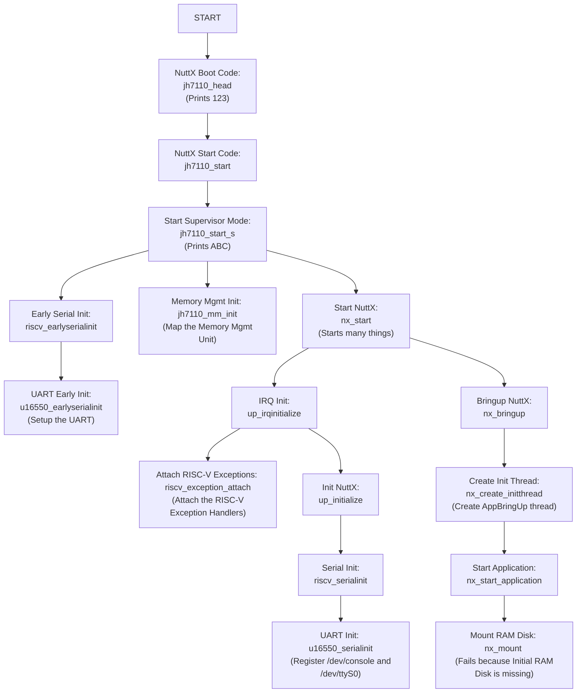

```mermaid
flowchart TD
START --> nx_bringup["NuttX Bringup: \n nx_bringup"]
click nx_bringup href "https://github.com/apache/nuttx/blob/master/sched/init/nx_bringup.c#L373-L458" "sched/init/nx_bringup.c" _blank

nx_bringup --> nx_create_initthread["Create Init Thread: \n nx_create_initthread \n (Create the Init Thread)"]
click nx_create_initthread href "https://github.com/apache/nuttx/blob/master/sched/init/nx_bringup.c#L330-L367" "sched/init/nx_bringup.c" _blank

nx_create_initthread --> nx_start_application["Start App: \n nx_start_application \n (Start NuttX Shell)"]
click nx_start_application href "https://github.com/apache/nuttx/blob/master/sched/init/nx_bringup.c#L212C1-L302" "sched/init/nx_bringup.c" _blank

nx_start_application --> exec_spawn["Exec Spawn: \n exec_spawn \n (Start the app)"]
click exec_spawn href "https://github.com/apache/nuttx/blob/master/binfmt/binfmt_exec.c#L183-L223" "binfmt/binfmt_exec.c" _blank

exec_spawn --> exec_internal["Exec Internal: \n exec_internal \n (Start the app)"]
click exec_internal href "https://github.com/apache/nuttx/blob/master/binfmt/binfmt_exec.c#L42-L179" "binfmt/binfmt_exec.c" _blank

exec_internal --> load_module["Load Module: \n load_module \n (Load the app)"]
click load_module href "https://github.com/apache/nuttx/blob/master/binfmt/binfmt_loadmodule.c#L136-L225" "binfmt/binfmt_loadmodule.c" _blank

exec_internal --> exec_module["Execute Module: \n exec_module \n (Execute the app)"]
click exec_module href "https://github.com/apache/nuttx/blob/master/binfmt/binfmt_execmodule.c#L190-L450" "binfmt/binfmt_execmodule.c" _blank

load_module --> load_absmodule["Load Absolute Module: \n load_absmodule \n (Load an absolute path)"]
click load_absmodule href "https://github.com/apache/nuttx/blob/master/binfmt/binfmt_loadmodule.c#L83-L132" "binfmt/binfmt_loadmodule.c" _blank

load_absmodule --> binfmt_s.load["Load Binary Format: \n binfmt_s.load \n (Load a binary module)"]
click binfmt_s.load href "https://github.com/apache/nuttx/blob/master/include/nuttx/binfmt/binfmt.h#L122-L148" "include/nuttx/binfmt/binfmt.h" _blank

binfmt_s.load --> g_elfbinfmt["ELF Loader: \n g_elfbinfmt \n (Load the ELF File)"]
click g_elfbinfmt href "https://github.com/apache/nuttx/blob/master/binfmt/elf.c#L84-L94" "binfmt/elf.c" _blank

g_elfbinfmt --> elf_loadbinary["Load ELF Binary: \n elf_loadbinary \n (Load the ELF Binary)"]
click elf_loadbinary href "https://github.com/apache/nuttx/blob/master/binfmt/elf.c#L225-L355" "binfmt/elf.c" _blank

elf_loadbinary --> elf_load["Load ELF: \n elf_load \n (Load the ELF Binary)"]
click elf_load href "https://github.com/apache/nuttx/blob/master/binfmt/libelf/libelf_load.c#L297-L445" "binfmt/libelf/libelf_load.c" _blank

elf_load --> elf_addrenv_alloc["Allocate Address Env: \n elf_addrenv_alloc \n (Allocate the Address Env)"]
click elf_addrenv_alloc href "https://github.com/apache/nuttx/blob/master/binfmt/libelf/libelf_addrenv.c#L56-L178" "binfmt/libelf/libelf_addrenv.c" _blank

elf_addrenv_alloc --> up_addrenv_create["Create Address Env: \n up_addrenv_create \n (Create the Address Env)"]
click up_addrenv_create href "https://github.com/apache/nuttx/blob/master/arch/risc-v/src/common/riscv_addrenv.c#L339-L490" "arch/risc-v/src/common/riscv_addrenv.c" _blank

elf_addrenv_alloc --> mmu_satp_reg["Set SATP Register: \n mmu_satp_reg \n (Set SATP Register)"]
click mmu_satp_reg href "https://github.com/apache/nuttx/blob/master/arch/risc-v/src/common/riscv_mmu.h#L152-L176" "arch/risc-v/src/common/riscv_mmu.h" _blank

up_addrenv_create --> create_region["Create MMU Region: \n create_region \n (Create the MMU Region)"]
click create_region href "https://github.com/apache/nuttx/blob/master/arch/risc-v/src/common/riscv_addrenv.c#L213-L310" "arch/risc-v/src/common/riscv_addrenv.c" _blank

create_region --> mmu_ln_setentry["Set MMU Page Table Entry: \n mmu_ln_setentry \n (Populate the Page Table Entries)"]
click mmu_ln_setentry href "https://github.com/apache/nuttx/blob/master/arch/risc-v/src/common/riscv_mmu.c#L62-L109" "arch/risc-v/src/common/riscv_mmu.c" _blank
```

# Apache NuttX RTOS for Pine64 Ox64 64-bit RISC-V SBC (Bouffalo Lab BL808)

Read the articles...

-   ["RISC-V Ox64 BL808 SBC: UART Interrupt and Platform-Level Interrupt Controller (PLIC)"](https://lupyuen.github.io/articles/plic2)

-   ["RISC-V Ox64 BL808 SBC: NuttX Apps and Initial RAM Disk"](https://lupyuen.github.io/articles/app)

-   ["RISC-V Ox64 BL808 SBC: Sv39 Memory Management Unit"](https://lupyuen.github.io/articles/mmu)

-   ["RISC-V Ox64 BL808 SBC: Starting Apache NuttX RTOS"](https://lupyuen.github.io/articles/ox2)

-   ["RISC-V Ox64 BL808 SBC: Booting Linux and (maybe) Apache NuttX RTOS"](https://lupyuen.github.io/articles/ox64)

_What's this BL808?_ [(Datasheet)](https://github.com/bouffalolab/bl_docs/blob/main/BL808_DS/en/BL808_DS_1.2_en.pdf) [(Reference Manual)](https://github.com/bouffalolab/bl_docs/blob/main/BL808_RM/en/BL808_RM_en_1.3.pdf)

BL808 is a complex creature with 3 (Asymmetric) RISC-V Cores (linked via IPC)...

1.  D0 Core: [T-Head C906 64-bit RV64IMAFCV](https://www.t-head.cn/product/c906?lang=en) (480 MHz)

    (Multimedia Core with MIPI CSI / DSI, Neural Proc Unit)

    (Memory Mgmt Unit is Sv39, 128/256/512 TLB table entry. Same as Star64?)

1.  M0 Core: [T-Head E907 32-bit RV32IMAFCP](https://www.t-head.cn/product/e907?lang=en) (320 MHz)

    (Wireless + Peripherals Core with WiFi, BLE, BT, Zigbee, Audio)

1.  LP Core: [T-Head E902 32-bit RV32E[M]C](https://www.t-head.cn/product/e902?lang=en) (150 MHz)

    (Low Power Core)

    [(Upcoming BL606 looks similar, minus the Low Power Core)](https://en.bouffalolab.com/product/?type=detail&id=16)


[Pine64 Ox64](https://wiki.pine64.org/wiki/Ox64) is the dev board for BL808C.

(BL808C supports MIPI CSI Cameras but not MIPI DSI Displays. Maybe someday we'll see BL808D for MIPI DSI Displays)

_Is Ox64 BL808 an SBC? Or an MCU Board?_

Technically Ox64 BL808 boots 64-bit RISC-V Linux (via MicroSD), so it feels like an SBC...

- ["Booting Linux on the Pine64 Ox64 SBC"](https://adventurist.me/posts/00317)

- [OpenBouffalo Wiki](https://openbouffalo.org/index.php/Main_Page)

- [Linux Image + OpenSBI + U-Boot Bootloader for BL808](https://github.com/openbouffalo/buildroot_bouffalo)

  [(Newer version?)](https://github.com/bouffalolab/buildroot_bouffalo)

  [(OpenSBI is the BIOS for RISC-V SBCs)](https://lupyuen.github.io/articles/sbi)

- USB-C Port for Camera Module (Dual-Lane MIPI CSI)

  (USB-C is not for Flashing!)

- USB 2.0 support for USB OTG

  (On-The-Go = USB Host + USB Device)

But Ox64 BL808 also feels like an MCU Board...

- Form Factor is similar to MCU Board

- Limited Memory: 64 MB of RAM, [128 Megabits](https://pine64.com/product/128mb-ox64-sbc-available-on-december-2-2022/) (16 MB) of Flash Memory

- M0 Wireless Core is 32-bit RISC-V MCU

- UART Pins need a USB Serial Adapter for Flashing and Console I/O

- Powered by Micro USB Port

  (Micro USB is not for Flashing either!)

- Super Affordable: [$8 for a 64-bit RISC-V Board!](https://pine64.com/product/128mb-ox64-sbc-available-on-december-2-2022/)

_Ox64 BL808 sounds a little tiny for 64-bit Linux?_

Yeah 64-bit Linux runs with Limited RAM on the D0 Multimedia Core. But most Peripherals are hosted on the M0 Wireless Core: WiFi, BLE, BT, Zigbee, Audio, ...

So we flash M0 with a simple 32-bit RISC-V Firmware, to forward the Peripheral Interrupts from M0 to D0 Linux.

Here are the binaries loaded into D0 Multimedia Core and M0 Wireless Core, from [buildroot_bouffalo](https://github.com/openbouffalo/buildroot_bouffalo)...

* __d0_lowload_bl808_d0.bin__: This is a very basic bootloader that loads opensbi, the kernel and dts files into ram

* __m0_lowload_bl808_m0.bin__: This firmware runs on M0 and forwards interupts to the D0 for several peripherals

* __bl808-firmware.bin__: An image containing OpenSBI, Uboot and uboot dtb files. 

* __sdcard-*.tar.xz__: A tarball containing the rootfs for the image to be flashed to the SD card

Perhaps Ox64 BL808 might run more efficiently with a tiny 64-bit RTOS.

_Why Apache NuttX RTOS?_

It might be interesting to run Apache NuttX RTOS on both the D0 Multimedia Core and the M0 Wireless Core. Then D0 and M0 can talk over OpenAMP (Asymmetric Multi-Processing).

Let's explore...

# Flashing UART vs Serial Console

Read the article...

-   ["Ox64 BL808 RISC-V SBC: Booting Linux and (maybe) Apache NuttX RTOS"](https://lupyuen.github.io/articles/ox64)


_We need to handle TWO UART Ports on Ox64?_

Yeah don't confuse the 2 UART Ports on Ox64! Let's give the UART Ports distinctive names [(like Migi & Dali)](https://en.wikipedia.org/wiki/Migi_%26_Dali)...

1.  __Ox64 Flashing UART__: Used for Flashing Ox64

    + Flashing UART TX is __GPIO 14__ (Physical Pin 1)
    + Flashing UART RX is __GPIO 15__ (Physical Pin 2)
    + Remember to connect GND
    + Baud Rate for Normal Mode: 2,000,000 (2 Mbps)
    + Baud Rate for Flashing Mode: 230,400 (230.4 kbps)
    + BL808 UART0 is controlled by the M0 Wireless Core (OpenBouffalo Firmware)

1.  __Ox64 Serial Console__: Used for Linux Serial Console (plus OpenSBI and U-Boot Bootloader)

    + Serial Console TX is __GPIO 16__ (Physical Pin 32)
    + Serial Console RX is __GPIO 17__ (Physical Pin 31)
    + Remember to connect GND
    + Baud Rate: 2,000,000 (2 Mbps)
    + BL808 UART3 is controlled by the D0 Multimedia Core (Linux + OpenSBI + U-Boot)
    + Output is totally blank if OpenBouffalo Firmware [wasn't flashed correctly](https://github.com/openbouffalo/buildroot_bouffalo/issues/60), or if OpenSBI / U-Boot / Linux couldn't boot

NEITHER UART Port is accessible over USB-C or Micro USB. So yeah it's totally counterintuitive.

(Maybe someone can create a Stackable HAT or Breadboard, that will expose the 2 UART Ports as USB Dongles? Or a UART Switcher?)

[(__For Pre-Production Ox64:__ Physical Pins are different, but GPIOs above are correct)](https://lupyuen.github.io/images/ox64-sd.jpg)

_Why 2 Baud Rates for Flashing UART?_

When we power up Ox64 in __Normal Mode__: (Boot Button NOT pressed)

- Flashing UART Port will show us the OpenBouffalo Firmware running on M0 Wireless Core

- This M0 Firmware will forward Peripheral Interrupts to D0 Multimedia Core

- M0 Firmware is hardcoded for 2 Mbps

- Not really fun to watch. But we use this for testing our 2 Mbps USB Serial Adapter.

When we power up Ox64 in __Flashing Mode__: (Boot Button pressed)

- Ox64 is ready for Firmware Flashing by the BL DevCube GUI Tool

- Firmware Flashing supports various Baud Rates: 230.4 kbps, 2 Mbps, ...

- But 2 Mbps will fail on macOS. That's why we Flash Firmware at 230.4 kbps.

  [(Same problem when flashing BL602)](https://lupyuen.github.io/articles/flash#flash-the-firmware)

_Serial Console is always 2 Mbps?_

Yeah 2 Mbps is hardcoded in Ox64 Linux. Switching to other Baud Rates will show garbled text.

Thus our USB Serial Adapter must connect reliably to Ox64 at 2 Mbps.

Now we flash Ox64 and boot Linux...

# Flash OpenSBI and U-Boot Bootloader to Ox64 BL808

Read the article...

-   ["Ox64 BL808 RISC-V SBC: Booting Linux and (maybe) Apache NuttX RTOS"](https://lupyuen.github.io/articles/ox64)

Before booting Linux on Ox64, we flash OpenSBI + U-Boot Bootloader to D0 Multimedia Core, and the Peripheral Interrupt Firmware to M0 Wireless Core. From [buildroot_bouffalo](https://github.com/openbouffalo/buildroot_bouffalo):

* __d0_lowload_bl808_d0.bin__: This is a very basic bootloader that loads opensbi, the kernel and dts files into ram

* __m0_lowload_bl808_m0.bin__: This firmware runs on M0 and forwards interupts to the D0 for several peripherals

* __bl808-firmware.bin__: An image containing OpenSBI, Uboot and uboot dtb files. 

Here are the steps, based on the [Official Flashing Instructions](https://github.com/openbouffalo/buildroot_bouffalo#flashing-instructions)...

1.  We tested with [Pine64 Woodpecker CH340G USB Serial Adapter](https://pine64.com/product/serial-console-woodpecker-edition/) on macOS x64.

    Warning: Some USB Serial Adapters [WON'T WORK!](https://wiki.pine64.org/wiki/Ox64#Compatible_UARTs_when_in_bootloader_mode)

    Probably because we are connecting at 2 Mbps, which might be too fast for some USB Serial Adapters.

    [(Like this CP2102, which shows garbled text at 2 Mbps)](https://www.lazada.sg/products/i2037772272-s11135131253.html)

    

1.  To Test our USB Serial Adapter: Connect the USB Serial Adapter to __Ox64 Flashing UART__ (pic above)...
    + Flashing UART TX is __GPIO 14__ (Physical Pin 1)
    + Flashing UART RX is __GPIO 15__ (Physical Pin 2)
    + Remember to connect GND
    + Baud 2,000,000 (2 Mbps)

    Start the USB Serial Terminal (Flashing UART).

    Power up Ox64 via the Micro USB Port. Ox64 Green LED should light up.

    This Clickety Micro USB Cable is very handy for rebooting Ox64...

    

1.  In the USB Serial Terminal (Flashing UART), we should see the Ox64 Factory Test Firmware...

    ```text
    Build:19:50:39,Nov 20 2022
    Copyright (c) 2022 Bouffalolab team
    dynamic memory init success,heap size = 93 Kbyte 
    sig1:ffff32ff
    sig2:0000ffff
    Pong!
    Ping!
    ```

    [(Source)](https://adventurist.me/posts/00317)

    If the text appears garbled: Try a different USB Serial Adapter. (See above)

    My prototype version shows this instead...

    ```text
    Init CLI with event Driven
    start aos loop... 
    CLI RAW Data, c906
    /romfs/c906.bin not found!
    ```

    [(Source)](https://gist.github.com/lupyuen/43676407bbced733e65566879e18732b)

1.  Pre-Flash Check: Set BL808 board to programming mode
    + Remove the microSD Card
    + Press and Hold BOOT Button
    + Unplug and replug the Micro USB Port
    + Release BOOT button
    + Ox64 Green LED should turn on

    In the USB Serial Terminal (Flashing UART), we should see this...

    ```text
    .
    ```

    Yep Ox64 is ready for flashing!

1.  Now we prepare to flash:

    Disconnect the USB Serial Terminal (to release the Flashing UART)

    Set BL808 board to programming mode
    + Remove the microSD Card
    + Press and Hold BOOT Button
    + Unplug and replug the Micro USB Port
    + Release BOOT button
    + Ox64 Green LED should turn on

1.  We download the Ox64 Binaries...

    - [bl808-linux-pine64_ox64_full_defconfig.tar.gz](https://github.com/openbouffalo/buildroot_bouffalo/releases/download/v1.0.1/bl808-linux-pine64_ox64_full_defconfig.tar.gz) 

    From the latest Ox64 Linux Release...

    - [openbouffalo/buildroot_bouffalo (Release v1.0.1)](https://github.com/openbouffalo/buildroot_bouffalo/releases/tag/v1.0.1)

    Unzip the download and we should see this...

    ```bash
    → ls -l firmware
       7340032  bl808-firmware.bin
         31360  d0_lowload_bl808_d0.bin
         65760  m0_lowload_bl808_m0.bin
      43859444  sdcard-pine64_ox64_full_defconfig.img.xz    
    ```

1.  We'll run BouffaloLab DevCube for Flashing BL808.

    Only Ubuntu x64, macOS and Windows are supported.

    TODO: How to flash BL808 on Arm64 SBCs and Pinebook Pro? Sigh. See [bflb-iot-tool / bflb-mcu-tool](https://wiki.pine64.org/wiki/Ox64#Alternative:_Open-Source_Flashing)

1.  Download Bouffalo Lab DevCube 1.8.3 from...

    [openbouffalo.org/static-assets/bldevcube/BouffaloLabDevCube-v1.8.3.zip](https://openbouffalo.org/static-assets/bldevcube/BouffaloLabDevCube-v1.8.3.zip)

    [(1.8.4 and later won't work)](https://github.com/openbouffalo/buildroot_bouffalo/issues/60)

    May need to Grant Execute Permission...

    ```bash
    cd BouffaloLabDevCube-v1.8.3
    chmod +x BLDevCube-macos-x86_64
    ./BLDevCube-macos-x86_64
    ```

1.  Run DevCube, select "BL808", and switch to "MCU" page

1.  M0 Group: Group0

    Image Addr: 0x58000000
    
    PATH: Select "m0_lowload_bl808_m0.bin"

1.  D0 Group: Group0

    Image Addr: 0x58100000
    
    PATH: Select "d0_lowload_bl808_d0.bin"

1.  Set UART Rate to 230400.

    Don't set to 2000000, it will fail on macOS!

    [(Same problem when flashing BL602)](https://lupyuen.github.io/articles/flash#flash-the-firmware)

1.  Click "Create & Download" and wait until it's done

    [(See the log)](https://gist.github.com/lupyuen/125e15be5ed1e034bed33d16ed496d87)

1.  Switch to "IOT" page

1.  Enable 'Single Download'

    Set Address to 0x800000
    
    Select "bl808-firmware.bin"

1.  Set UART Rate to 230400.

    Don't set to 2000000, it will fail on macOS!

    [(Same problem when flashing BL602)](https://lupyuen.github.io/articles/flash#flash-the-firmware)

1.  Click "Create & Download" again and wait until it's done

    [(See the log)](https://gist.github.com/lupyuen/e8c0aca0ebd0f1eae034b0996a5b3ec3)

1.  Start the USB Serial Terminal (Flashing UART at 2 Mbps).

    Unplug and replug the Micro USB Port.

    (Don't press the Boot Button!)

1.  On the USB Serial Terminal (Flashing UART) we should see...

    ```text
    [I][] Powered by BouffaloLab
    [I][] Build:11:52:22,Mar  6 2023
    [I][] Copyright (c) 2023 OpenBouffalo team
    [I][] Copyright (c) 2022 Bouffalolab team
    [I][] =========== flash cfg ==============
    [I][] jedec id   0xEF6018
    [I][] mid            0xEF
    [I][] iomode         0x04
    [I][] clk delay      0x01
    [I][] clk invert     0x01
    [I][] read reg cmd0  0x05
    [I][] read reg cmd1  0x35
    [I][] write reg cmd0 0x01
    [I][] write reg cmd1 0x31
    [I][] qe write len   0x01
    [I][] cread support  0x00
    [I][] cread code     0xFF
    [I][] burst wrap cmd 0x77
    [I][] sector size:   0x04
    [I][] =====================================
    [I][] dynamic memory init success,heap size = 156 Kbyte 
    [I][MAIN] Starting Mailbox Handlers
    [I][MBOX] Forwarding Interupt SDH (33) to D0 (0x58008bbc)
    [I][MBOX] Forwarding Interupt GPIO (60) to D0 (0x58008d0e)
    [I][MAIN] Running...
    [I][MBOX] Mailbox IRQ Stats:
    [I][MBOX] .Peripheral SDH (33): 0
    [I][MBOX] .Peripheral GPIO (60): 0
    [I][MBOX] Unhandled Interupts: 0 Unhandled Signals 0
    ```

    [(Source)](https://gist.github.com/lupyuen/52ccdf076ae294db26e837e6ffc4bafb)

    Yep we have flashed the OpenBouffalo Firmware successfully!

    

1.  Connect our USB Serial Adapter to __Ox64 Serial Console__: (pic above)
    + Serial Console TX is __GPIO 16__ (Physical Pin 32)
    + Serial Console RX is __GPIO 17__ (Physical Pin 31)
    + Remember to connect GND
    + Baud 2,000,000 (2 Mbps)

    Start the USB Serial Terminal (Serial Console).

    Unplug and replug the Micro USB Port.

    (Don't press the Boot Button!)

1.  On the USB Serial Terminal (Serial Console) we should see...

    ```text
    U-Boot 2023.04-rc2 (Mar 06 2023 - 11:48:40 +0000)
    Card did not respond to voltage select! : -110
    BOOTP broadcast
    Retry time exceeded; starting again
    ```

    [(Source)](https://gist.github.com/lupyuen/0b1a98781e86ba11c5538eb1e3058718)

    Which is OK because U-Boot Bootloader is waiting for a microSD Card. 

1.  If nothing appears...

    Check that we are using [Bouffalo Lab DevCube 1.8.3](https://openbouffalo.org/static-assets/bldevcube/BouffaloLabDevCube-v1.8.3.zip)

    [(1.8.4 and later won't work)](https://github.com/openbouffalo/buildroot_bouffalo/issues/60)

    In BL Dev Cube, UART Rate (for MCU and IoT) should be 230400.

    Don't set to 2000000, it will fail on macOS!

    [(Same problem when flashing BL602)](https://lupyuen.github.io/articles/flash#flash-the-firmware)

Let's load Ox64 Linux into a microSD Card...

# Boot Linux on Ox64 BL808


Read the article...

-   ["Ox64 BL808 RISC-V SBC: Booting Linux and (maybe) Apache NuttX RTOS"](https://lupyuen.github.io/articles/ox64)

Now that D0 Multimedia Core is flashed with OpenSBI and U-Boot Bootloader, we're ready to boot Linux on microSD!

Based on the [Official Flashing Instructions](https://github.com/openbouffalo/buildroot_bouffalo#flashing-instructions)...

1.  Look for the microSD Image that we downloaded earlier...

    ```text
    sdcard-pine64_ox64_full_defconfig.img.xz
    ```

    Uncompress the file to get...

    ```text
    sdcard-pine64_ox64_full_defconfig.img
    ```

1.  Flash the uncompressed image to your microSD card.

    You can use [Balena Etcher](https://github.com/balena-io/etcher), GNOME Disks or `dd`.

1.  Insert the microSD Card into Ox64. (Pic above)

    

1.  Connect our USB Serial Adapter to __Ox64 Flashing UART__: (pic above)
    + Flashing UART TX is __GPIO 14__ (Physical Pin 1)
    + Flashing UART RX is __GPIO 15__ (Physical Pin 2)
    + Remember to connect GND
    + Baud 2,000,000 (2 Mbps)

    Start the USB Serial Terminal (Flashing UART).

    Unplug and replug the Micro USB Port.

    (Don't press the Boot Button!)

1.  On the USB Serial Terminal (Flashing UART) we should see the same thing as earlier...

    ```text
    [I][MAIN] Starting Mailbox Handlers
    [I][MBOX] Forwarding Interupt SDH (33) to D0 (0x58008bbc)
    [I][MBOX] Forwarding Interupt GPIO (60) to D0 (0x58008d0e)
    [I][MAIN] Running...
    [I][MBOX] Mailbox IRQ Stats:
    [I][MBOX] .Peripheral SDH (33): 0
    [I][MBOX] .Peripheral GPIO (60): 0
    [I][MBOX] Unhandled Interupts: 0 Unhandled Signals 0
    ```

    [(Source)](https://gist.github.com/lupyuen/52ccdf076ae294db26e837e6ffc4bafb)

    

1.  Connect our USB Serial Adapter to __Ox64 Serial Console__: (pic above)
    + Serial Console TX is __GPIO 16__ (Physical Pin 32)
    + Serial Console RX is __GPIO 17__ (Physical Pin 31)
    + Remember to connect GND
    + Baud 2,000,000 (2 Mbps)

    Start the USB Serial Terminal (Serial Console).

    Unplug and replug the Micro USB Port.

    (Don't press the Boot Button!)

1.  On the USB Serial Terminal (Serial Console) we should see...

    ```text
    [I][] Powered by BouffaloLab
    [I][] Build:11:52:04,Mar  6 2023
    [I][] Copyright (c) 2023 OpenBouffalo team
    [I][] Copyright (c) 2022 Bouffalolab team
    [I][] dynamic memory init success,heap s[I][LowLoad] D0 start...
    [I][LowLoad] low_load start... 
    [I][LowLoad] Header at 0x5d5ff000
    [I][LowLoad] Section dtb(1) - Start 0x5d5ff100, Size 14314
    [I][LowLoad] Copying DTB to 0x51ff8000...0x51ffb7ea
    [I][LowLoad] Done!
    [I][LowLoad] Section OpenSBI(2) - Start 0x5d60f100, Size 109864
    [I][LowLoad] Copying OpenSBI to 0x3ef80000...0x3ef9ad28
    [I][LowLoad] Done!
    [I][LowLoad] Section Kernel(3) - Start 0x5d62f100, Size 315597
    [I][LowLoad] Uncompressing Kernel to 0x50000000...
    [I][LowLoad] Done!
    [I][LowLoad] CRC: 00000000
    [I][LowLoad] load time: 61306 us 
    [I][LowLoad] ing PMP
    [I][LowLoad] Booting OpenSBI at 0x000000003ef80000 with DTB at 0x51ff8000
    ...
    OpenSBI v1.2
    Platform Name             : Pine64 Ox64 (D0)
    Platform Features          medeleg
    Platform HART Count       : 1
    Platform IPI Device       : aclint-mswi
    Platform Timer Device     : aclint-mtimer @ 1000000Hz
    Platform Console Device   : bflb_uart
    Platform HSM Device       : ---
    Platform PMU Device       : ---
    Platform Reboot Device    : ---
    Platform Shutdown Device  : ---
    Firmware Base             : 0x3ef80000
    Firmware Size             : 200 KB
    Runtime SBI Version       : 1.0
    ...

    U-Boot 2023.04-rc2 (Mar 06 2023 - 11:48:40 +0000)
    DRAM:  64 MiB
    Core:  36 devices, 17 uclasses, devicetree: board
    MMC:   mmc@20060000: 0
    Loading Environment from FAT... Unable to read "uboot.env" from mmc0:2... 
    ...
    Starting kernel ...
    Linux version 6.2.0 (runner@fv-az587-938) (riscv64-unknown-linux-gnu-gcc (Xuantie-900 linux-5.10.4 glibc gcc Toolchain V2.6.1 B-20220906) 10.2.0, GNU ld (GNU Binutils) 2.35) #1 Mon Mar  6 11:17:27 UTC 2023
    ...
    Welcome to Buildroot
    ox64 login: 
    ```

    [(See the Complete Log)](https://gist.github.com/lupyuen/3035a70d52d2d1d529e96f5292f54210)

    [(Watch the Video on YouTube)](https://youtu.be/UJ_7DyHnfDA)

    Yep Linux is running on Ox64 yay! (Pic below)

1.  If nothing appears...

    Check that we are using [Bouffalo Lab DevCube 1.8.3](https://openbouffalo.org/static-assets/bldevcube/BouffaloLabDevCube-v1.8.3.zip)

    [(1.8.4 and later won't work)](https://github.com/openbouffalo/buildroot_bouffalo/issues/60)

    In BL Dev Cube, UART Rate (for MCU and IoT) should be 230400.

    Don't set to 2000000, it will fail on macOS!

    [(Same problem when flashing BL602)](https://lupyuen.github.io/articles/flash#flash-the-firmware)

1.  If we see...

    ```text
    U-Boot 2023.04-rc2 (Mar 06 2023 - 11:48:40 +0000)
    Card did not respond to voltage select! : -110
    BOOTP broadcast
    Retry time exceeded; starting again
    ```

    [(Source)](https://gist.github.com/lupyuen/0b1a98781e86ba11c5538eb1e3058718)

    Check that the microSD Card is inserted correctly. (Pic above)

1.  TODO: TFTP Boot over Ethernet


Comment by [@gamelaster](https://x.com/gamelaster/status/1719073156281798755?s=20)...

> "This is not hardware specific, but flasher specific. With blisp, I was able to get faster flashing working, but this is Apple's quirk. Or maybe not? Because FreeBSD need same quirks and exact buffer sizes as Apple."

Comment by [@madushan1000](https://x.com/madushan1000/status/1719069431580524720?s=20)...

> "You can also use u-boot. https://github.com/openbouffalo/u-boot/releases/tag/bl808-2023-02-19 
You can also get rid of mailbox, but you will have to build the kernel yourself https://github.com/openbouffalo/linux/tree/bl808/all"

# Forward Peripheral Interrupts

Read the article...

-   ["Ox64 BL808 RISC-V SBC: Booting Linux and (maybe) Apache NuttX RTOS"](https://lupyuen.github.io/articles/ox64)

TODO

```text
[I][MAIN] Starting Mailbox Handlers
[I][MBOX] Forwarding Interupt SDH (33) to D0 (0x58008bbc)
[I][MBOX] Forwarding Interupt GPIO (60) to D0 (0x58008d0e)
[I][MAIN] Running...
[I][MBOX] Mailbox IRQ Stats:
[I][MBOX] .Peripheral SDH (33): 0
[I][MBOX] .Peripheral GPIO (60): 0
[I][MBOX] Unhandled Interupts: 0 Unhandled Signals 0
```

[(Source)](https://gist.github.com/lupyuen/52ccdf076ae294db26e837e6ffc4bafb)

SDH: SD Card (SDIO) Host Controller (BL808 RM Page 561)

IRQ 60: GPIO_INT0 (IRQ_NUM_BASE+44) GPIO Interrupt (BL808 RM Page 44)

[GPIO_INT0_IRQn](https://github.com/bouffalolab/bl808_linux/blob/main/bl_mcu_sdk_bl808/drivers/bl808_driver/regs/bl808.h#L123)

[SDH is IRQ 33: SDH_IRQn](https://github.com/bouffalolab/bl808_linux/blob/main/bl_mcu_sdk_bl808/drivers/bl808_driver/regs/bl808.h#L96)

IRQ_NUM_BASE is 16 (BL808 RM Page 45)

[m0_lowload](https://github.com/openbouffalo/OBLFR/tree/master/apps/m0_lowload)

[d0_lowload](https://github.com/openbouffalo/OBLFR/tree/master/apps/d0_lowload)

[Forward GPIO Interrupt](https://github.com/openbouffalo/OBLFR/blob/master/components/mailbox/src/oblfr_mailbox.c#L127-L135)

[Forward SDH Interrupt](https://github.com/openbouffalo/OBLFR/blob/master/components/mailbox/src/oblfr_mailbox.c#L95-L103)

[Setup SDH Interrupt](https://github.com/openbouffalo/OBLFR/blob/master/components/mailbox/src/oblfr_mailbox.c#L238C1-L257)

Other Interrupts (unused)
- [UART2](https://github.com/openbouffalo/OBLFR/blob/master/components/mailbox/src/oblfr_mailbox.c#L103-L111)
- [USB](https://github.com/openbouffalo/OBLFR/blob/master/components/mailbox/src/oblfr_mailbox.c#L111-L119)
- [EMAC](https://github.com/openbouffalo/OBLFR/blob/master/components/mailbox/src/oblfr_mailbox.c#L119-L127)

# Inspect the Linux Image for Ox64 BL808

Read the article...

-   ["Ox64 BL808 RISC-V SBC: Booting Linux and (maybe) Apache NuttX RTOS"](https://lupyuen.github.io/articles/ox64)

_Will Apache NuttX RTOS boot on Ox64 BL808?_

Let's examine the Linux Kernel Image for Ox64, and we replicate the same format for NuttX. (Which is how we ported NuttX to 64-bit RISC-V Star64 JH7110 SBC)

We download the Ox64 Binaries...

- [bl808-linux-pine64_ox64_full_defconfig.tar.gz](https://github.com/openbouffalo/buildroot_bouffalo/releases/download/v1.0.1/bl808-linux-pine64_ox64_full_defconfig.tar.gz) 

From the latest Ox64 Linux Release...

- [openbouffalo/buildroot_bouffalo (Release v1.0.1)](https://github.com/openbouffalo/buildroot_bouffalo/releases/tag/v1.0.1)

Unzip it and mount the SD Card Image...

```bash
→ ls -l sdcard-pine64_ox64_full_defconfig     
-  13,154,816  Image
-       4,012  bl808-pine64-ox64.dtb
-       4,106  bl808-sipeed-m1s.dtb
-         350  boot-m1s.scr
-         352  boot-pine64.scr
-         352  boot.scr
d          96  extlinux
```

Dump the `Image` as hex...

```bash
→ hexdump sdcard-pine64_ox64_full_defconfig/Image
0000000 4d 5a 6f 10 20 08 01 00 00 00 20 00 00 00 00 00
0000010 00 80 cd 00 00 00 00 00 00 00 00 00 00 00 00 00
0000020 02 00 00 00 00 00 00 00 00 00 00 00 00 00 00 00
0000030 52 49 53 43 56 00 00 00 52 53 43 05 40 00 00 00
```

The Linux Kernel Image begins with this __RISC-V Linux Image Header__...

-   [__"Boot Image Header in RISC-V Linux"__](https://www.kernel.org/doc/html/latest/riscv/boot-image-header.html)

Here are the decoded bytes...

1.  __code0__: Executable code

    (4 bytes, offset `0x00`)

    ```text
    4d 5a 6f 10 
    ```

1.  __code1__: Executable code 

    (4 bytes, offset `0x04`)

    ```text
    20 08 01 00 
    ```

1.  __text_offset__: Image load offset, little endian

    (8 bytes, offset `0x08`)

    ```text
    00 00 20 00 00 00 00 00
    ```

1.  __image_size__: Effective Image size, little endian 

    (8 bytes, offset `0x10`)

    ```text
    00 80 cd 00 00 00 00 00
    ```

1.  __flags__: Kernel flags, little endian 

    (8 bytes, offset `0x18`)

    ```text
    00 00 00 00 00 00 00 00
    ```

1.  __version__: Version of this header (_MinL_ _MinM_ `.` _MajL_ _MajM_)

    (4 bytes, offset `0x20`)

    ```text
    02 00 00 00
    ```

1.  __res1__: Reserved

    (4 bytes, offset `0x24`)

    ```text
    00 00 00 00
    ```

1.  __res2__: Reserved

    (8 bytes, offset `0x28`)

    ```text
    00 00 00 00 00 00 00 00
    ```

1.  __magic__: Magic number, little endian, "RISCV\x00\x00\x00" 
    
    (8 bytes, offset `0x30`)

    ```text
    52 49 53 43 56 00 00 00
    ```

1.  __magic2__: Magic number 2, little endian, "RSC\x05" 

    (4 bytes, offset `0x38`)

    ```text
    52 53 43 05
    ```

1.  __res3__: Reserved for PE COFF offset

    (4 bytes, offset `0x3C`)
    
    ```text
    40 00 00 00
    ```

Our NuttX Kernel shall __recreate this RISC-V Linux Image Header__. (Total `0x40` bytes)

(Or U-Boot Bootloader might refuse to boot NuttX)

Header Values are exactly the same as Star64. (Except the Image Size and Executable Code, since the Jump Address is different)

Thus we simply reuse the code from NuttX Star64!

# Linux Device Tree for Ox64 BL808

Read the article...

-   ["Ox64 BL808 RISC-V SBC: Booting Linux and (maybe) Apache NuttX RTOS"](https://lupyuen.github.io/articles/ox64)

TODO: Dump the Device Tree

```text
dtc \
  -o bl808-pine64-ox64.dts \
  -O dts \
  -I dtb \
  bl808-pine64-ox64.dtb
```

Here's the Decompiled Device Tree: [bl808-pine64-ox64.dts](bl808-pine64-ox64.dts)

TODO: Transmit to UART3 at 0x30002000. Reuse the BL602 UART Driver for NuttX.

```text
serial@30002000 {
  compatible = "bflb,bl808-uart";
  reg = <0x30002000 0x1000>;
  interrupts = <0x14 0x04>;
  clocks = <0x04>;
  status = "okay";
  phandle = <0x0a>;
};
```

[(Source)](https://github.com/lupyuen/nuttx-ox64/blob/main/bl808-pine64-ox64.dts#L89-L96)

TODO: Forward the Interrupts from M0 Wireless Core to D0 Multimedia Core via Mailbox / IPC (Where are the addresses documented?)

```text
mailbox@30005000 {
  compatible = "bflb,bl808-ipc";
  reg = <
    0x30005000 0x20 
    0x30005020 0x20 
    0x2000a800 0x20 
    0x2000a820 0x20
  >;
  interrupts = <0x36 0x04>;
  interrupt-controller;
  #interrupt-cells = <0x03>;
  #mbox-cells = <0x02>;
  status = "okay";
  phandle = <0x03>;
};
```

[(Source)](https://github.com/lupyuen/nuttx-ox64/blob/main/bl808-pine64-ox64.dts#L118-L127)

TODO: Print Debug Logs with OpenSBI

# Boot Apache NuttX RTOS on Ox64 BL808

Read the article...

-   ["Ox64 BL808 RISC-V SBC: Starting Apache NuttX RTOS"](https://lupyuen.github.io/articles/ox2)

_What happens if we boot Star64 NuttX on Ox64 BL808?_

Let's find out!

```bash
## Download and build NuttX for Star64
git clone --branch ox64 https://github.com/lupyuen2/wip-pinephone-nuttx nuttx
git clone --branch ox64 https://github.com/lupyuen2/wip-pinephone-nuttx-apps apps
cd nuttx
tools/configure.sh star64:nsh
make

## Export the Binary Image to nuttx.bin
riscv64-unknown-elf-objcopy \
  -O binary \
  nuttx \
  nuttx.bin

## TODO: Prepare the microSD for Ox64 Linux
## https://lupyuen.github.io/articles/ox64#boot-linux-on-ox64

## Copy and overwrite the `Image` file on the microSD for Ox64 Linux
cp nuttx.bin Image
cp Image "/Volumes/NO NAME"
diskutil unmountDisk /dev/disk2
```

We boot NuttX on Ox64 via microSD... But Ox64 shows absolutely nothing!

```text
Retrieving file: /extlinux/../Image
append: root=PARTLABEL=rootfs rootwait rw rootfstype=ext4 console=ttyS0,2000000 loglevel=8 earlycon=sbi
Retrieving file: /extlinux/../bl808-pine64-ox64.dtb
## Flattened Device Tree blob at 51ff8000
   Booting using the fdt blob at 0x51ff8000
Working FDT set to 51ff8000
   Loading Device Tree to 0000000053f22000, end 0000000053f25fab ... OK
Working FDT set to 53f22000
Starting kernel ...
```

[(Source)](https://gist.github.com/lupyuen/8134f17502db733ce87d6fa8b00eab55)

We're hoping that NuttX would crash and OpenSBI could print a meaningful Stack Trace. But nope! NuttX was probably stuck in a loop waiting for Star64 UART.

Let's print to the Ox64 Serial Console in the NuttX Boot Code (in RISC-V Assembly)...

# Print to Ox64 Serial Console in NuttX Boot Code

Read the article...

-   ["Ox64 BL808 RISC-V SBC: Starting Apache NuttX RTOS"](https://lupyuen.github.io/articles/ox2)

_How to print to the Ox64 Serial Console in the NuttX Boot Code? (RISC-V Assembly)_

When we compare the BL808 and BL602 Reference Manuals, we discover that BL808 UART works the same way as BL602.

This is how the BL602 UART Driver prints to the Serial Console: [bl602_serial.c](https://github.com/apache/nuttx/blob/master/arch/risc-v/src/bl602/bl602_serial.c#L704-L725)

```c
#define BL602_UART_FIFO_WDATA_OFFSET 0x000088  /* uart_fifo_wdata */
#define BL602_UART_FIFO_WDATA(n) (BL602_UART_BASE(n) + BL602_UART_FIFO_WDATA_OFFSET)

static void bl602_send(struct uart_dev_s *dev, int ch) {
  ...
  // Wait for FIFO to be empty
  while ((getreg32(BL602_UART_FIFO_CONFIG_1(uart_idx)) & \
    UART_FIFO_CONFIG_1_TX_CNT_MASK) == 0);
  // Write output to FIFO
  putreg32(ch, BL602_UART_FIFO_WDATA(uart_idx));
}
```

So for BL808, we simply write the character to...

- UART3 Base Address: 0x30002000 (from the Linux Device Tree earlier)

- Offset: 0x88

[Based on Star64 Debug Code](https://lupyuen.github.io/articles/nuttx2#print-to-qemu-console), we code this in RISC-V Assembly...

```text
/* Load UART3 Base Address to Register t0 */
li  t0, 0x30002000

/* Load `1` to Register t1 */
li  t1, 0x31
/* Store byte from Register t1 to UART3 Base Address, Offset 0x88 */
sb  t1, 0x88(t0)

/* Load `2` to Register t1 */
li  t1, 0x32
/* Store byte from Register t1 to UART3 Base Address, Offset 0x88 */
sb  t1, 0x88(t0)

/* Load `3` to Register t1 */
li  t1, 0x33
/* Store byte from Register t1 to UART3 Base Address, Offset 0x88 */
sb  t1, 0x88(t0)
```

We insert the above code into the NuttX Boot Code: [jh7110_head.S](https://github.com/lupyuen2/wip-pinephone-nuttx/blob/ox64/arch/risc-v/src/jh7110/jh7110_head.S#L69-L87)

Now NuttX prints to the Serial Console yay! (Pic below)

```text
Starting kernel ...
123
```

[(Source)](https://gist.github.com/lupyuen/1f895c9d57cb4e7294522ce27fea70fb)

OpenSBI boots on Ox64 with Hart ID 0 (instead of 1), so we remove this code...

```text
 /* We assume that OpenSBI has passed Hart ID (value 1) in Register a0.
   * But NuttX expects Hart ID to start at 0, so we subtract 1.
   */
  /* Previously: addi a0, a0, -1 */
```

[(Source)](https://github.com/lupyuen2/wip-pinephone-nuttx/blob/ox64/arch/risc-v/src/jh7110/jh7110_head.S#L89-L93)


# Update the NuttX Boot Address for Ox64 BL808

Read the article...

-   ["Ox64 BL808 RISC-V SBC: Starting Apache NuttX RTOS"](https://lupyuen.github.io/articles/ox2)

_What is the Linux Boot Address for Ox64 BL808?_

From the [U-Boot Settings](https://gist.github.com/lupyuen/30df5a965fabf719cc52bf733e945db7)...

```bash
kernel_addr_r=0x50200000
```

Let's update the Boot Address in NuttX: [ld.script](https://github.com/lupyuen2/wip-pinephone-nuttx/blob/ox64/boards/risc-v/jh7110/star64/scripts/ld.script#L20-L27)

```text
MEMORY
{
  kflash (rx) : ORIGIN = 0x50200000, LENGTH = 2048K   /* w/ cache */
  ksram (rwx) : ORIGIN = 0x50400000, LENGTH = 2048K   /* w/ cache */
  pgram (rwx) : ORIGIN = 0x50600000, LENGTH = 4096K   /* w/ cache */
  ramdisk (rwx) : ORIGIN = 0x50A00000, LENGTH = 6M   /* w/ cache */
}
```

TODO: Use up to 64 MB, the total RAM Size on Ox64

We make the same changes to the NuttX Config: [nsh/defconfig](https://github.com/lupyuen2/wip-pinephone-nuttx/blob/ox64/boards/risc-v/jh7110/star64/configs/nsh/defconfig)

```text
CONFIG_RAM_START=0x50200000
CONFIG_RAM_SIZE=1048576
CONFIG_ARCH_PGPOOL_PBASE=0x50600000
CONFIG_ARCH_PGPOOL_VBASE=0x50600000
CONFIG_ARCH_PGPOOL_SIZE=4194304
```

And the Memory Mapping: [jh7110_mm_init.c](https://github.com/lupyuen2/wip-pinephone-nuttx/blob/ba093f2477f011ec7c5351eaba0a3002add02d6b/arch/risc-v/src/jh7110/jh7110_mm_init.c#L47-L50)

```c
/* Map the whole I/O memory with vaddr = paddr mappings */
#define MMU_IO_BASE     (0x00000000)
#define MMU_IO_SIZE     (0x50000000)
```

TODO: What's the RAM Disk Address? It's missing from [U-Boot Settings](https://gist.github.com/lupyuen/30df5a965fabf719cc52bf733e945db7)

```c
/* Ramdisk Load Address from U-Boot */
#define RAMDISK_ADDR_R  (0x46100000)
```

[(Source)](https://github.com/lupyuen2/wip-pinephone-nuttx/blob/ox64/arch/risc-v/src/jh7110/jh7110_mm_init.c#L43-L45)

NuttX shows the same output as earlier, no change...

```text
Starting kernel ...
123
```

[(Source)](https://gist.github.com/lupyuen/1f895c9d57cb4e7294522ce27fea70fb)

Let's fix the NuttX UART Driver...

# Fix the NuttX UART Driver for Ox64 BL808

Read the article...

-   ["Ox64 BL808 RISC-V SBC: Starting Apache NuttX RTOS"](https://lupyuen.github.io/articles/ox2)

_NuttX on Ox64 has been awfully quiet. How to fix the UART Driver so that NuttX can print things?_

Ox64 is still running on the JH7110 UART Driver (16550). Let's make a quick patch so that we will see something on the Ox64 Serial Console...

We hardcode the UART3 Base Address (from above) and FIFO Offset for now: [uart_16550.c](https://github.com/lupyuen2/wip-pinephone-nuttx/blob/ox64/drivers/serial/uart_16550.c#L1698-L1716)

```c
// Write one character to the UART (polled)
static void u16550_putc(FAR struct u16550_s *priv, int ch) {

  // Hardcode the UART3 Base Address and FIFO Offset
  *(volatile uint8_t *) 0x30002088 = ch; ////

  // Previously:
  // while ((u16550_serialin(priv, UART_LSR_OFFSET) & UART_LSR_THRE) == 0);
  // u16550_serialout(priv, UART_THR_OFFSET, (uart_datawidth_t)ch);
}
```

(Yeah the UART Buffer might overflow, we'll fix later)

We skip the reading and writing of other UART Registers, because we'll patch them later: [uart_16550.c](https://github.com/lupyuen2/wip-pinephone-nuttx/blob/ox64/drivers/serial/uart_16550.c#L604-L632)

```c
// Read UART Register
static inline uart_datawidth_t u16550_serialin(FAR struct u16550_s *priv, int offset) {
  return 0; ////
  // Commented out the rest
}

// Write UART Register
static inline void u16550_serialout(FAR struct u16550_s *priv, int offset, uart_datawidth_t value) {
  // Commented out the rest
}
```

And we won't wait for UART Ready, since we're not accessing the Line Control Register: [uart_16550.c](https://github.com/lupyuen2/wip-pinephone-nuttx/blob/ox64/drivers/serial/uart_16550.c#L633-L670)

```c
// Wait until UART is not busy. This is needed before writing to Line Control Register.
// Otherwise we will get spurious interrupts on Synopsys DesignWare 8250.
static int u16550_wait(FAR struct u16550_s *priv) {
  // Nopez! No waiting for now
  return OK; ////
}
```

Now NuttX prints our very first Stack Dump on Ox64 yay!

```text
Starting kernel ...
123
ABC
riscv_exception: EXCEPTION: Load access fault. MCAUSE: 0000000000000005, EPC: 0000000050208086, MTVAL: 000000000c002104
riscv_exception: PANIC!!! Exception = 0000000000000005
_assert: Current Version: NuttX  12.0.3 93a92a7-dirty Nov  5 2023 11:27:46 risc-v
_assert: Assertion failed panic: at file: common/riscv_exception.c:85 task: Idle_Task process: Kernel 0x50200e28
up_dump_register: EPC: 0000000050208086
up_dump_register: A0: 000000000c002104 A1: ffffffffffffffff A2: 0000000000000001 A3: 0000000000000003
up_dump_register: A4: ffffffffffffffff A5: 8000000200046000 A6: 0000000000000000 A7: fffffffffffffff8
up_dump_register: T0: 00000000502000a8 T1: 0000000000000007 T2: 656d616e2d64746d T3: 0000000050407b10
up_dump_register: T4: 0000000050407b08 T5: 0000000053f23fff T6: 0000000053f33870
up_dump_register: S0: 0000000000000000 S1: 0000000050400140 S2: 0000000000000001 S3: 8000000200046002
up_dump_register: S4: 0000000050400070 S5: 00000000000001b6 S6: 0000000000000000 S7: 0000000000000000
up_dump_register: S8: 0000000053f7a15c S9: 0000000053fcf2e0 S10: 0000000000000001 S11: 0000000000000003
up_dump_register: SP: 0000000050407a00 FP: 0000000000000000 TP: 0000000000000000 RA: 0000000050204064
```

[(Source)](https://gist.github.com/lupyuen/36b8c47abc2632063ca5cdebb958e3e8)

Let's look up the RISC-V Exception Code Address 0x50208086 in our RISC-V Disassembly...

```text
EXCEPTION: Load access fault 
MCAUSE: 0000000000000005 
EPC:    0000000050208086 
MTVAL:  000000000c002104
```

And the offending Data Address 0xc002104. (Which looks very familiar!)


# Platform-Level Interrupt Controller for Ox64 BL808

Read the article...

-   ["Ox64 BL808 RISC-V SBC: Starting Apache NuttX RTOS"](https://lupyuen.github.io/articles/ox2)

_Why did NuttX crash with this RISC-V Exception?_

```text
EXCEPTION: Load access fault 
MCAUSE: 0000000000000005 
EPC:    0000000050208086 
MTVAL:  000000000c002104
```

NuttX crashed when it tried to access invalid Data Address 0xc002104 from Code Address 0x50208086.

We look up Code Address 0x50208086 in our NuttX Disassembly...

```text
000000005020807a <modifyreg32>:
up_irq_save():
nuttx/include/arch/irq.h:689
    5020807a:	4789                	li	a5,2
    5020807c:	1007b7f3          	csrrc	a5,sstatus,a5
modifyreg32():
nuttx/arch/risc-v/src/common/riscv_modifyreg32.c:52
{
  irqstate_t flags;
  uint32_t   regval;

  flags   = spin_lock_irqsave(NULL);
  regval  = getreg32(addr);
    50208080:	4118                	lw	a4,0(a0)
nuttx/arch/risc-v/src/common/riscv_modifyreg32.c:53
  regval &= ~clearbits;
    50208082:	fff5c593          	not	a1,a1
nuttx/arch/risc-v/src/common/riscv_modifyreg32.c:52
  regval  = getreg32(addr);
    50208086:	2701                	sext.w	a4,a4
```

Which comes from here: [riscv_modifyreg32.c](https://github.com/lupyuen2/wip-pinephone-nuttx/blob/ox64/arch/risc-v/src/common/riscv_modifyreg32.c#L38-L57)

```c
 // Atomically modify the specified bits in a memory mapped register
void modifyreg32(uintptr_t addr, uint32_t clearbits, uint32_t setbits) {
  irqstate_t flags;
  uint32_t   regval;

  flags   = spin_lock_irqsave(NULL);
  // Crashes here because `addr` is invalid...
  regval  = getreg32(addr);
  regval &= ~clearbits;
  regval |= setbits;
  putreg32(regval, addr);
  spin_unlock_irqrestore(NULL, flags);
}
```

It's trying to modify a Memory-Mapped Register, and crashed.

_But what Memory-Mapped Register?_

The offending Data Address 0xc002104 actually comes from Star64 PLIC! (Platform-Level Interrupt Controller)

```c
// From https://github.com/lupyuen2/wip-pinephone-nuttx/blob/ox64/arch/risc-v/src/jh7110/hardware/jh7110_memorymap.h#L30
#define JH7110_PLIC_BASE    0x0c000000

// From https://github.com/lupyuen2/wip-pinephone-nuttx/blob/ox64/arch/risc-v/src/jh7110/hardware/jh7110_plic.h#L34-L49
/* Interrupt Priority */
#define JH7110_PLIC_PRIORITY  (JH7110_PLIC_BASE + 0x000000)

/* Hart 1 S-Mode Interrupt Enable */
#define JH7110_PLIC_ENABLE1   (JH7110_PLIC_BASE + 0x002100)
#define JH7110_PLIC_ENABLE2   (JH7110_PLIC_BASE + 0x002104)

/* Hart 1 S-Mode Priority Threshold */
#define JH7110_PLIC_THRESHOLD (JH7110_PLIC_BASE + 0x202000)

/* Hart 1 S-Mode Claim / Complete */
#define JH7110_PLIC_CLAIM     (JH7110_PLIC_BASE + 0x202004)
```

The PLIC Base Address is different for BL808, let's change it.

_What's the PLIC Base Address in Ox64 BL808?_

PLIC Base Address is 0xe0000000, according to the Linux Device Tree: [bl808-pine64-ox64.dts](https://github.com/lupyuen/nuttx-ox64/blob/main/bl808-pine64-ox64.dts#L129-L138)

```text
interrupt-controller@e0000000 {
  compatible = "thead,c900-plic";
  reg = <0xe0000000 0x4000000>;
  interrupts-extended = <0x06 0xffffffff 0x06 0x09>;
  interrupt-controller;
  #address-cells = <0x00>;
  #interrupt-cells = <0x02>;
  riscv,ndev = <0x40>;
  phandle = <0x01>;
};
```

TODO: Why isn't this documented in [XuanTie OpenC906 User Manual](https://occ-intl-prod.oss-ap-southeast-1.aliyuncs.com/resource/XuanTie-OpenC906-UserManual.pdf)?

So we change the PLIC Base Address for Ox64: [jh7110_memorymap.h](https://github.com/lupyuen2/wip-pinephone-nuttx/blob/ox64/arch/risc-v/src/jh7110/hardware/jh7110_memorymap.h#L30)

```c
#define JH7110_PLIC_BASE    0xe0000000
```

TODO: Enable Scheduler Debug

# Handle RISC-V Exceptions in NuttX

Read the article...

-   ["Ox64 BL808 RISC-V SBC: Starting Apache NuttX RTOS"](https://lupyuen.github.io/articles/ox2)

Now NuttX crashes at a different place, with IRQ 15...

```text
123ABC
nx_start: Entry
up_irqinitialize: a
up_irqinitialize: b
up_irqinitialize: c
riscv_dispatch_irq: irq=15
irq_unexpected_isr: ERROR irq: 15
_assert: Current Version: NuttX  12.0.3 910bfca-dirty Nov  6 2023 15:23:11 risc-v
_assert: Assertion failed panic: at file: irq/irq_unexpectedisr.c:54 task: Idle_Task process: Kernel 0x50200e50
```

[(Source)](https://gist.github.com/lupyuen/11b8d4221a150f10afa3aa5ab5e50a4c)

_What's IRQ 15?_

From [XuanTie OpenC906 User Manual](https://occ-intl-prod.oss-ap-southeast-1.aliyuncs.com/resource/XuanTie-OpenC906-UserManual.pdf) (Page 21):

> "Exception Vector ID 15: A store/atomic instruction page error exception."

This RISC-V Exception says that we tried to write to an invalid Data Address. And failed.

_Where did it crash?_

Based on our log, NuttX crashes before setting the PLIC!

From [jh7110_irq.c](https://github.com/lupyuen2/wip-pinephone-nuttx/blob/8f318c363c80e1d4f5788f3815009cb57b5ff298/arch/risc-v/src/jh7110/jh7110_irq.c#L42-L85)

```c
// Init the IRQs
void up_irqinitialize(void) {
  _info("a\n");////

  /* Disable S-Mode interrupts */
  _info("b\n");////
  up_irq_save();

  /* Disable all global interrupts */
  _info("c\n");////
  // Crashes here!
  putreg32(0x0, JH7110_PLIC_ENABLE1);
  putreg32(0x0, JH7110_PLIC_ENABLE2);

  /* Colorize the interrupt stack for debug purposes */
  ...

  /* Set irq threshold to 0 (permits all global interrupts) */
  _info("e\n");////
  putreg32(0, JH7110_PLIC_THRESHOLD);

  /* Attach the common interrupt handler */
  _info("f\n");////
  riscv_exception_attach();
```

_But it's a RISC-V Exception! Shouldn't NuttX dump this as a proper exception?_

See the `riscv_exception_attach()` above? It happens AFTER the crash! This means NuttX hasn't properly initialised the Exception Handlers, when the crash happened.

Let's init the Exception Handlers earlier: [jh7110_irq.c](https://github.com/lupyuen2/wip-pinephone-nuttx/blob/ox64/arch/risc-v/src/jh7110/jh7110_irq.c#L42-L85)

```c
// Init the IRQs
void up_irqinitialize(void) {
  _info("a\n");////

  /* Disable S-Mode interrupts */
  _info("b\n");////
  up_irq_save();

  /* Attach the common interrupt handler */
  _info("f\n");////
  // Init the Exception Handlers here
  riscv_exception_attach();

  /* Disable all global interrupts */
  _info("c\n");////
  // Crashes here!
  putreg32(0x0, JH7110_PLIC_ENABLE1);
  putreg32(0x0, JH7110_PLIC_ENABLE2);
```

`riscv_exception_attach()` will handle all RISC-V Exceptions, including Store/AMO Page Fault (IRQ 15): [riscv_exception.c](https://github.com/lupyuen2/wip-pinephone-nuttx/blob/ox64/arch/risc-v/src/common/riscv_exception.c#L89-L142)

```c
// Attach standard exception with suitable handler
void riscv_exception_attach(void) {
  // Handle Store/AMO Page Fault (IRQ 15)
  irq_attach(RISCV_IRQ_STOREPF, riscv_exception, NULL);
```

Now we see the Store/AMO Page Fault Exception!

```text
up_irqinitialize: c
riscv_dispatch_irq: irq=15
riscv_exception: 
EXCEPTION: Store/AMO page fault
MCAUSE: 000000000000000f
EPC:    0000000050207e6a
MTVAL:  00000000e0002100
```

[(Source)](https://gist.github.com/lupyuen/85db0510712ba8c660e10f922d4564c9)

Code Address is 0x50207e6a, from our PLIC Code...

```text
nuttx/arch/risc-v/src/chip/jh7110_irq.c:62
  putreg32(0x0, JH7110_PLIC_ENABLE1);
    50207e64:	700017b7          	lui	a5,0x70001
    50207e68:	0786                	slli	a5,a5,0x1
    50207e6a:	1007a023          	sw	zero,256(a5) # 70001100 <__ramdisk_end+0x1e601100>
```

The offending Data Address is 0xe0002100. Which is our BL808 PLIC!

# Add PLIC to I/O Memory Map

Read the article...

-   ["Ox64 BL808 RISC-V SBC: Starting Apache NuttX RTOS"](https://lupyuen.github.io/articles/ox2)

_But is 0xe0002100 accessible?_

Ah we forgot to add it to the I/O Memory Map! Let's fix it: [jh7110_mm_init.c](https://github.com/lupyuen2/wip-pinephone-nuttx/blob/b244f85065ecc749599842088f35f1b190466429/arch/risc-v/src/jh7110/jh7110_mm_init.c#L47-L50)

```c
/* Map the whole I/O memory with vaddr = paddr mappings */
#define MMU_IO_BASE     (0x00000000)
#define MMU_IO_SIZE     (0xf0000000)
```

(Doesn't look right, but we'll fix later)

Now NuttX boots further! And tries to register IRQ 57 for the Star64 UART Interrupt...

```text
up_irqinitialize: c
up_irqinitialize: d
up_irqinitialize: e
up_irqinitialize: g
irq_attach: irq=17, isr=0x50207eee
up_enable_irq: irq=17
uart_register: Registering /dev/console
uart_register: Registering /dev/ttyS0
irq_attach: irq=57, isr=0x502041fe
up_enable_irq: irq=57
riscv_dispatch_irq: irq=5
riscv_exception: 
EXCEPTION: Load access fault
MCAUSE: 0000000000000005
EPC:    0000000050208342
MTVAL:  00000000e0002104
```

[(Source)](https://gist.github.com/lupyuen/ade5ff1433812fb675ff06f805f7339f)

But it crashes while accessing the PLIC at another address: 0xe0002104.

_Are we tired of PLIC yet?_

Yeah let's fix PLIC later. The entire UART Driver will be revamped anyway, including the UART Interrupt.

Let's disable the UART Interrupt for now: [uart_16550.c](https://github.com/lupyuen2/wip-pinephone-nuttx/blob/ox64/drivers/serial/uart_16550.c#L902-L958)

```c
// Attach the UART Interrupt for Star64
static int u16550_attach(struct uart_dev_s *dev) {
  // Don't attach the interrupt
  // Previously: ret = irq_attach(priv->irq, u16550_interrupt, dev);

  // Don't enable the interrupt
  // Previously: up_enable_irq(priv->irq);
```

# Fail to Load Initial RAM Disk

Read the article...

-   ["Ox64 BL808 RISC-V SBC: Starting Apache NuttX RTOS"](https://lupyuen.github.io/articles/ox2)

Now NuttX boots even further yay! But crashes in the NuttX Bringup...

```text
up_irqinitialize: c
up_irqinitialize: d
up_irqinitialize: e
up_irqinitialize: g
irq_attach: irq=17, isr=0x50207e64
up_enable_irq: irq=17
uart_register: Registering /dev/console
uart_register: Registering /dev/ttyS0
work_start_lowpri: Starting low-priority kernel worker thread(s)
_assert: Current Version: NuttX  12.0.3 b244f85-dirty Nov  6 2023 17:35:34 risc-v
_assert: Assertion failed ret >= 0: at file: init/nx_bringup.c:283 task: AppBringUp process: Kernel 0x5020107e
```

[(Source)](https://gist.github.com/lupyuen/ab640bcb3ba3a19834bcaa29e43baddf)

Because it couldn't map the Initial RAM Disk: [nx_bringup.c](https://github.com/lupyuen2/wip-pinephone-nuttx/blob/ox64/sched/init/nx_bringup.c#L276-L284)

```c
/* Mount the file system containing the init program. */
ret = nx_mount(CONFIG_INIT_MOUNT_SOURCE, CONFIG_INIT_MOUNT_TARGET,
  CONFIG_INIT_MOUNT_FSTYPE, CONFIG_INIT_MOUNT_FLAGS,
  CONFIG_INIT_MOUNT_DATA);
DEBUGASSERT(ret >= 0);
```

That's because we haven't loaded the Initial RAM Disk! Let's fix this later.

# NuttX Boot Flow for Ox64 BL808

(To see the NuttX Source Code: Right-click the Node and select "Open Link")



Read the article...

-   ["Ox64 BL808 RISC-V SBC: Starting Apache NuttX RTOS"](https://lupyuen.github.io/articles/ox2)

_What happens exactly when NuttX boots on Ox64?_

In this article, NuttX has booted plenty of code on Ox64. Here's the flow of the __NuttX Code that boots on Ox64__...

[__NuttX Boot Code: jh7110_head__](https://github.com/lupyuen2/wip-pinephone-nuttx/blob/ox64/arch/risc-v/src/jh7110/jh7110_head.S#L41-L156) prints "123" and calls...

- [__NuttX Start Code: jh7110_start__](https://github.com/lupyuen2/wip-pinephone-nuttx/blob/ox64/arch/risc-v/src/jh7110/jh7110_start.c#L129-L159) which calls...

- [__Start Supervisor Mode: jh7110_start_s__](https://github.com/lupyuen2/wip-pinephone-nuttx/blob/ox64/arch/risc-v/src/jh7110/jh7110_start.c#L82-L129) which prints "ABC" and calls...

- [__Early Serial Init: riscv_earlyserialinit__](https://github.com/lupyuen2/wip-pinephone-nuttx/blob/ox64/arch/risc-v/src/jh7110/jh7110_start.c#L159-L164) (see below) and...

  [__Memory Mgmt Init: jh7110_mm_init__](https://github.com/lupyuen2/wip-pinephone-nuttx/blob/ox64/arch/risc-v/src/jh7110/jh7110_mm_init.c#L259-L284) (to map the Memory Mgmt Unit) and...

  [__Start NuttX: nx_start__](https://github.com/lupyuen2/wip-pinephone-nuttx/blob/ox64/sched/init/nx_start.c#L298-L713) (see below)

[__Early Serial Init: riscv_earlyserialinit__](https://github.com/lupyuen2/wip-pinephone-nuttx/blob/ox64/arch/risc-v/src/jh7110/jh7110_start.c#L159-L164) calls...

- [__UART Early Init: u16550_earlyserialinit__](https://github.com/lupyuen2/wip-pinephone-nuttx/blob/ox64/drivers/serial/uart_16550.c#L1722-L1747)

  (To setup the UART)

[__Start NuttX: nx_start__](https://github.com/lupyuen2/wip-pinephone-nuttx/blob/ox64/sched/init/nx_start.c#L298-L713) does [__many things__](https://lupyuen.github.io/articles/unicorn2#after-primary-routine) and calls...

- [__IRQ Init: up_irqinitialize__](https://github.com/lupyuen2/wip-pinephone-nuttx/blob/ox64/arch/risc-v/src/jh7110/jh7110_irq.c#L41C1-L103) (see below) and...

  [__Bringup NuttX: nx_bringup__](https://github.com/lupyuen2/wip-pinephone-nuttx/blob/ox64/sched/init/nx_bringup.c#L373-L462) (see below)

[__IRQ Init: up_irqinitialize__](https://github.com/lupyuen2/wip-pinephone-nuttx/blob/ox64/arch/risc-v/src/jh7110/jh7110_irq.c#L41C1-L103) calls...

- [__Attach RISC-V Exceptions: riscv_exception_attach__](https://github.com/lupyuen2/wip-pinephone-nuttx/blob/ox64/arch/risc-v/src/common/riscv_exception.c#L89-L142) (to attach the RISC-V Exception Handlers) and...

  [__Init NuttX: up_initialize__](https://github.com/lupyuen2/wip-pinephone-nuttx/blob/ox64/arch/risc-v/src/common/riscv_initialize.c#L70-L132) (see below)

[__Init NuttX: up_initialize__](https://github.com/lupyuen2/wip-pinephone-nuttx/blob/ox64/arch/risc-v/src/common/riscv_initialize.c#L70-L132) calls...

- [__Serial Init: riscv_serialinit__](https://github.com/lupyuen2/wip-pinephone-nuttx/blob/ox64/arch/risc-v/src/jh7110/jh7110_start.c#L164-L168) which calls...

- [__UART Init: u16550_serialinit__](https://github.com/lupyuen2/wip-pinephone-nuttx/blob/ox64/drivers/serial/uart_16550.c#L1747-L1775)

  (To register "/dev/console" and "/dev/ttyS0")

[__Bringup NuttX: nx_bringup__](https://github.com/lupyuen2/wip-pinephone-nuttx/blob/ox64/sched/init/nx_bringup.c#L373-L462) calls...

- [__Create Init Thread: nx_create_initthread__](https://github.com/lupyuen2/wip-pinephone-nuttx/blob/ox64/sched/init/nx_bringup.c#L330-L369) (to create "AppBringUp" thread) which calls...

- [__Start Application: nx_start_application__](https://github.com/lupyuen2/wip-pinephone-nuttx/blob/ox64/sched/init/nx_bringup.c#L212-L304) which calls...

- [__Mount RAM Disk: nx_mount__](https://github.com/lupyuen2/wip-pinephone-nuttx/blob/ox64/fs/mount/fs_mount.c#L260-L514)

  (Which fails because our Initial RAM Disk is missing)

  (Which prevents NuttX Shell from starting)

# NuttX UART Driver for Ox64 BL808

Read the article...

-   ["RISC-V Ox64 BL808 SBC: UART Interrupt and Platform-Level Interrupt Controller (PLIC)"](https://lupyuen.github.io/articles/plic2)

BL808 UART is mostly identical to BL602 UART, so we ported the NuttX BL602 UART Driver to BL808.

Here's the UART Driver ported to BL808: [bl602_serial.c](https://github.com/lupyuen2/wip-pinephone-nuttx/blob/ox64a/arch/risc-v/src/jh7110/bl602_serial.c)

We hardcoded the UART3 Base Address: [bl602_uart.h](https://github.com/lupyuen2/wip-pinephone-nuttx/blob/ox64a/arch/risc-v/src/jh7110/hardware/bl602_uart.h#L30-L41)

```c
#define BL602_UART0_BASE 0x30002000
#define BL602_UART_BASE(n) (BL602_UART0_BASE)
// Previously: #define BL602_UART_BASE(n)    (BL602_UART0_BASE + (n * (BL602_UART1_BASE - BL602_UART0_BASE)))
```

We fixed the NuttX Start Code to call our new UART Driver: [jh7110_start.c](https://github.com/lupyuen2/wip-pinephone-nuttx/blob/ox64a/arch/risc-v/src/jh7110/jh7110_start.c#L175-L184)

```c
void riscv_earlyserialinit(void) {
  bl602_earlyserialinit();
}

void riscv_serialinit(void) {
  bl602_serialinit();
}
```

We disabled UART Interrupts for now: [bl602_attach and bl602_detach](https://github.com/lupyuen2/wip-pinephone-nuttx/blob/ox64a/arch/risc-v/src/jh7110/bl602_serial.c#L377-L431)

And the UART Driver works! [(See the log)](https://gist.github.com/lupyuen/74a44a3e432e159c62cc2df6a726cb89)

TODO: /dev/ttyS0 is missing

TODO: Enable UART Interrupts

# Initial RAM Disk for Ox64 BL808

Read the article...

-   ["RISC-V Ox64 BL808 SBC: NuttX Apps and Initial RAM Disk"](https://lupyuen.github.io/articles/app)

Two ways we can load the Initial RAM Disk...

1.  Load the Initial RAM Disk from a __Separate File: initrd__ (similar to Star64)

    This means we need to modify the [__U-Boot Script: boot-pine64.scr__](https://github.com/openbouffalo/buildroot_bouffalo/blob/main/board/pine64/ox64/boot-pine64.cmd)

    And make it [__load the initrd__](https://lupyuen.github.io/articles/semihost#appendix-boot-nuttx-over-tftp-with-initial-ram-disk) file into RAM.

    (Which is good for separating the NuttX Kernel and NuttX Apps)

    OR...

1.  Append the Initial RAM Disk to the __NuttX Kernel Image__

    So the U-Boot Bootloader will load (one-shot into RAM) the NuttX Kernel + Initial RAM Disk.
    
    And we reuse the existing __U-Boot Config__ on the microSD Card: [__extlinux/extlinux.conf__](https://github.com/openbouffalo/buildroot_bouffalo/blob/main/board/pine64/ox64/rootfs-overlay/boot/extlinux/extlinux.conf)

    (Which might be more efficient for our Limited RAM)

    [(See the __U-Boot Boot Flow__)](https://github.com/openbouffalo/buildroot_bouffalo/wiki/U-Boot-Bootflow)

    __TODO:__ Can we mount the File System directly from the __NuttX Kernel Image in RAM__? Without copying to the [__RAM Disk Memory Region__](https://github.com/lupyuen2/wip-pinephone-nuttx/blob/ox64/boards/risc-v/jh7110/star64/scripts/ld.script#L26)?

We'll do the Second Method, since we are low on RAM. Like this...

```bash
## Export the Binary Image to `nuttx.bin`
riscv64-unknown-elf-objcopy \
  -O binary \
  nuttx \
  nuttx.bin

## Insert 64 KB of zeroes after Binary Image for Kernel Stack
head -c 65536 /dev/zero >/tmp/nuttx.zero

## Append Initial RAM Disk to Binary Image
cat nuttx.bin /tmp/nuttx.zero initrd \
  >Image

## Overwrite the Linux Image on Ox64 microSD
cp Image "/Volumes/NO NAME/"
```


This is how we copy the initrd in RAM to the Memory Region for the RAM Disk: [jh7110_start.c](https://github.com/lupyuen2/wip-pinephone-nuttx/blob/ox64a/arch/risc-v/src/jh7110/jh7110_start.c#L190-L245)

```c
static void jh7110_copy_ramdisk(void) {
  // Based on ROM FS Format: https://docs.kernel.org/filesystems/romfs.html
  // After _edata, search for "-rom1fs-". This is the RAM Disk Address.
  // Stop searching after 64 KB.
  extern uint8_t _edata[];
  extern uint8_t _sbss[];
  extern uint8_t _ebss[];
  const char *header = "-rom1fs-";
  uint8_t *ramdisk_addr = NULL;
  for (uint8_t *addr = _edata; addr < (uint8_t *)JH7110_IDLESTACK_TOP + (65 * 1024); addr++) {
    if (memcmp(addr, header, strlen(header)) == 0) {
      ramdisk_addr = addr;
      break;
    }
  }
  // Check for Missing RAM Disk
  if (ramdisk_addr == NULL) { _info("Missing RAM Disk"); }
  DEBUGASSERT(ramdisk_addr != NULL); 

  // RAM Disk must be after Idle Stack
  if (ramdisk_addr <= (uint8_t *)JH7110_IDLESTACK_TOP) { _info("RAM Disk must be after Idle Stack"); }
  DEBUGASSERT(ramdisk_addr > (uint8_t *)JH7110_IDLESTACK_TOP);

  // Read the Filesystem Size from the next 4 bytes, in Big Endian
  // Add 0x1F0 to Filesystem Size
  const uint32_t size =
    (ramdisk_addr[8] << 24) + 
    (ramdisk_addr[9] << 16) + 
    (ramdisk_addr[10] << 8) + 
    ramdisk_addr[11] + 
    0x1F0;
  _info("size=%d\n", size);

  // Filesystem Size must be less than RAM Disk Memory Region
  DEBUGASSERT(size <= (size_t)__ramdisk_size);

  // Before Copy: Verify the RAM Disk Image to be copied
  verify_image(ramdisk_addr);

  // Copy the Filesystem Size to RAM Disk Start
  // Warning: __ramdisk_start overlaps with ramdisk_addr + size
  // memmove is aliased to memcpy, so we implement memmove ourselves
  local_memmove((void *)__ramdisk_start, ramdisk_addr, size);

  // Before Copy: Verify the copied RAM Disk Image
  verify_image(__ramdisk_start);
}
```

We copy the initrd at the very top of our NuttX Start Code, before erasing the BSS (in case it corrupts our RAM Disk, but actually it shouldn't): [jh7110_start.c](https://github.com/lupyuen2/wip-pinephone-nuttx/blob/ox64a/arch/risc-v/src/jh7110/jh7110_start.c#L144-L156)

```c
// NuttX Start Code
void jh7110_start(int mhartid) {
  DEBUGASSERT(mhartid == 0); /* Only Hart 0 supported for now */
  if (0 == mhartid) {
    /* Copy the RAM Disk */
    jh7110_copy_ramdisk();

    /* Clear the BSS */
    jh7110_clear_bss();
```

NuttX mounts the RAM Disk from the Memory Region later during startup: [jh7110_appinit.c](https://github.com/lupyuen2/wip-pinephone-nuttx/blob/ox64a/boards/risc-v/jh7110/star64/src/jh7110_appinit.c#L51-L87)

```c
// After NuttX has booted...
void board_late_initialize(void) {
  // Mount the RAM Disk
  mount_ramdisk();
}

// Mount the RAM Disk
int mount_ramdisk(void) {
  desc.minor    = RAMDISK_DEVICE_MINOR;
  desc.nsectors = NSECTORS((ssize_t)__ramdisk_size);
  desc.sectsize = SECTORSIZE;
  desc.image    = __ramdisk_start;
  ret = boardctl(BOARDIOC_ROMDISK, (uintptr_t)&desc);
```

And NuttX mounts our RAM Disk successfully!

```text
jh7110_copy_ramdisk: _edata=0x50400258, _sbss=0x50400290, _ebss=0x50407000, JH7110_IDLESTACK_TOP=0x50407c00
jh7110_copy_ramdisk: ramdisk_addr=0x50408288
jh7110_copy_ramdisk: size=8192016
jh7110_copy_ramdisk: Before Copy: ramdisk_addr=0x50408288
jh7110_copy_ramdisk: After Copy: __ramdisk_start=0x50a00000
...
elf_initialize: Registering ELF
uart_register: Registering /dev/console
work_start_lowpri: Starting low-priority kernel worker thread(s)
nx_start_application: Starting init task: /system/bin/init
load_absmodule: Loading /system/bin/init
elf_loadbinary: Loading file: /system/bin/init
elf_init: filename: /system/bin/init loadinfo: 0x5040c618
elf_read: Read 64 bytes from offset 0
```

[(Source)](https://gist.github.com/lupyuen/74a44a3e432e159c62cc2df6a726cb89)

_Why did we insert 64 KB of zeroes after the NuttX Binary Image, before the initrd Initial RAM Disk?_

```bash
## Insert 64 KB of zeroes after Binary Image for Kernel Stack
head -c 65536 /dev/zero >/tmp/nuttx.zero

## Append Initial RAM Disk to Binary Image
cat nuttx.bin /tmp/nuttx.zero initrd \
  >Image
```

When we refer to the [NuttX Log](https://gist.github.com/lupyuen/74a44a3e432e159c62cc2df6a726cb89) and the [NuttX Linker Script](https://github.com/lupyuen2/wip-pinephone-nuttx/blob/ox64a/boards/risc-v/jh7110/star64/scripts/ld.script)...

```text
// End of Data Section
_edata=0x50400258

// Start of BSS Section
_sbss=0x50400290

// End of BSS Section
_ebss=0x50407000

// Top of Idle Stack
JH7110_IDLESTACK_TOP=0x50407c00

// We located the initd after the Top of Idle Stack
ramdisk_addr=0x50408288, size=8192016

// And we copied initrd to the Memory Region for the RAM Disk
__ramdisk_start=0x50a00000
```

Which says...

1.  The NuttX Binary Image `nuttx.bin` terminates at `_edata`. (End of Data Section)

1.  If we append `initrd` directly to the end of `nuttx.bin`, it will collide with the [BSS Section](https://github.com/lupyuen2/wip-pinephone-nuttx/blob/ox64a/arch/risc-v/src/jh7110/jh7110_start.c#L74-L92) and the [Idle Stack](https://github.com/lupyuen2/wip-pinephone-nuttx/blob/ox64a/arch/risc-v/src/jh7110/jh7110_head.S#L94-L101). And `initrd` will get overwritten by NuttX.

1.  Best place to append `initrd` is after the Top of Idle Stack. Which is located 32 KB after `_edata`. (End of Data Section)

1.  That's why we inserted a padding of 64 KB between `nuttx.bin` and `initrd`. So it won't collide with BSS and Idle Stack.

1.  Our code locates `initrd` (searching by Magic Number "-rom1fs-"). And copies `initrd` to `__ramdisk_start`. (Memory Region for the RAM Disk)

1.  NuttX mounts the RAM Disk from `__ramdisk_start`. (Memory Region for the RAM Disk)

_But 64 KB sounds so arbitrary. What if the parameters change?_

That's why we have a Runtime Check: [jh7110_start.c](https://github.com/lupyuen2/wip-pinephone-nuttx/blob/ox64a/arch/risc-v/src/jh7110/jh7110_start.c#L190-L245)

```c
  // RAM Disk must be after Idle Stack
  if (ramdisk_addr <= (uint8_t *)JH7110_IDLESTACK_TOP) { _info("RAM Disk must be after Idle Stack"); }
  DEBUGASSERT(ramdisk_addr > (uint8_t *)JH7110_IDLESTACK_TOP);
```

_Why did we call local_memmove to copy `initrd` to `__ramdisk_start`? Why not memcpy?_

That's because `initrd` overlaps with `__ramdisk_start`!

```
ramdisk_addr = 0x50408288, size = 8192016
ramdisk_addr + size = 0x50bd8298
Which is AFTER __ramdisk_start (0x50a00000)
```

`memcpy` won't work with Overlapping Memory Regions. So we wrote our own: [jh7110_start.c](https://github.com/lupyuen2/wip-pinephone-nuttx/blob/ox64a/arch/risc-v/src/jh7110/jh7110_start.c#L246-L487)

```c
// From libs/libc/string/lib_memmove.c
static FAR void *local_memmove(FAR void *dest, FAR const void *src, size_t count) {
  FAR char *d;
  FAR char *s;
  DEBUGASSERT(dest > src);
  d = (FAR char *) dest + count;
  s = (FAR char *) src + count;

  while (count--) {
    d -= 1;
    s -= 1;
    // TODO: Very strange. This needs to be volatile or C Compiler will replace this by memcpy.
    volatile char c = *s;
    *d = c;
  }
  return dest;
}
```

_We're sure that it works?_

That's why we called `verify_image` to do a simple integrity check on `initrd`, before and after copying. And that's how we discovered that `memcpy` doesn't work. From [jh7110_start.c](https://github.com/lupyuen2/wip-pinephone-nuttx/blob/ox64a/arch/risc-v/src/jh7110/jh7110_start.c#L246-L487)

```c
// Verify that image is correct
static void verify_image(uint8_t *addr) {
  // Verify that the Byte Positions below (offset by 1) contain 0x0A
  for (int i = 0; i < sizeof(search_addr) / sizeof(search_addr[0]); i++) {
    const uint8_t *p = addr + search_addr[i] - 1;
    if (*p != 0x0A) { _info("No Match: %p\n", p); }
  }
}

// Byte Positions (offset by 1) of 0x0A in initrd. Extracted from:
// grep --binary-files=text -b -o A initrd
const uint32_t search_addr[] =
{
76654,
78005,
79250,
...
7988897,
7992714,
};
```

But NuttX fails to start our NuttX Shell (NSH) ELF Executable from "/system/bin/init"...

```text
elf_read: Read 3392 bytes from offset 3385080
elf_addrenv_select: ERROR: up_addrenv_text_enable_write failed: -22
elf_load: ERROR: elf_addrenv_select() failed: -22
...
elf_loadbinary: Failed to load ELF program binary: -22
exec_internal: ERROR: Failed to load program '/system/bin/init': -22
_assert: Current Version: NuttX  12.0.3 8017bd9-dirty Nov 10 2023 22:50:07 risc-v
_assert: Assertion failed ret > 0: at file: init/nx_bringup.c:302 task: AppBringUp process: Kernel 0x502014ea
```

[(Source)](https://gist.github.com/lupyuen/74a44a3e432e159c62cc2df6a726cb89)

Maybe because NuttX is trying to map the User Address Space 0xC000 0000: [nsh/defconfig](https://github.com/lupyuen2/wip-pinephone-nuttx/blob/ox64a/boards/risc-v/jh7110/star64/configs/nsh/defconfig#L17-L26)

```text
CONFIG_ARCH_TEXT_VBASE=0xC0000000
CONFIG_ARCH_TEXT_NPAGES=128
CONFIG_ARCH_DATA_VBASE=0xC0100000
CONFIG_ARCH_DATA_NPAGES=128
CONFIG_ARCH_HEAP_VBASE=0xC0200000
CONFIG_ARCH_HEAP_NPAGES=128
```

But our Kernel Memory Space already extends to 0xF000 0000? (Because of the PLIC at 0xE000 0000)

From [jh7110_mm_init.c](https://github.com/lupyuen2/wip-pinephone-nuttx/blob/ox64a/arch/risc-v/src/jh7110/jh7110_mm_init.c#L43-L46):

```c
/* Map the whole I/O memory with vaddr = paddr mappings */
#define MMU_IO_BASE     (0x00000000)
#define MMU_IO_SIZE     (0xf0000000)
```

_Let's disable PLIC, and exclude PLIC from Memory Map. Will the NuttX Shell start?_

Yep it does! [(See the log)](https://gist.github.com/lupyuen/9fc9b2de9938b48666cc5e5fa3f8278e)

Now we fix the Memory Map...

# NuttX Memory Map for Ox64 BL808

Read the article...

-   ["RISC-V Ox64 BL808 SBC: Sv39 Memory Management Unit"](https://lupyuen.github.io/articles/mmu)

To fix the NuttX Memory Map for Ox64, let's trace the MMU Page Table Entries. From the [MMU Log](https://gist.github.com/lupyuen/22712d6a2c3a7eb2da1f3cd5c2f4f6cf)...

## Map the I/O Region (Level 1)

From the [MMU Log](https://gist.github.com/lupyuen/22712d6a2c3a7eb2da1f3cd5c2f4f6cf)...

```text
mmu_ln_map_region: 
  ptlevel=1, lnvaddr=0x50407000, paddr=0, vaddr=0, size=0x40000000, mmuflags=0x26

mmu_ln_setentry: 
  ptlevel=1, lnvaddr=0x50407000, paddr=0, vaddr=0, mmuflags=0x26
mmu_ln_setentry: 
  index=0, paddr=0, mmuflags=0xe7, pte_addr=0x50407000, pte_val=0xe7
```

`mmuflags=0x26` means Read + Write + Global


## Map the PLIC (Level 2)

From the [MMU Log](https://gist.github.com/lupyuen/22712d6a2c3a7eb2da1f3cd5c2f4f6cf)...

```text
mmu_ln_map_region: 
  ptlevel=2, lnvaddr=0x50403000, paddr=0xe0000000, vaddr=0xe0000000, size=0x10000000, mmuflags=0x26

mmu_ln_setentry: ptlevel=2, lnvaddr=0x50403000, paddr=0xe0000000, vaddr=0xe0000000, mmuflags=0x26
mmu_ln_setentry: index=0x100, paddr=0xe0000000, mmuflags=0xe7, pte_addr=0x50403800, pte_val=0x380000e7
mmu_ln_setentry: ptlevel=2, lnvaddr=0x50403000, paddr=0xe0200000, vaddr=0xe0200000, mmuflags=0x26
mmu_ln_setentry: index=0x101, paddr=0xe0200000, mmuflags=0xe7, pte_addr=0x50403808, pte_val=0x380800e7
mmu_ln_setentry: ptlevel=2, lnvaddr=0x50403000, paddr=0xe0400000, vaddr=0xe0400000, mmuflags=0x26
mmu_ln_setentry: index=0x102, paddr=0xe0400000, mmuflags=0xe7, pte_addr=0x50403810, pte_val=0x381000e7
...
mmu_ln_setentry: ptlevel=2, lnvaddr=0x50403000, paddr=0xefe00000, vaddr=0xefe00000, mmuflags=0x26
mmu_ln_setentry: index=0x17f, paddr=0xefe00000, mmuflags=0xe7, pte_addr=0x50403bf8, pte_val=0x3bf800e7
```

`mmuflags=0x26` means Read + Write + Global


## Connect the Level 1 and Level 2 Page Tables for PLIC

From the [MMU Log](https://gist.github.com/lupyuen/22712d6a2c3a7eb2da1f3cd5c2f4f6cf)...

```text
mmu_ln_setentry: 
  ptlevel=1, lnvaddr=0x50407000, paddr=0x50403000, vaddr=0xe0000000, mmuflags=0x20

mmu_ln_setentry: 
  index=0x3, paddr=0x50403000, mmuflags=0x21, pte_addr=0x50407018, pte_val=0x14100c21
```

`mmuflags=0x20` means PTE_G: Global Mapping.


## Map the Kernel Text (Levels 2 & 3)

From the [MMU Log](https://gist.github.com/lupyuen/22712d6a2c3a7eb2da1f3cd5c2f4f6cf)...

```text
// Level 2
mmu_ln_setentry: ptlevel=2, lnvaddr=0x50406000, paddr=0x50404000, vaddr=0x50200000, mmuflags=0x0
mmu_ln_setentry: index=0x81, paddr=0x50404000, mmuflags=0x1, pte_addr=0x50406408, pte_val=0x14101001

// Level 3
mmu_ln_setentry: ptlevel=3, lnvaddr=0x50404000, paddr=0x50200000, vaddr=0x50200000, mmuflags=0x2a
mmu_ln_setentry: index=0, paddr=0x50200000, mmuflags=0xeb, pte_addr=0x50404000, pte_val=0x140800eb

mmu_ln_setentry: ptlevel=3, lnvaddr=0x50404000, paddr=0x5020100, vaddr=0x50201000, mmuflags=0x2a
mmu_ln_setentry: index=0x1, paddr=0x50201000, mmuflags=0xeb, pte_addr=0x50404008, pte_val=0x140804eb

mmu_ln_setentry: ptlevel=3, lnvaddr=0x50404000, paddr=0x50202000, vaddr=0x50202000, mmuflags=0x2a
mmu_ln_setentry: index=0x2, paddr=0x50202000, mmuflags=0xeb, pte_addr=0x50404010, pte_val=0x140808eb
...
mmu_ln_setentry: ptlevel=3, lnvaddr=0x50404000, paddr=0x503ff000, vaddr=0x503ff000, mmuflags=0x2a
mmu_ln_setentry: index=0x1ff, paddr=0x503ff000, mmuflags=0xeb, pte_addr=0x50404ff8, pte_val=0x140ffceb
```

`mmuflags=0x0` means PTE is a pointer to the next level of the page table

`mmuflags=0x2a` means Read + Execute + Global


## Map the Kernel Data (Levels 2 & 3)

From the [MMU Log](https://gist.github.com/lupyuen/22712d6a2c3a7eb2da1f3cd5c2f4f6cf)...

```text
// Level 2
mmu_ln_setentry: ptlevel=2, lnvaddr=0x50406000, paddr=0x50405000, vaddr=0x50400000, mmuflags=0x0
mmu_ln_setentry: index=0x82, paddr=0x50405000, mmuflags=0x1, pte_addr=0x50406410, pte_val=0x14101401

// Level 3
mmu_ln_setentry: ptlevel=3, lnvaddr=0x50405000, paddr=0x50400000, vaddr=0x5040000, mmuflags=0x26
mmu_ln_setentry: index=0, paddr=0x50400000, mmuflags=0xe7, pte_addr=0x50405000, pte_val=0x141000e7
mmu_ln_setentry: ptlevel=3, lnvaddr=0x50405000, paddr=0x50401000, vaddr=0x50401000, mmuflags=0x26
mmu_ln_setentry: index=0x1, paddr=0x50401000, mmuflags=0xe7, pte_addr=0x50405008, pte_val=0x141004e7
mmu_ln_setentry: ptlevel=3, lnvaddr=0x50405000, paddr=0x50402000, vaddr=0x50402000, mmuflags=0x26
mmu_ln_setentry: index=0x2, paddr=0x50402000, mmuflags=0xe7, pte_addr=0x50405010, pte_val=0x141008e7
...
mmu_ln_setentry: ptlevel=3, lnvaddr=0x50405000, paddr=0x505ff000, vaddr=0x505ff000, mmuflags=0x26
mmu_ln_setentry: index=0x1ff, paddr=0x505ff000, mmuflags=0xe7, pte_addr=0x50405ff8, pte_val=0x1417fce7
```

`mmuflags=0x0` means PTE is a pointer to the next level of the page table

`mmuflags=0x26` means Read + Write + Global

## Connect the Level 1 and Level 2 Page Tables

From the [MMU Log](https://gist.github.com/lupyuen/22712d6a2c3a7eb2da1f3cd5c2f4f6cf)...

```text
mmu_ln_setentry: 
  ptlevel=1, lnvaddr=0x50407000, paddr=0x50406000, vaddr=0x50200000, mmuflags=0x20

mmu_ln_setentry: 
  index=0x1, paddr=0x50406000, mmuflags=0x21, pte_addr=0x50407008, pte_val=0x14101821
```

`mmuflags=0x20` means PTE_G: Global Mapping.

And PTE is a pointer to the next level of the page table.

Which means that Virtual Address 0x5020 0000 points to the L2 Page Table 0x5040 6000

## Map the Page Pool (Level 2)

From the [MMU Log](https://gist.github.com/lupyuen/22712d6a2c3a7eb2da1f3cd5c2f4f6cf)...

```text
mmu_ln_map_region: ptlevel=2, lnvaddr=0x50406000, paddr=0x50600000, vaddr=0x50600000, size=0x1400000, mmuflags=0x26

mmu_ln_setentry: ptlevel=2, lnvaddr=0x50406000, paddr=0x50600000, vaddr=0x50600000, mmuflags=0x26
mmu_ln_setentry: index=0x83, paddr=0x50600000, mmuflags=0xe7, pte_addr=0x50406418, pte_val=0x141800e7

mmu_ln_setentry: ptlevel=2, lnvaddr=0x50406000, paddr=0x50800000, vaddr=0x50800000, mmuflags=0x26
mmu_ln_setentry: index=0x84, paddr=0x50800000, mmuflags=0xe7, pte_addr=0x50406420, pte_val=0x142000e7

mmu_ln_setentry: ptlevel=2, lnvaddr=0x50406000, paddr=0x50a00000, vaddr=0x50a00000, mmuflags=0x26
mmu_ln_setentry: index=0x85, paddr=0x50a00000, mmuflags=0xe7, pte_addr=0x50406428, pte_val=0x142800e7
...
mmu_ln_setentry: ptlevel=2, lnvaddr=0x50406000, paddr=0x51800000, vaddr=0x51800000, mmuflags=0x26
mmu_ln_setentry: index=0x8c, paddr=0x51800000, mmuflags=0xe7, pte_addr=0x50406460, pte_val=0x146000e7
```

`mmuflags=0x26` means Read + Write + Global


## Map the User Code, Data and Heap (Levels 1, 2, 3)

From the [MMU Log](https://gist.github.com/lupyuen/22712d6a2c3a7eb2da1f3cd5c2f4f6cf)...

```text
nx_start_application: Starting init task: /system/bin/init
// Level 1 (Code, Data, Heap)
// `mmuflags=0x0` means it's a link to a PTE
// `vaddr=0x80100000` will be aligned to 0x80000000
mmu_ln_setentry: ptlevel=1, lnvaddr=0x50600000, paddr=0x50601000, vaddr=0x80100000, mmuflags=0x0
mmu_ln_setentry: index=0x2, paddr=0x50601000, mmuflags=0x1, pte_addr=0x50600010, pte_val=0x14180401

// Level 2 (Code, Data)
// `mmuflags=0x0` means it's a link to a PTE
mmu_ln_setentry: ptlevel=2, lnvaddr=0x50601000, paddr=0x50602000, vaddr=0x80100000, mmuflags=0x0
mmu_ln_setentry: index=0, paddr=0x50602000, mmuflags=0x1, pte_addr=0x50601000, pte_val=0x14180801

// Level 3 (Data)
// `mmuflags=0x16` means Read + Write + User
mmu_ln_setentry: ptlevel=3, lnvaddr=0x50602000, paddr=0x50603000, vaddr=0x80100000, mmuflags=0x16
mmu_ln_setentry: index=0x100, paddr=0x50603000, mmuflags=0xd7, pte_addr=0x50602800, pte_val=0x14180cd7

// Level 3 (Code)
// `mmuflags=0x1a` means Read + Execute + User
mmu_ln_setentry: ptlevel=3, lnvaddr=0x50602000, paddr=0x50604000, vaddr=0x80000000, mmuflags=0x1a
mmu_ln_setentry: index=0, paddr=0x50604000, mmuflags=0xdb, pte_addr=0x50602000, pte_val=0x141810db

mmu_ln_setentry: ptlevel=3, lnvaddr=0x50602000, paddr=0x50605000, vaddr=0x80001000, mmuflags=0x1a
mmu_ln_setentry: index=0x1, paddr=0x50605000, mmuflags=0xdb, pte_addr=0x50602008, pte_val=0x141814db
...
mmu_ln_setentry: ptlevel=3, lnvaddr=0x50602000, paddr=0x50619000, vaddr=0x80015000, mmuflags=0x1a
mmu_ln_setentry: index=0x15, paddr=0x50619000, mmuflags=0xdb, pte_addr=0x506020a8, pte_val=0x141864db

// Level 3 (Data)
// `mmuflags=0x16` means Read + Write + User
mmu_ln_setentry: ptlevel=3, lnvaddr=0x50602000, paddr=0x5061a000, vaddr=0x80101000, mmuflags=0x16
mmu_ln_setentry: index=0x101, paddr=0x5061a000, mmuflags=0xd7, pte_addr=0x50602808, pte_val=0x141868d7

// Level 2 (Heap)
// `mmuflags=0x0` means it's a link to a PTE
mmu_ln_setentry: ptlevel=2, lnvaddr=0x50601000, paddr=0x5061b000, vaddr=0x80200000, mmuflags=0x0
mmu_ln_setentry: index=0x1, paddr=0x5061b000, mmuflags=0x1, pte_addr=0x50601008, pte_val=0x14186c01

// Level 3 (Heap)
// `mmuflags=0x16` means Read + Write + User
mmu_ln_setentry: ptlevel=3, lnvaddr=0x5061b000, paddr=0x5061c000, vaddr=0x80200000, mmuflags=0x16
mmu_ln_setentry: index=0, paddr=0x5061c000, mmuflags=0xd7, pte_addr=0x5061b000, pte_val=0x141870d7

mmu_ln_setentry: ptlevel=3, lnvaddr=0x5061b000, paddr=0x5061d000, vaddr=0x80201000, mmuflags=0x16
mmu_ln_setentry: index=0x1, paddr=0x5061d000, mmuflags=0xd7, pte_addr=0x5061b008, pte_val=0x141874d7
...
mmu_ln_setentry: ptlevel=3, lnvaddr=0x5061b000, paddr=0x5069c000, vaddr=0x80280000, mmuflags=0x16
mmu_ln_setentry: index=0x80, paddr=0x5069c000, mmuflags=0xd7, pte_addr=0x5061b400, pte_val=0x141a70d7
```


## Page Tables

_What are the 3 Levels of Page Tables?_

From the [MMU Log](https://gist.github.com/lupyuen/22712d6a2c3a7eb2da1f3cd5c2f4f6cf)...

lnvaddr=0x50407000 is m_l1_pgtable (Level 1 Page Table for Kernel)

lnvaddr=0x50406000 is m_l2_pgtable (Level 2 Page Table for Kernel)

lnvaddr=0x50404000 is m_l3_pgtable (Level 3 Page Table for Kernel)

lnvaddr=0x50403000 is m_int_l3_pgtable (Level 3 Page Table for Kernel PLIC)

lnvaddr=0x5061b000 is User L1 Page Table for Code, Data, Heap

lnvaddr=0x50601000 is User L2 Page Table for Code, Data 

lnvaddr=0x50602000 is User L3 Page Table for Code, Data

lnvaddr=0x50601000 is User L2 Page Table for Heap

lnvaddr=0x5061b000 is User L3 Page Table for Heap

# Fix the NuttX Memory Map for PLIC

Read the article...

-   ["RISC-V Ox64 BL808 SBC: Sv39 Memory Management Unit"](https://lupyuen.github.io/articles/mmu)

_Can we add L1 for 0xE000 0000 to access PLIC?_

[Nope it fails](https://gist.github.com/lupyuen/73906723edf5f1611c7829779b18668a). Because 0xE000 0000 is not aligned to 0x4000 0000 for L1.

But when we add L1 for 0xC000 0000, it works!

```c
  // Map PLIC
  mmu_ln_map_region(1, PGT_L1_VBASE, 0xC0000000, 0xC0000000,
                    0x40000000, MMU_IO_FLAGS);
```

But NuttX Apps need to access 0xC000 0000. So NuttX Apps will fail...

```text
nx_start_application: Starting init task: /system/bin/init
mmu_ln_setentry: ptlevel=2, lnvaddr=0x50601000, paddr=0x50602000, vaddr=0xc0100000, mmuflags=0x0
mmu_ln_setentry: ptlevel=2, lnvaddr=0x50601000, paddr=0x5061b000, vaddr=0xc0200000, mmuflags=0x0
elf_addrenv_select: ERROR: up_addrenv_text_enable_write failed: -22
elf_load: ERROR: elf_addrenv_select() failed: -22
elf_loadbinary: Failed to load ELF program binary: -22
exec_internal: ERROR: Failed to load program '/system/bin/init': -22
_assert: Current Version: NuttX  12.0.3 47ec850-dirty Nov 11 2023 20:24:22 risc-v
_assert: Assertion failed ret > 0: at file: init/nx_bringup.c:302 task: AppBringUp process: Kernel 0x502014b0
```

[(Source)](https://gist.github.com/lupyuen/124aa56c263e51d9306e0d70321f2864)

_What if we map PLIC as L2 at 0xE000 0000? By reusing the existing L2 Page Tables?_

```c
  // Map PLIC as L2, by reusing the existing L2 Page Tables
  map_region(0xE0000000, 0xE0000000, 0x10000000, MMU_IO_FLAGS);
```

This fails with IRQ 5. The existing L2 Page Tables can't accommodate PLIC at 0xE000 0000.

_What if we add L1 for 0xC000 0000? And move apps to 0x8000 0000?_

From [jh7110_mm_init.c](https://github.com/lupyuen2/wip-pinephone-nuttx/blob/ox64a/arch/risc-v/src/jh7110/jh7110_mm_init.c#L238-L246):

```c
  // Map PLIC as L1
  // This will waste a whole chunk of L1 Addresses (Size 0x4000 0000) just for PLIC:
  mmu_ln_map_region(1, PGT_L1_VBASE, 0xC0000000, 0xC0000000,
                    0x40000000, MMU_IO_FLAGS);
```

NSH starts OK! Though we wasted a whole chunk of L1 Addresses (Size 0x4000 0000) just for PLIC...

```text
jh7110_kernel_mappings: map PLIC as L1
mmu_ln_map_region: ptlevel=1, lnvaddr=0x50406000, paddr=0xc0000000, vaddr=0xc0000000, size=0x40000000, mmuflags=0x26
mmu_ln_setentry: ptlevel=1, lnvaddr=0x50406000, paddr=0xc0000000, vaddr=0xc0000000, mmuflags=0x26
...
uart_register: Registering /dev/console
work_start_lowpri: Starting low-priority kernel worker thread(s)
nx_start_application: Starting init task: /system/bin/init
mmu_ln_setentry: ptlevel=1, lnvaddr=0x50600000, paddr=0x50601000, vaddr=0x80100000, mmuflags=0x0
mmu_ln_setentry: ptlevel=2, lnvaddr=0x50601000, paddr=0x50602000, vaddr=0x80100000, mmuflags=0x0
mmu_ln_setentry: ptlevel=2, lnvaddr=0x50601000, paddr=0x5061b000, vaddr=0x80200000, mmuflags=0x0
elf_symname: Symbol has no name
elf_symvalue: SHN_UNDEF: Failed to get symbol name: -3
elf_relocateadd: Section 2 reloc 2: Undefined symbol[0] has no name: -3
up_exit: TCB=0x50409900 exiting
riscv_dispatch_irq: irq=8

NuttShell (NSH) NuttX-12.0.3
riscv_dispatch_irq: irq=8
nsh> riscv_dispatch_irq: irq=8
riscv_dispatch_irq: irq=8
nx_start: CPU0: Beginning Idle Loop
```

[(Source)](https://gist.github.com/lupyuen/0f4bd7efc4d2d2839eba5ad62349af35)

_What if we map PLIC as a new L2 Page Table: Interrupt L2?_

From [jh7110_mm_init.c](https://github.com/lupyuen2/wip-pinephone-nuttx/blob/ox64a/arch/risc-v/src/jh7110/jh7110_mm_init.c#L250-L257):

```c
// Interrupt L2 Table Table
#define PGT_INT_L2_PBASE (uintptr_t)&m_int_l2_pgtable
#define PGT_INT_L2_VBASE PGT_INT_L2_PBASE
#define PGT_INT_L2_SIZE (512)  /* Enough to map 1 GiB */
static size_t m_int_l2_pgtable[PGT_INT_L2_SIZE] locate_data(".pgtables");

// Map PLIC as Interrupt L2 Table Table
mmu_ln_map_region(2, PGT_INT_L2_PBASE, 0xE0000000, 0xE0000000, 0x10000000,
                  MMU_IO_FLAGS);

// Connect the L1 and Interrupt L2 Page Tables for PLIC
mmu_ln_setentry(1, PGT_L1_VBASE, PGT_INT_L2_PBASE, 0xE0000000, PTE_G);
```

NSH starts OK yay!

```text
jh7110_kernel_mappings: map PLIC as Interrupt L2
mmu_ln_map_region: ptlevel=2, lnvaddr=0x50403000, paddr=0xe0000000, vaddr=0xe0000000, size=0x10000000, mmuflags=0x26
mmu_ln_setentry: ptlevel=2, lnvaddr=0x50403000, paddr=0xe0000000, vaddr=0xe0000000, mmuflags=0x26
mmu_ln_setentry: ptlevel=2, lnvaddr=0x50403000, paddr=0xe0200000, vaddr=0xe0200000, mmuflags=0x26
mmu_ln_setentry: ptlevel=2, lnvaddr=0x50403000, paddr=0xe0400000, vaddr=0xe0400000, mmuflags=0x26
...

mmu_ln_setentry: ptlevel=2, lnvaddr=0x50403000, paddr=0xefa00000, vaddr=0xefa00000, mmuflags=0x26
mmu_ln_setentry: ptlevel=2, lnvaddr=0x50403000, paddr=0xefc00000, vaddr=0xefc00000, mmuflags=0x26
mmu_ln_setentry: ptlevel=2, lnvaddr=0x50403000, paddr=0xefe00000, vaddr=0xefe00000, mmuflags=0x26
jh7110_kernel_mappings: connect the L1 and Interrupt L2 page tables for PLIC
mmu_ln_setentry: ptlevel=1, lnvaddr=0x50407000, paddr=0x50403000, vaddr=0xe0000000, mmuflags=0x20
...
uart_register: Registering /dev/console
work_start_lowpri: Starting low-priority kernel worker thread(s)
nx_start_application: Starting init task: /system/bin/init
mmu_ln_setentry: ptlevel=1, lnvaddr=0x50600000, paddr=0x50601000, vaddr=0x80100000, mmuflags=0x0
mmu_ln_setentry: ptlevel=2, lnvaddr=0x50601000, paddr=0x50602000, vaddr=0x80100000, mmuflags=0x0
mmu_ln_setentry: ptlevel=2, lnvaddr=0x50601000, paddr=0x5061b000, vaddr=0x80200000, mmuflags=0x0
elf_symname: Symbol has no name
elf_symvalue: SHN_UNDEF: Failed to get symbol name: -3
elf_relocateadd: Section 2 reloc 2: Undefined symbol[0] has no name: -3
up_exit: TCB=0x5040a900 exiting
riscv_dispatch_irq: irq=8

NuttShell (NSH) NuttX-12.0.3
riscv_dispatch_irq: irq=8
nsh> riscv_dispatch_irq: irq=8
riscv_dispatch_irq: irq=8
nx_start: CPU0: Beginning Idle Loop
```

[(Source)](https://gist.github.com/lupyuen/74c8cb0e519984f6392384f6cca3daff)

TODO: Who maps the User Memory for `lnvaddr=0x50600000`?


[_Ox64 boots to NuttX Shell_](https://gist.github.com/lupyuen/aa9b3e575ba4e0c233ab02c328221525)

__Compute Level 1 PTE:__

Based the [Updated MMU Log with PTE](https://gist.github.com/lupyuen/22712d6a2c3a7eb2da1f3cd5c2f4f6cf)...

```text
connect the L1 and Interrupt L2 page tables for PLIC
mmu_ln_setentry:
  ptlevel=1, lnvaddr=0x50407000, paddr=0x50403000, vaddr=0xe0000000, mmuflags=0x20
mmu_ln_setentry: 
  index=0x3, 
  paddr=0x50403000, 
  mmuflags=0x21, 
  pte_addr=0x50407018, 
  pte_val=0x14100c21
```

To compute the Address of Level 1 PTE:

- pte_addr = lnvaddr + (index * 8) = 0x50407018

  (8 bytes per PTE)

- index = vpn >> 18 = 3

  (Extract Bits 18 to 26 to get Level 1 Index)

- vpn = vaddr >> 12 = 0xe0000

  (4096 bytes per Memory Page)

To compute the Value of Level 1 PTE:

- pte_val = (ppn << 10) | mmuflags = 0x14100c21

  (Shift 10 bits to accommodate MMU Flags)

- ppn = paddr >> 12 = 0x50403

  (1<<12 bits per Memory Page)

mmuflags=0x21 means 0b100001:

- NOT Dirty

- NOT Accessed

- Global Mapping

- NOT User-Accessible

- NOT eXecutable

- NOT Writeable

- NOT Readable

- Valid

__Compute Level 2 PTE:__

Based the [Updated MMU Log with PTE](https://gist.github.com/lupyuen/22712d6a2c3a7eb2da1f3cd5c2f4f6cf)...

```text
map PLIC as Interrupt L2
mmu_ln_map_region:
  ptlevel=2, lnvaddr=0x50403000, paddr=0xe0000000, vaddr=0xe0000000, size=0x10000000, mmuflags=0x26
mmu_ln_setentry:
  ptlevel=2, lnvaddr=0x50403000, paddr=0xe0000000, vaddr=0xe0000000, mmuflags=0x26
mmu_ln_setentry:
  index=0x100,
  paddr=0xe0000000,
  mmuflags=0xe7,
  pte_addr=0x50403800,
  pte_val=0x380000e7
```

To compute the Address of Level 2 PTE:

- pte_addr = lnvaddr + (index * 8) = 0x50403800

  (8 bytes per PTE)

- index = (vpn >> 9) & 0b111111111 = 0x100

  (Extract Bits 9 to 17 to get Level 2 Index)

- vpn = vaddr >> 12 = 0xe0000

  (4096 bytes per Memory Page)

To compute the Value of Level 2 PTE:

- pte_val = (ppn << 10) | mmuflags = 0x380000e7

  (Shift 10 bits to accommodate MMU Flags)

- ppn = paddr >> 12 = 0xe0000

  (4096 bytes per Memory Page)

mmuflags=0xe7 means 0b11100111:

- Dirty

- Accessed

- Global Mapping

- NOT User-Accessible

- NOT eXecutable

- Writeable

- Readable

- Valid

__Compute Level 3 PTE:__

Based the [Updated MMU Log with PTE](https://gist.github.com/lupyuen/22712d6a2c3a7eb2da1f3cd5c2f4f6cf)...

```text
map kernel text
mmu_ln_setentry: 
  ptlevel=2, lnvaddr=0x50406000, paddr=0x50404000, vaddr=0x50200000, mmuflags=0x0
mmu_ln_setentry: 
  index=0x81, paddr=0x50404000, mmuflags=0x1, pte_addr=0x50406408, pte_val=0x14101001
...
mmu_ln_setentry: ptlevel=3, lnvaddr=0x50404000, paddr=0x5020100, vaddr=0x50201000, mmuflags=0x2a
mmu_ln_setentry: 
  index=0x1, 
  paddr=0x50201000, 
  mmuflags=0xeb, 
  pte_addr=0x50404008, 
  pte_val=0x140804eb
```

To compute the Address of Level 3 PTE:

- pte_addr = lnvaddr + (index * 8) = 0x50404008

  (8 bytes per PTE)

- index = vpn & 0b111111111 = 0x1

  (Extract Bits 0 to 8 to get Level 3 Index)

- vpn = vaddr >> 12 = 0x50201

  (4096 bytes per Memory Page)

To compute the Value of Level 3 PTE:

- pte_val = (ppn << 10) | mmuflags = 0x140804eb

  (Shift 10 bits to accommodate MMU Flags)

- ppn = paddr >> 12 = 0x50201

  (4096 bytes per Memory Page)

mmuflags=0xeb means 0b11101011:

- Dirty

- Accessed

- Global Mapping

- NOT User-Accessible

- eXecutable

- NOT Writeable

- Readable

- Valid

TODO: [G Bit](https://five-embeddev.com/riscv-isa-manual/latest/supervisor.html#sec:translation)

> "The G bit designates a global mapping. Global mappings are those that exist in all address spaces. For non-leaf PTEs, the global setting implies that all mappings in the subsequent levels of the page table are global. Note that failing to mark a global mapping as global merely reduces performance, whereas marking a non-global mapping as global is a software bug that, after switching to an address space with a different non-global mapping for that address range, can unpredictably result in either mapping being used."

TODO: [SATP Log](https://gist.github.com/lupyuen/aa9b3e575ba4e0c233ab02c328221525)


[_NuttX swaps the SATP Register_](https://gist.github.com/lupyuen/aa9b3e575ba4e0c233ab02c328221525)

# Start NuttX Apps on Ox64 BL808

Read the article...

-   ["RISC-V Ox64 BL808 SBC: NuttX Apps and Initial RAM Disk"](https://lupyuen.github.io/articles/app)

NuttX Kernel starts a NuttX App (in ELF Format) by calling...

- [__ELF Loader: g_elfbinfmt__](https://github.com/lupyuen2/wip-pinephone-nuttx/blob/ox64b/binfmt/elf.c#L84-L94), which calls...

- [__elf_loadbinary__](https://github.com/lupyuen2/wip-pinephone-nuttx/blob/ox64b/binfmt/elf.c#L225-L355), which calls...

- [__elf_load__](https://github.com/lupyuen2/wip-pinephone-nuttx/blob/ox64b/binfmt/libelf/libelf_load.c#L297-L445), which calls...

- [__elf_addrenv_alloc__](https://github.com/lupyuen2/wip-pinephone-nuttx/blob/ox64b/binfmt/libelf/libelf_addrenv.c#L56-L178), which calls...

- [__up_addrenv_create__](https://github.com/lupyuen2/wip-pinephone-nuttx/blob/ox64b/arch/risc-v/src/common/riscv_addrenv.c#L339-L490), which calls...

  (Also calls [__mmu_satp_reg__](https://github.com/lupyuen2/wip-pinephone-nuttx/blob/ox64b/arch/risc-v/src/common/riscv_mmu.h#L152-L176) to set SATP Register)

- [__create_region__](https://github.com/lupyuen2/wip-pinephone-nuttx/blob/ox64b/arch/risc-v/src/common/riscv_addrenv.c#L213-L310), which calls...

- [__mmu_ln_setentry__](https://github.com/lupyuen2/wip-pinephone-nuttx/blob/ox64b/arch/risc-v/src/common/riscv_mmu.c#L62-L109) to populate the Page Table Entries

_Who calls [ELF Loader g_elfbinfmt](https://github.com/lupyuen2/wip-pinephone-nuttx/blob/ox64b/binfmt/elf.c#L84-L94) to start the NuttX App?_

Earlier we stepped through the __Boot Sequence__ for NuttX...

- [__"NuttX Boot Flow"__](https://lupyuen.github.io/articles/ox2#appendix-nuttx-boot-flow)

Right after that, [__nx_bringup__](https://github.com/apache/nuttx/blob/master/sched/init/nx_bringup.c#L373-L458) calls...

- [__nx_create_initthread__](https://github.com/apache/nuttx/blob/master/sched/init/nx_bringup.c#L330-L367), which calls...

- [__nx_start_application__](https://github.com/apache/nuttx/blob/master/sched/init/nx_bringup.c#L212C1-L302), which calls...

- [__exec_spawn__](https://github.com/apache/nuttx/blob/master/binfmt/binfmt_exec.c#L183-L223), which calls...

- [__exec_internal__](https://github.com/apache/nuttx/blob/master/binfmt/binfmt_exec.c#L42-L179), which calls...

- [__load_module__](https://github.com/apache/nuttx/blob/master/binfmt/binfmt_loadmodule.c#L136-L225) and...

  [__exec_module__](https://github.com/apache/nuttx/blob/master/binfmt/binfmt_execmodule.c#L190-L450)

[__load_module__](https://github.com/apache/nuttx/blob/master/binfmt/binfmt_loadmodule.c#L136-L225) calls...

- [__load_absmodule__](https://github.com/apache/nuttx/blob/master/binfmt/binfmt_loadmodule.c#L83-L132), which calls...

- [__binfmt_s.load__](https://github.com/lupyuen2/wip-pinephone-nuttx/blob/master/include/nuttx/binfmt/binfmt.h#L122-L148), which calls...

- [__ELF Loader: g_elfbinfmt__](https://github.com/lupyuen2/wip-pinephone-nuttx/blob/ox64b/binfmt/elf.c#L84-L94) to load the ELF File (explained above)

# Simple NuttX App for Ox64 BL808

Read the article...

-   ["RISC-V Ox64 BL808 SBC: NuttX Apps and Initial RAM Disk"](https://lupyuen.github.io/articles/app)

_What's inside the simplest app for NuttX?_

From [hello_main.c](https://github.com/lupyuen2/wip-pinephone-nuttx-apps/blob/ox64b/examples/hello/hello_main.c#L36-L40)

```c
int main(int argc, FAR char *argv[]) {
  printf("Hello, World!!\n");
  return 0;
}
```

Here's the RISC-V Disassembly: [hello.S](https://github.com/lupyuen2/wip-pinephone-nuttx/releases/download/ox64a-1/hello.S)

```text
000000000000003e <main>:
main():
apps/examples/hello/hello_main.c:37
/****************************************************************************
 * hello_main
 ****************************************************************************/

int main(int argc, FAR char *argv[])
{
  3e:	1141                	addi	sp,sp,-16
apps/examples/hello/hello_main.c:38
  printf("Hello, World!!\n");
  40:	00000517          	auipc	a0,0x0	40: R_RISCV_PCREL_HI20	.LC0
	40: R_RISCV_RELAX	*ABS*
  44:	00050513          	mv	a0,a0	44: R_RISCV_PCREL_LO12_I	.L0 
	44: R_RISCV_RELAX	*ABS*

0000000000000048 <.LVL1>:
apps/examples/hello/hello_main.c:37
{
  48:	e406                	sd	ra,8(sp)
apps/examples/hello/hello_main.c:38
  printf("Hello, World!!\n");
  4a:	00000097          	auipc	ra,0x0	4a: R_RISCV_CALL	puts
	4a: R_RISCV_RELAX	*ABS*
  4e:	000080e7          	jalr	ra # 4a <.LVL1+0x2>

0000000000000052 <.LVL2>:
apps/examples/hello/hello_main.c:40
  return 0;
}
  52:	60a2                	ld	ra,8(sp)
  54:	4501                	li	a0,0
  56:	0141                	addi	sp,sp,16
  58:	8082                	ret
```

We see that [main](https://github.com/lupyuen2/wip-pinephone-nuttx-apps/blob/ox64b/examples/hello/hello_main.c#L36-L40) calls...

- [puts](https://github.com/lupyuen2/wip-pinephone-nuttx/blob/ox64b/libs/libc/stdio/lib_puts.c#L34-L96), which calls...

- [lib_fwrite_unlocked](https://github.com/lupyuen2/wip-pinephone-nuttx/blob/ox64b/libs/libc/stdio/lib_libfwrite.c#L45-L200), which calls...

- [stream->fs_iofunc.write](https://github.com/lupyuen2/wip-pinephone-nuttx/blob/ox64b/libs/libc/stdio/lib_libfwrite.c#L145) OR...

  [write](https://github.com/lupyuen2/wip-pinephone-nuttx/blob/ox64b/libs/libc/stdio/lib_libfwrite.c#L149) (See below)

TODO: Which one?

TODO: _start prepares sig_trampoline and calls main

_This code doesn't look right..._

```text
apps/examples/hello/hello_main.c:38
  printf("Hello, World!!\n");
  4a:	00000097          	auipc	ra,0x0
  4e:	000080e7          	jalr	ra
```

That's because this is __Relocatable Code__. The auipc offset will be fixed up by the NuttX ELF Loader when it loads this code into User Memory.

The Relocation Info shows that 0x0 will be replaced by the address of `puts`...

```text
  4a:	00000097          	auipc	ra,0x0
  4a: R_RISCV_CALL	puts
  4e:	000080e7          	jalr	ra
```

_Why `puts` instead of `printf`?_

The GCC Compiler has cleverly optimised away `printf` to become `puts`.

If we do this...

```c
  printf("Hello, World %s!!\n", "Luppy");
```

Then `printf` will appear in our disassembly.

# NuttX App calls NuttX Kernel


Read the article...

-   ["RISC-V Ox64 BL808 SBC: NuttX Apps and Initial RAM Disk"](https://lupyuen.github.io/articles/app)

_How does a NuttX App make a System Call to NuttX Kernel?_

Our NuttX App calls `write`, which is a Proxy Version...

```c
// From nuttx/syscall/proxies/PROXY_write.c
/* Auto-generated write proxy file -- do not edit */
#include <nuttx/config.h>
#include <unistd.h>
#include <syscall.h>

ssize_t write(int parm1, FAR const void * parm2, size_t parm3) {
  return (ssize_t)sys_call3((unsigned int)SYS_write, (uintptr_t)parm1, (uintptr_t)parm2, (uintptr_t)parm3);
}
```
Proxy for `write` calls [sys_call3](https://github.com/lupyuen2/wip-pinephone-nuttx/blob/ox64b/arch/risc-v/include/syscall.h), which makes an `ecall` to NuttX Kernel...

```c
// Make an `ecall` to NuttX Kernel
static inline uintptr_t sys_call3(unsigned int nbr, uintptr_t parm1,
                                  uintptr_t parm2, uintptr_t parm3) {
  register long r0 asm("a0") = (long)(nbr);
  register long r1 asm("a1") = (long)(parm1);
  register long r2 asm("a2") = (long)(parm2);
  register long r3 asm("a3") = (long)(parm3);
  asm volatile
    (
     "ecall"
     :: "r"(r0), "r"(r1), "r"(r2), "r"(r3)
     : "memory"
     );
  asm volatile("nop" : "=r"(r0));
  return r0;
}
```

Here's how it works...


We can see the list of proxies in the RISC-V Disassembly of the NuttX Apps...

```bash
## Hello App
→ grep PROXY hello.S
PROXY__assert.c
PROXY__exit.c
PROXY_clock_gettime.c
PROXY_gettid.c
PROXY_lseek.c
PROXY_nxsem_wait.c
PROXY_sem_clockwait.c
PROXY_sem_destroy.c
PROXY_sem_post.c
PROXY_sem_trywait.c
PROXY_task_setcancelstate.c
PROXY_write.c

## NuttX Shell NSH
→ grep PROXY init.S
PROXY__assert.c
PROXY__exit.c
PROXY_clock_gettime.c
PROXY_gettid.c
PROXY_nxsem_wait.c
PROXY_sched_getparam.c
PROXY_sched_setparam.c
PROXY_sem_clockwait.c
PROXY_sem_destroy.c
PROXY_sem_post.c
PROXY_sem_trywait.c
PROXY_task_setcancelstate.c
PROXY_write.c
PROXY_boardctl.c
PROXY_clock_nanosleep.c
PROXY_close.c
PROXY_ftruncate.c
PROXY_get_environ_ptr.c
PROXY_getenv.c
PROXY_gethostname.c
PROXY_ioctl.c
PROXY_kill.c
PROXY_lseek.c
PROXY_lstat.c
PROXY_mkdir.c
PROXY_mount.c
PROXY_nx_pthread_create.c
PROXY_nx_pthread_exit.c
PROXY_nx_vsyslog.c
PROXY_open.c
PROXY_pgalloc.c
PROXY_posix_spawn.c
PROXY_pthread_detach.c
PROXY_read.c
PROXY_rename.c
PROXY_rmdir.c
PROXY_sched_getscheduler.c
PROXY_sched_lock.c
PROXY_sched_unlock.c
PROXY_setenv.c
PROXY_stat.c
PROXY_sysinfo.c
PROXY_umount2.c
PROXY_unlink.c
PROXY_unsetenv.c
PROXY_waitpid.c
```

# Kernel Handles App Call

Read the article...

-   ["RISC-V Ox64 BL808 SBC: NuttX Apps and Initial RAM Disk"](https://lupyuen.github.io/articles/app)

_Our App makes an ecall to jump to NuttX Kernel..._

_What happens on the other side?_

Remember the Proxy Function from earlier? Now we do the exact opposite in our __Stub Function__ (that runs in the Kernel)...

```c
// From nuttx/syscall/stubs/STUB_write.c
/* Auto-generated write stub file -- do not edit */
#include <nuttx/config.h>
#include <stdint.h>
#include <unistd.h>

uintptr_t STUB_write(int nbr, uintptr_t parm1, uintptr_t parm2, uintptr_t parm3) {
  return (uintptr_t)write((int)parm1, (FAR const void *)parm2, (size_t)parm3);
}
```

To handle IRQ 8 (RISCV_IRQ_ECALLU), NuttX does...

- [Attach RISCV_IRQ_ECALLU](https://github.com/lupyuen2/wip-pinephone-nuttx/blob/ox64b/arch/risc-v/src/common/riscv_exception.c#L114-L119), which calls...

- [riscv_swint](https://github.com/lupyuen2/wip-pinephone-nuttx/blob/ox64b/arch/risc-v/src/common/riscv_swint.c#L105-L537), which calls...

- [dispatch_syscall](https://github.com/lupyuen2/wip-pinephone-nuttx/blob/ox64b/arch/risc-v/src/common/riscv_swint.c#L54-L100), which calls Kernel Function Stub and... 

- [sys_call2](https://github.com/lupyuen2/wip-pinephone-nuttx/blob/ox64b/arch/risc-v/src/common/supervisor/riscv_syscall.S#L49-L177) with A0=SYS_syscall_return (3), which calls...

- [riscv_perform_syscall](https://github.com/lupyuen2/wip-pinephone-nuttx/blob/ox64b/arch/risc-v/src/common/supervisor/riscv_perform_syscall.c#L36-L78), which calls...

- [riscv_swint](https://github.com/lupyuen2/wip-pinephone-nuttx/blob/ox64b/arch/risc-v/src/common/riscv_swint.c#L105-L537) with IRQ 0, to return from Syscall

_How did we figure out that 63 is the System Call Number for "write"?_

OK this part gets tricky. Below is the Enum that defines all __System Call Numbers__: [syscall.h](https://github.com/lupyuen2/wip-pinephone-nuttx/blob/ox64b/include/sys/syscall.h#L55-L66) and [syscall_lookup.h](https://github.com/lupyuen2/wip-pinephone-nuttx/blob/ox64b/include/sys/syscall_lookup.h#L202)

```c
// System Call Enum sequentially assigns
// all System Call Numbers (8 to 147-ish)
enum {
  ...
  SYSCALL_LOOKUP(close, 1)
  SYSCALL_LOOKUP(ioctl, 3)
  SYSCALL_LOOKUP(read,  3)
  SYSCALL_LOOKUP(write, 3)
  ...
};
```

But it's an Enum, __numbered sequentially__ from 8 to 147-ish. We won't actually see 63 in the NuttX Source Code.

When we look at the RISC-V Disassembly hello.S:

```text
ssize_t write(int parm1, FAR const void * parm2, size_t parm3)
{
 dcc:	872a                	mv	a4,a0

0000000000000dce <.LVL1>:
 dce:	87ae                	mv	a5,a1

0000000000000dd0 <.LVL2>:
 dd0:	86b2                	mv	a3,a2

0000000000000dd2 <.LBB4>:
sys_call3():
/Users/Luppy/ox64/nuttx/include/arch/syscall.h:252
  register long r0 asm("a0") = (long)(nbr);
 dd2:	03f00513          	li	a0,63
```

We see that SYS_write = 63. Also from hello.S:

```text
 <2><66e7>: Abbrev Number: 6 (DW_TAG_enumerator)
    <66e8>   DW_AT_name        : (indirect string, offset: 0x4b98): SYS_write
    <66ec>   DW_AT_const_value : 63
```

_What happens when we run this?_

In `make menuconfig`, enable CONFIG_DEBUG_SYSCALL_INFO: Build Setup > Debug Options > Syscall Debug Features > Syscall Warning / Error / Info

The [NuttX Log](https://gist.github.com/lupyuen/ce82b29c664b1d5898b6a59743310c17) shows the System Calls from NuttX App to NuttX Kernel...

```text
riscv_dispatch_irq: irq=8
riscv_swint: Entry: regs: 0x5040bcb0 cmd: 63
up_dump_register: EPC: 00000000800019b2
up_dump_register: A0: 000000000000003f A1: 0000000000000001 A2: 000000008000ad00 A3: 000000000000001e
up_dump_register: A4: 0000000000000001 A5: 000000008000ad00 A6: 0000000000000000 A7: fffffffffffffff8
up_dump_register: T0: 0000000050212a20 T1: 0000000000000007 T2: 0000000000000000 T3: 0000000080200908
up_dump_register: T4: 0000000080200900 T5: 0000000000000000 T6: 0000000000000000
up_dump_register: S0: 00000000802005c0 S1: 0000000080202010 S2: 0000000080202010 S3: 0000000000000000
up_dump_register: S4: 0000000000000001 S5: 0000000000000000 S6: 0000000000000000 S7: 0000000000000000
up_dump_register: S8: 0000000000000000 S9: 0000000000000000 S10: 0000000000000000 S11: 0000000000000000
up_dump_register: SP: 0000000080202b70 FP: 00000000802005c0 TP: 0000000000000000 RA: 0000000080001a6a
riscv_swint: SWInt Return: 37
STUB_write: nbr=440, parm1=1, parm2=8000ad00, parm3=1e

NuttShell (NSH) NuttX-12.0.3
riscv_swint: Entry: regs: 0x5040baa0 cmd: 3
up_dump_register: EPC: 0000000080001a6a
up_dump_register: A0: 0000000000000003 A1: 000000005040bbec A2: 000000000000001e A3: 0000000000000000
up_dump_register: A4: 0000000000007fff A5: 0000000000000001 A6: 0000000000000009 A7: fffffffffffffff8
up_dump_register: T0: 000000000000002e T1: 000000000000006a T2: 00000000000001ff T3: 000000000000006c
up_dump_register: T4: 0000000000000068 T5: 0000000000000009 T6: 000000000000002a
up_dump_register: S0: 00000000802005c0 S1: 0000000080202010 S2: 0000000080202010 S3: 0000000000000000
up_dump_register: S4: 0000000000000001 S5: 0000000000000000 S6: 0000000000000000 S7: 0000000000000000
up_dump_register: S8: 0000000000000000 S9: 0000000000000000 S10: 0000000000000000 S11: 0000000000000000
up_dump_register: SP: 000000005040bcb0 FP: 00000000802005c0 TP: 0000000000000000 RA: 0000000080001a6a
riscv_swint: SWInt Return: 1e
```

_What are the Register Values?_

Before System Call:

- A0 = 0x3f (SYS_write) 

- A1 = 1 (stdout)

- A2 = 0x8000ad00 (g_nshgreeting)

- A3 = 0x1e (length)

- nbr = 440 (Offset for the stub lookup table, [g_stublookup](https://github.com/lupyuen2/wip-pinephone-nuttx/blob/ox64b/syscall/syscall_stublookup.c#L80-L93))

After System Call:

- A0 = 3 [(SYS_syscall_return)](https://github.com/lupyuen2/wip-pinephone-nuttx/blob/ox64b/arch/risc-v/include/syscall.h#L80-L87)

- Returns 0x1E = 30 chars, including [linefeeds before and after](https://github.com/lupyuen2/wip-pinephone-nuttx-apps/blob/ox64b/nshlib/nsh_parse.c#L292-L302)

# Kernel Starts a NuttX App

(To see the NuttX Source Code: Right-click the Node and select "Open Link")



Read the article...

-   ["RISC-V Ox64 BL808 SBC: NuttX Apps and Initial RAM Disk"](https://lupyuen.github.io/articles/app)

_Phew so NuttX Apps can call NuttX Kernel..._

_But how does NuttX Kernel start a NuttX App?_

Earlier we stepped through the __Boot Sequence__ for NuttX...

- [__"NuttX Boot Flow"__](https://lupyuen.github.io/articles/ox2#appendix-nuttx-boot-flow)

Right after that, [__NuttX Bringup (nx_bringup)__](https://github.com/apache/nuttx/blob/master/sched/init/nx_bringup.c#L373-L458) calls...

- [__Create Init Thread: nx_create_initthread__](https://github.com/apache/nuttx/blob/master/sched/init/nx_bringup.c#L330-L367) (to create the Init Thread), which calls...

- [__Start App: nx_start_application__](https://github.com/apache/nuttx/blob/master/sched/init/nx_bringup.c#L212C1-L302) (to start NuttX Shell), which calls...

- [__Exec Spawn: exec_spawn__](https://github.com/apache/nuttx/blob/master/binfmt/binfmt_exec.c#L183-L223) (to start the app), which calls...

- [__Exec Internal: exec_internal__](https://github.com/apache/nuttx/blob/master/binfmt/binfmt_exec.c#L42-L179) (to start the app), which calls...

- [__Load Module: load_module__](https://github.com/apache/nuttx/blob/master/binfmt/binfmt_loadmodule.c#L136-L225) (to load the app, see below) and...

  [__Execute Module: exec_module__](https://github.com/apache/nuttx/blob/master/binfmt/binfmt_execmodule.c#L190-L450) (to execute the app)

To load a NuttX App module: [__load_module__](https://github.com/apache/nuttx/blob/master/binfmt/binfmt_loadmodule.c#L136-L225) calls...

- [__Load Absolute Module: load_absmodule__](https://github.com/apache/nuttx/blob/master/binfmt/binfmt_loadmodule.c#L83-L132) (to load an absolute path), which calls...

- [__Load Binary Format: binfmt_s.load__](https://github.com/apache/nuttx/blob/master/include/nuttx/binfmt/binfmt.h#L122-L148) (to load a binary module), which calls...

- [__ELF Loader: g_elfbinfmt__](https://github.com/apache/nuttx/blob/master/binfmt/elf.c#L84-L94) (to load the ELF File, see below)

To load the ELF File: [__ELF Loader g_elfbinfmt__](https://github.com/apache/nuttx/blob/master/binfmt/elf.c#L84-L94) calls...

- [__Load ELF Binary: elf_loadbinary__](https://github.com/apache/nuttx/blob/master/binfmt/elf.c#L225-L355) (to load the ELF Binary), which calls...

- [__Load ELF: elf_load__](https://github.com/apache/nuttx/blob/master/binfmt/libelf/libelf_load.c#L297-L445) (to load the ELF Binary), which calls...

- [__Allocate Address Env: elf_addrenv_alloc__](https://github.com/apache/nuttx/blob/master/binfmt/libelf/libelf_addrenv.c#L56-L178) (to allocate the Address Env), which calls...

- [__Create Address Env: up_addrenv_create__](https://github.com/apache/nuttx/blob/master/arch/risc-v/src/common/riscv_addrenv.c#L339-L490) (to create the Address Env), which calls...

  (Also calls [__mmu_satp_reg__](https://github.com/apache/nuttx/blob/master/arch/risc-v/src/common/riscv_mmu.h#L152-L176) to set SATP Register)

- [__Create MMU Region: create_region__](https://github.com/apache/nuttx/blob/master/arch/risc-v/src/common/riscv_addrenv.c#L213-L310) (to create the MMU Region), which calls...

- [__Set MMU Page Table Entry: mmu_ln_setentry__](https://github.com/apache/nuttx/blob/master/arch/risc-v/src/common/riscv_mmu.c#L62-L109) (to populate the Page Table Entries)

There's plenty happening inside [__Execute Module: exec_module__](https://github.com/apache/nuttx/blob/master/binfmt/binfmt_execmodule.c#L190-L450). But we won't explore today.

# UART Interrupt for Ox64 BL808


Read the article...

-   ["RISC-V Ox64 BL808 SBC: UART Interrupt and Platform-Level Interrupt Controller (PLIC)"](https://lupyuen.github.io/articles/plic2)

Let's fix the UART Interrupts for NuttX on Ox64 BL808!

We fix the PLIC Offsets according to [C906 User Manual (Page 77)](https://occ-intl-prod.oss-ap-southeast-1.aliyuncs.com/resource/XuanTie-OpenC906-UserManual.pdf)

_What's the UART3 IRQ?_

From the Linux Device Tree...

```text
serial@30002000 {
  compatible = "bflb,bl808-uart";
  reg = <0x30002000 0x1000>;
  interrupts = <0x14 0x04>;
  clocks = <0x04>;
  status = "okay";
  phandle = <0x0a>;
};
```

Thus...

- RISC-V IRQ = 0x14 = 20

- UART3 Int = (IRQ_NUM_BASE + 4)

- IRQ_NUM_BASE = 16

- NuttX IRQ = 45 (Offset by RISCV_IRQ_EXT)

- RISCV_IRQ_EXT = 25

We show the UART Interrupt Status...

```text
bl602_attach: BL602_UART_INT_STS=0x84
bl602_attach: BL602_UART_INT_MASK=0xfff
bl602_attach: BL602_UART_INT_CLEAR=0x0
bl602_attach: BL602_UART_INT_EN=0xfff
```

[(Source)](https://gist.github.com/lupyuen/c3f187af9f5c81594ddf8f854de2ed0a)

"urx_fer_int = 1" means "UART RX FIFO error interrupt, auto-cleared when FIFO overflow/underflow error flag is cleared"

We clear the RX FIFO Underflow, but still no UART Interrupts...

```text
bl602_attach: BL602_UART_FIFO_CONFIG_0=0x80
bl602_attach: BL602_UART_FIFO_CONFIG_0=0x8
```

We dump the PLIC and UART Registers in U-Boot...

```bash
## UART Registers
=> md 0x30002000 0x36
30002000: 00001705 00000701 00130013 00000000  ................
30002010: 009f0070 0000006f 0000000f 00000000  p...o..........
30002020: 00000012 00000fff 00000000 00000fff  ................
30002030: 00000001 00000000 00000000 00000000  ................
30002040: 00000000 00000000 00000003 00000000  ................
30002050: 0026ffff 00000002 00000000 00000000  ..&.............
30002060: 00000000 00000000 00000000 00000000  ................
30002070: 00000000 00000000 00000000 00000000  ................
30002080: 00000000 07070000 0000000a 00000078  ............x...
30002090: 00000000 00000000 00000000 00000000  ................
300020a0: 00000000 00000000 00000000 00000000  ................
300020b0: 00000000 00000000 00000000 00000000  ................
300020c0: 00000000 00000000 00000000 00000000  ................
300020d0: 00000000 00000000                    ........

## PLIC Interrupt Priority
=> md 0xe0000004 0x50
e0000004: 00000000 00000000 00000000 00000000  ................
e0000014: 00000000 00000000 00000000 00000000  ................
e0000024: 00000000 00000000 00000000 00000000  ................
e0000034: 00000000 00000000 00000000 00000000  ................
e0000044: 00000000 00000000 00000000 00000000  ................
e0000054: 00000000 00000000 00000000 00000000  ................
e0000064: 00000000 00000000 00000000 00000000  ................
e0000074: 00000000 00000000 00000000 00000000  ................
e0000084: 00000000 00000000 00000000 00000000  ................
e0000094: 00000000 00000000 00000000 00000000  ................
e00000a4: 00000000 00000000 00000000 00000000  ................
e00000b4: 00000000 00000000 00000000 00000000  ................
e00000c4: 00000000 00000000 00000000 00000000  ................
e00000d4: 00000000 00000000 00000000 00000000  ................
e00000e4: 00000000 00000000 00000000 00000000  ................
e00000f4: 00000000 00000000 00000000 00000000  ................
e0000104: 00000000 00000000 00000000 00000000  ................
e0000114: 00000000 00000000 00000000 00000000  ................
e0000124: 00000000 00000000 00000000 00000000  ................
e0000134: 00000000 00000000 00000000 00000000  ................

## PLIC Hart 0 S-Mode Interrupt Enable
=> md 0xe0002080 2
e0002080: 00000000 00000000                    ........

## PLIC Hart 0 S-Mode Priority Threshold
=> md 0xe0201000 2
e0201000: 00000007 00000000                    ........

## PLIC Hart 0 S-Mode Claim / Complete
=> md 0xe0201004 1
e0201004: 00000000                             ....

## Interrupt Pending
=> md 0xe0001000 2
e0001000: 00000000 00000000                    ........

## PLIC Hart 0 M-Mode Interrupt Enable
=> md 0xe0002000 2
e0002000: 00000000 00000000                    ........

## PLIC Hart 0 M-Mode Priority Threshold
=> md 0xe0200000 2
e0200000: 00000007 00000000                    ........

## PLIC Hart 0 M-Mode Claim / Complete
=> md 0xe0200004 1
e0200004: 00000000                             ....

## Doesn't work: PLIC permission control register
## md 0xe01ffffc 1
```

_Claim / Complete M-Mode seems OK in U-Boot. Can we Claim / Complete M-Mode in NuttX S-Mode?_

```text
=> md 0xe0200004 1
e0200004: 00000000                             ....
=> mw 0xe0200004 0x00 1
```

Yes we can Claim / Complete M-Mode in NuttX S-Mode. But S-Mode Claim is still 0...

```text
PLIC Hart 0 M-Mode Claim / Complete (0xe0200004):
0000  07 00 00 00                                      ....            
bl602_attach: Claim / Complete M-Mode: claim=7
PLIC Hart 0 M-Mode Claim / Complete (0xe0200004):
0000  00 00 00 00                                      ....            
...
riscv_dispatch_irq: Clear Pending Interrupts, irq=45, claim=0
```

TODO: Why UART Interrupt not enabled? U-Boot and OpenSBI don't use UART Interrupts?

TODO: What is Priority Threshold 7?

But after enabling UART IRQ, PLIC Interrupt Priority is 0 and Invalid!

```text
PLIC Interrupt Priority (0xe0000004):
0000  00 00 00 00 00 00 00 00 00 00 00 00 00 00 00 00  ................
0010  00 00 00 00 00 00 00 00 00 00 00 00 00 00 00 00  ................
0020  00 00 00 00 00 00 00 00 00 00 00 00 00 00 00 00  ................
0030  00 00 00 00 00 00 00 00 00 00 00 00 00 00 00 00  ................
0040  00 00 00 00 00 00 00 00 00 00 00 00 00 00 00 00  ................
```

We set PLIC Interrupt Priority to 1 ourselves...

```text
bl602_attach: Set PLIC Interrupt Priority to 1
PLIC Interrupt Priority (0xe0000004):
0000  00 00 00 00 00 00 00 00 00 00 00 00 00 00 00 00  ................
0010  00 00 00 00 00 00 00 00 00 00 00 00 00 00 00 00  ................
0020  00 00 00 00 00 00 00 00 00 00 00 00 00 00 00 00  ................
0030  00 00 00 00 00 00 00 00 00 00 00 00 00 00 00 00  ................
0040  00 00 00 00 00 00 00 00 00 00 00 00 01 00 00 00  ................
0050  01 00 00 00 01 00 00 00 01 00 00 00 00 00 00 00  ................
0060  00 00 00 00 00 00 00 00 00 00 00 00 00 00 00 00  ................
0070  00 00 00 00 00 00 00 00 00 00 00 00 00 00 00 00  ................
0080  00 00 00 00 00 00 00 00 00 00 00 00 00 00 00 00  ................
0090  00 00 00 00 00 00 00 00 00 00 00 00 00 00 00 00  ................
00a0  00 00 00 00 00 00 00 00 00 00 00 00 00 00 00 00  ................
00b0  00 00 00 00 00 00 00 00 00 00 00 00 00 00 00 00  ................
00c0  00 00 00 00 00 00 00 00 00 00 00 00 00 00 00 00  ................
00d0  00 00 00 00 00 00 00 00 00 00 00 00 00 00 00 00  ...............
00e0  00 00 00 00 00 00 00 00 00 00 00 00 00 00 00 00  ................
00f0  00 00 00 00 00 00 00 00 00 00 00 00 00 00 00 00  ................
0100  00 00 00 00 00 00 00 00 00 00 00 00 00 00 00 00  ................
0110  00 00 00 00 00 00 00 00 00 00 00 00 00 00 00 00  ................
0120  00 00 00 00 00 00 00 00 00 00 00 00 00 00 00 00  ................
0130  00 00 00 00 00 00 00 00 00 00 00 00 01 00 00 00  ................
```

Then [IRQ 25 is OK yay!](https://gist.github.com/lupyuen/af6112c80db6907e5e5dec3519af53ff)

```text
riscv_dispatch_irq: irq=8
riscv_dispatch_irq: irq=8

NuttShell (NSH) NuttX-12.0.3
riscv_dispatch_irq: irq=25
riscv_dispatch_irq: irq=25
riscv_dispatch_irq: irq=25
```

But UART Interrupt can't be handled because [PLIC Claim is 0](https://gist.github.com/lupyuen/e1e6bf670ee4eefa0f968f1901407419)...

```text
riscv_dispatch_irq: Do irq=8
NuttShell (NSH) NuttX-12.0.3
riscv_dispatch_irq: irq=25, claim=0
riscv_dispatch_irq: *0xe0201004=0
PLIC Interrupt Pending (0xe0001000):
0000  00 00 10 00 00 00 10 00                          ........        
```

_Why is PLIC Claim = 0?_

This means that there are no External Interrupts triggered. So NuttX does nothing, again and again, till it becomes too busy to respond.

But Interrupt Pending is actually set for 2 External Interrupts!

_What are the 2 Interrupts Pending?_

```text
PLIC Interrupt Pending (0xe0001000):
0000  00 00 10 00 00 00 10 00                          ........        
```

- (0xe0001000) PLIC_IP0: Interrupt Pending for interrupts 1 to 31

  0x100000 = (1 << 20) = IRQ 20 (UART3)

- (0xe0001004) PLIC_IP1: Interrupt Pending for interrupts 32 to 63

  0x100000 = (1 << 20) = IRQ 52 (EMAC2)

  TODO: Why EMAC2? We didn't enable the interrupt

We [handle Interrupt Pending](https://gist.github.com/lupyuen/84959d9ba79498a13a759b5b86c6fa29) ourselves...

```text
riscv_dispatch_irq: irq=25, claim=0
riscv_dispatch_irq: *0xe0201004=0
PLIC Interrupt Pending (0xe0001000):
0000  00 00 10 00 00 00 10 00                          ........        
riscv_dispatch_irq: Do irq=45
After Claim (0xe0001000):
0000  00 00 10 00 00 00 10 00                          ........        

riscv_dispatch_irq: irq=25, claim=0
riscv_dispatch_irq: *0xe0201004=0
PLIC Interrupt Pending (0xe0001000):
0000  00 00 10 00 00 00 10 00                          ........        
riscv_dispatch_irq: Do irq=45
After Claim (0xe0001000):
0000  00 00 10 00 00 00 10 00                          ........
```

"Do IRQ" now works! But Interrupt Pending is not cleared, after we Claimed the interrupt.

_Doesn't NuttX already implement C906 PLIC?_

Yep but for Machine Mode only...

- [c906_irq.c](https://github.com/apache/nuttx/blob/master/arch/risc-v/src/c906/c906_irq.c)

- [c906_irq_dispatch.c](https://github.com/apache/nuttx/blob/master/arch/risc-v/src/c906/c906_irq_dispatch.c)

_What if we copy this code into Ox64 PLIC?_

```c
// From arch/risc-v/src/c906/c906_irq.c
/* Clear pendings in PLIC */
uintptr_t val = getreg32(JH7110_PLIC_CLAIM);
putreg32(val, JH7110_PLIC_CLAIM);
```

Still the same, Claim = 0...

```text
riscv_dispatch_irq: irq=25, claim=0
riscv_dispatch_irq: *0xe0201004=0
PLIC Interrupt Pending (0xe0001000):
0000  00 00 10 00 00 00 10 00                          ........        
```

_Something special about T-Head C906 PLIC?_

According to the Linux Device Tree, Ox64 uses this PLIC Driver: "thead,c900-plic"

```text
interrupt-controller@e0000000 {
  compatible = "thead,c900-plic";
```

Then from this [Linux Patch](https://lore.kernel.org/lkml/CAJF2gTS8Z+6Ewy0D5+0X_h2Jz4BqsJp7wEC5F0iNaDsSpiE2aw@mail.gmail.com/)

> "The T-HEAD C9xx SoC implements a modified/custom T-HEAD PLIC
specification which will mask current IRQ upon read to CLAIM register
and will unmask the IRQ upon write to CLAIM register. The
thead,c900-plic compatible string represents the custom T-HEAD PLIC
specification."

"thead,c900-plic" is implemented in Linux here: [irq-sifive-plic.c](https://github.com/torvalds/linux/blob/master/drivers/irqchip/irq-sifive-plic.c#L574-L582)

Which sets [PLIC_QUIRK_EDGE_INTERRUPT](https://github.com/torvalds/linux/blob/master/drivers/irqchip/irq-sifive-plic.c#L64), which is used by...

- [plic_irq_set_type](https://github.com/torvalds/linux/blob/master/drivers/irqchip/irq-sifive-plic.c#L212-L235)

- [plic_irq_domain_translate](https://github.com/torvalds/linux/blob/master/drivers/irqchip/irq-sifive-plic.c#L312-L325)

  Which calls [irq_domain_translate_twocell](https://github.com/torvalds/linux/blob/master/kernel/irq/irqdomain.c#L1060-L1081)

  (Instead of the normal [irq_domain_translate_onecell](https://github.com/torvalds/linux/blob/master/kernel/irq/irqdomain.c#L1043-L1060))

_What does it do?_

From another [Linux Patch](https://lore.kernel.org/all/20220630100241.35233-3-samuel@sholland.org/)

> The Renesas RZ/Five SoC has a RISC-V AX45MP AndesCore with NCEPLIC100. The
NCEPLIC100 supports both edge-triggered and level-triggered interrupts. In
case of edge-triggered interrupts NCEPLIC100 ignores the next interrupt
edge until the previous completion message has been received and
NCEPLIC100 doesn't support pending interrupt counter, hence losing the
interrupts if not acknowledged in time.

> So the workaround for edge-triggered interrupts to be handled correctly
and without losing is that it needs to be acknowledged first and then
handler must be run so that we don't miss on the next edge-triggered
interrupt.

TODO: Fix this for Ox64 NuttX

After Clearing the Pending Interrupts, [NuttX responds to Key Presses yay!](https://gist.github.com/lupyuen/4e8ca1f0c0c2bd3b22a8b63f098abdd5)

```text
NuttShell (NSH) NuttX-12.0.3
riscv_dispatch_irq: Clear Pending Interrupts, irq=45, claim=0
PLIC Interrupt Pending (0xe0001000):
0000  00 00 00 00 00 00 00 00                          ........        
nsh> riscv_dispatch_irq: Clear Pending Interrupts, irq=45, claim=0
PLIC Interrupt Pending (0xe0001000):
0000  00 00 00 00 00 00 00 00                          ........        
riscv_dispatch_irq: Clear Pending Interrupts, irq=45, claim=0
PLIC Interrupt Pending (0xe0001000):
0000  00 00 00 00 00 00 00 00                          ........        
nx_start: CPU0: Beginning Idle Loop
riscv_dispatch_irq: Clear Pending Interrupts, irq=45, claim=0
PLIC Interrupt Pending (0xe0001000):
0000  00 00 00 00 00 00 00 00                          ........        
ˇriscv_dispatch_irq: Clear Pending Interrupts, irq=45, claim=0
PLIC Interrupt Pending (0xe0001000):
0000  00 00 00 00 00 00 00 00                          ........ 
```

But Claim is still 0 though.

_Does it work for UART Input?_

Since we've correctly identified the IRQ Number, [__riscv_dispatch_irq__](https://github.com/lupyuen2/wip-pinephone-nuttx/blob/ox64b/arch/risc-v/src/jh7110/jh7110_irq_dispatch.c#L48-L105) will (eventually) call [__bl602_receive__](https://github.com/lupyuen2/wip-pinephone-nuttx/blob/ox64b/arch/risc-v/src/jh7110/bl602_serial.c#L859-L904) to read the UART Input (pic below)...

```text
bl602_receive: rxdata=-1
bl602_receive: rxdata=0x0
```

But the [__UART Input is empty__](https://github.com/lupyuen2/wip-pinephone-nuttx/blob/ox64b/arch/risc-v/src/jh7110/bl602_serial.c#L892-L901)! We need to troubleshoot our UART Driver some more.

[(See the __Complete Log__)](https://gist.github.com/lupyuen/cf32c834f4f5b8f66715ee4c606b7580#file-ox64-nuttx-int-clear-pending2-log-L294-L325)

[(Watch the __Demo on YouTube__)](https://youtu.be/VSTpsSJ_7L0)


# Strangeness in Ox64 BL808 PLIC

Read the article...

-   ["RISC-V Ox64 BL808 SBC: UART Interrupt and Platform-Level Interrupt Controller (PLIC)"](https://lupyuen.github.io/articles/plic2)

_PLIC in Ox64 BL808 is acting really strange..._

_Why is Interrupt Priority set for 4 Interrupts, when we only set 1 (for UART)?_

```text
bl602_attach: Set PLIC Interrupt Priority to 1
PLIC Interrupt Priority (0xe0000004):
...
0040  00 00 00 00 00 00 00 00 00 00 00 00 01 00 00 00  ................
0050  01 00 00 00 01 00 00 00 01 00 00 00 00 00 00 00  ................
```

_Maybe it's a problem with the RISC-V Code generated by GCC?_

Let's do a simple test: [bl602_serial.c](https://github.com/lupyuen2/wip-pinephone-nuttx/blob/ox64b/arch/risc-v/src/jh7110/bl602_serial.c#L447-L473)

```c
// Test the setting of PLIC Interrupt Priority
void test_interrupt_priority(void) {
  static uint32_t before1 = 0xFF;
  static uint32_t before2 = 0xFF;
  static uint32_t after1 = 0xFF;
  static uint32_t after2 = 0xFF;

  // Read the values before setting Interrupt Priority
  before1 = *(volatile uint32_t *) 0xe0000050UL;
  before2 = *(volatile uint32_t *) 0xe0000054UL;

  // Set the Interrupt Priority
  *(volatile uint32_t *) 0xe0000050UL = 1;

  // Read the values after setting Interrupt Priority
  after1 = *(volatile uint32_t *) 0xe0000050UL;
  after2 = *(volatile uint32_t *) 0xe0000054UL;
  _info("before1=%u, before2=%u, after1=%u, after2=%u\n", before1, before2, after1, after2);
}
```

The Interrupt Priority [wasn't be set correctly](https://gist.github.com/lupyuen/4e8ca1f0c0c2bd3b22a8b63f098abdd5). Why did 0xe0000054 change from 0 to 1?

```text
bl602_attach: Test Interrupt Priority
test_interrupt_priority: before1=0, before2=0, after1=1, after2=1
```

Here's the Disassembly, which looks OK...

```text
0000000050200daa <test_interrupt_priority>:
test_interrupt_priority():
/Users/Luppy/ox64/nuttx/arch/risc-v/src/chip/bl602_serial.c:451
  uint32_t before1 = *(volatile uint32_t *) 0xe0000050;
    50200daa:	461d                	li	a2,7
    50200dac:	0676                	slli	a2,a2,0x1d

/Users/Luppy/ox64/nuttx/arch/risc-v/src/chip/bl602_serial.c:454
  *(volatile uint32_t *) 0xe0000050 = 1;
    50200dae:	4785                	li	a5,1

/Users/Luppy/ox64/nuttx/arch/risc-v/src/chip/bl602_serial.c:451
  uint32_t before1 = *(volatile uint32_t *) 0xe0000050;
    50200db0:	4a34                	lw	a3,80(a2)

/Users/Luppy/ox64/nuttx/arch/risc-v/src/chip/bl602_serial.c:452
  uint32_t before2 = *(volatile uint32_t *) 0xe0000054;
    50200db2:	4a78                	lw	a4,84(a2)

/Users/Luppy/ox64/nuttx/arch/risc-v/src/chip/bl602_serial.c:454
  *(volatile uint32_t *) 0xe0000050 = 1;
    50200db4:	ca3c                	sw	a5,80(a2)

/Users/Luppy/ox64/nuttx/arch/risc-v/src/chip/bl602_serial.c:457
  uint32_t after1 = *(volatile uint32_t *) 0xe0000050;
    50200db6:	4a3c                	lw	a5,80(a2)

/Users/Luppy/ox64/nuttx/arch/risc-v/src/chip/bl602_serial.c:458
  uint32_t after2 = *(volatile uint32_t *) 0xe0000054;
    50200db8:	05462803          	lw	a6,84(a2)
```

_Maybe we need to flush the CPU Cache?_

Nope `sfence` doesn't help...

```text
0000000050200daa <test_interrupt_priority>:
test_interrupt_priority():
/Users/Luppy/ox64/nuttx/arch/risc-v/src/chip/bl602_serial.c:451
  uint32_t before1 = *(volatile uint32_t *) 0xe0000050;
    50200daa:	461d                	li	a2,7
    50200dac:	0676                	slli	a2,a2,0x1d
    50200dae:	4a34                	lw	a3,80(a2)
/Users/Luppy/ox64/nuttx/arch/risc-v/src/chip/bl602_serial.c:452
  uint32_t before2 = *(volatile uint32_t *) 0xe0000054;
    50200db0:	4a78                	lw	a4,84(a2)
/Users/Luppy/ox64/nuttx/arch/risc-v/src/chip/bl602_serial.c:455
  *(volatile uint32_t *) 0xe0000050 = 1;
    50200db2:	4785                	li	a5,1
/Users/Luppy/ox64/nuttx/arch/risc-v/src/chip/bl602_serial.c:451
  uint32_t before1 = *(volatile uint32_t *) 0xe0000050;
    50200db4:	2681                	sext.w	a3,a3
/Users/Luppy/ox64/nuttx/arch/risc-v/src/chip/bl602_serial.c:452
  uint32_t before2 = *(volatile uint32_t *) 0xe0000054;
    50200db6:	2701                	sext.w	a4,a4
/Users/Luppy/ox64/nuttx/arch/risc-v/src/chip/bl602_serial.c:455
  *(volatile uint32_t *) 0xe0000050 = 1;
    50200db8:	ca3c                	sw	a5,80(a2)
/Users/Luppy/ox64/nuttx/arch/risc-v/src/chip/bl602_serial.c:458
  __asm__ __volatile__
    50200dba:	12000073          	sfence.vma
    50200dbe:	0330000f          	fence	rw,rw
    50200dc2:	0000100f          	fence.i
/Users/Luppy/ox64/nuttx/arch/risc-v/src/chip/bl602_serial.c:467
  uint32_t after1 = *(volatile uint32_t *) 0xe0000050;
    50200dc6:	4a3c                	lw	a5,80(a2)
    50200dc8:	2781                	sext.w	a5,a5
/Users/Luppy/ox64/nuttx/arch/risc-v/src/chip/bl602_serial.c:469
  __asm__ __volatile__
    50200dca:	12000073          	sfence.vma
    50200dce:	0330000f          	fence	rw,rw
    50200dd2:	0000100f          	fence.i
/Users/Luppy/ox64/nuttx/arch/risc-v/src/chip/bl602_serial.c:477
  uint32_t after2 = *(volatile uint32_t *) 0xe0000054;
    50200dd6:	05462803          	lw	a6,84(a2)
    50200dda:	2801                	sext.w	a6,a6
/Users/Luppy/ox64/nuttx/arch/risc-v/src/chip/bl602_serial.c:479
  __asm__ __volatile__
    50200ddc:	12000073          	sfence.vma
    50200de0:	0330000f          	fence	rw,rw
    50200de4:	0000100f          	fence.i
```

Let's do the same with U-Boot Bootloader. It looks OK, doesn't have the same problem...

```bash
## Read the values before setting Interrupt Priority
=> md 0xe0000050 1
e0000050: 00000000                             ....
=> md 0xe0000054 1
e0000054: 00000000                             ....

## Set the Interrupt Priority
=> mw 0xe0000050 0x01 1

## Read the values after setting Interrupt Priority
=> md 0xe0000050 1
e0000050: 00000001                             ....
=> md 0xe0000054 1
e0000054: 00000000                             ....
```

And U-Boot doesn't use MMU.

_Could it be caused by MMU?_

Let's try setting Interrupt Priority before MMU Init. It works OK!

```text
123jh7110_copy_ramdisk: _edata=0x50400258, _sbss=0x504002a0, _ebss=0x50408000, JH7110_IDLESTACK_TOP=0x50408c00
jh7110_copy_ramdisk: ramdisk_addr=0x50410291
jh7110_copy_ramdisk: size=8192000
ABCjh7110_mm_init: Test Interrupt Priority
test_interrupt_priority: before1=0, before2=0, after1=1, after2=0
jh7110_kernel_mappings: map I/O regions
```

When we set Interrupt Priority after MMU Init, it looks incorrect...

```text
123jh7110_copy_ramdisk: _edata=0x50400258, _sbss=0x504002a0, _ebss=0x50408000, JH7110_IDLESTACK_TOP=0x50408c00
jh7110_copy_ramdisk: ramdisk_addr=0x50410291
jh7110_copy_ramdisk: size=8192000
ABCjh7110_kernel_mappings: map I/O regions
jh7110_kernel_mappings: map PLIC as Interrupt L2
jh7110_kernel_mappings: connect the L1 and Interrupt L2 page tables for PLIC
jh7110_kernel_mappings: map kernel text
jh7110_kernel_mappings: map kernel data
jh7110_kernel_mappings: connect the L1 and L2 page tables
jh7110_kernel_mappings: map the page pool
mmu_satp_reg: pgbase=0x50407000, asid=0x0, reg=0x8000000000050407
mmu_write_satp: reg=0x8000000000050407
jh7110_mm_init: Test Interrupt Priority
test_interrupt_priority: before1=0, before2=0, after1=0, after2=0
nx_start: Entry
```

So it's an MMU problem!

_Why is MMU messing up our updates to Ox64 BL808 PLIC?_

We might have missed something specific to C906 MMU. Here are the Extended Page Attributes, from [C906 User Manual (Page 53)](https://occ-intl-prod.oss-ap-southeast-1.aliyuncs.com/resource/XuanTie-OpenC906-UserManual.pdf)

- __SO – Strong order__ (Bit 63)

  Indicates the access order required by memory.

  0: no strong order (Normal-memory)

  1: strong order (Device)

  The default value is no strong order.

- __C – Cacheable__ (Bit 62)

  0: Non-cacheable

  1: Cacheable

  The default value is Non-cacheable.

- __B – Buffer__ (Bit 61)

  0: Non-bufferable

  1: Bufferable

  The default value is Non-bufferable

Also...

> "C906 extended page attributes exist only when the MAEE bit in the MXSTATUS register is 1."

TODO: Set MAEE Bit in MXSTATUS Register

TODO: [d0_lowload Boot Code](https://github.com/openbouffalo/OBLFR/blob/master/apps/d0_lowload/src/rv32i_xtheade_lz4.S) doesn't set MXSTATUS

TODO: Set Strong Order (Bit 63) in MMU Page Table Entries. Retest the setting of PLIC Interrupt Priority

_What if we disable and re-enable MMU, while setting PLIC Interrupt Priority?_

Yep seems to work...

```text
jh7110_mm_init: Disable MMU
mmu_write_satp: reg=0
jh7110_mm_init: Test Interrupt Priority
test_interrupt_priority: before1=0, before2=0, after1=1, after2=0
jh7110_mm_init: Enable MMU
```

TODO: What is ERRATA_THEAD_* in Linux Kernel?

- [riscv/errata/thead/errata.c](https://github.com/torvalds/linux/blob/master/arch/riscv/errata/thead/errata.c#L88C1-L122)

- [riscv/include/asm/errata_list.h](https://github.com/torvalds/linux/blob/master/arch/riscv/include/asm/errata_list.h#L69-L164)

- [riscv/include/asm/pgtable-64.h](https://github.com/torvalds/linux/blob/master/arch/riscv/include/asm/pgtable-64.h#L126-L142)

- [drivers/perf/riscv_pmu_sbi.c](https://github.com/torvalds/linux/blob/master/drivers/perf/riscv_pmu_sbi.c#L803-L845)

# Compare Ox64 BL808 UART Registers

To fix the null UART Input, let's compare the [UART Registers from NuttX](https://gist.github.com/lupyuen/5d16f536133c0c3b5a30a50950a1ee75) vs [U-Boot Bootloader](https://gist.github.com/lupyuen/e0d13fb888a490fbf3dfcb01bbdd86fc)

UART Registers from [NuttX UART Driver](https://gist.github.com/lupyuen/5d16f536133c0c3b5a30a50950a1ee75)...

```bash
// UART Registers from NuttX
bl602_receive: rxdata=-1
bl602_receive: rxdata=0x0
UART Registers (0x30002000):
0000  05 17 00 00 | 01 07 00 00 | 13 00 13 00 | 00 00 00 00  ................
0010  70 00 9f 00 | 6f 00 00 00 | 0f 00 00 00 | 00 00 00 00  p...o...........
0020 [94 00 00 00]|[f5 0f 00 00]| 00 00 00 00 | ff 0f 00 00  ................
0030  01 00 00 00 | 00 00 00 00 | 00 00 00 00 | 00 00 00 00  ................
0040  00 00 00 00 | 00 00 00 00 | 03 00 00 00 | 00 00 00 00  ................
0050 [ff ff 1c 00]| 02 00 00 00 | 00 00 00 00 | 00 00 00 00  ................
0060  00 00 00 00 | 00 00 00 00 | 00 00 00 00 | 00 00 00 00  ...............
0070  00 00 00 00 | 00 00 00 00 | 00 00 00 00 | 00 00 00 00  ................
0080 [80 00 00 00]|[18 00 07 07]| 0a 00 00 00 |[00 00 00 00] ................
0090  00 00 00 00 | 00 00 00 00 | 00 00 00 00 | 00 00 00 00  ................
00a0  00 00 00 00 | 00 00 00 00 | 00 00 00 00 | 00 00 00 00  ................
00b0  00 00 00 00 | 00 00 00 00 | 00 00 00 00 | 00 00 00 00  ................
00c0  00 00 00 00 | 00 00 00 00 | 00 00 00 00 | 00 00 00 00  ................
00d0  00 00 00 00 | 00 00 00 00 |             |              ........        
```

UART Registers from [U-Boot Bootloader](https://gist.github.com/lupyuen/e0d13fb888a490fbf3dfcb01bbdd86fc)...

```bash
## UART Registers from U-Boot
=> md 0x30002000 0x36
30002000: 00001705  00000701 00130013 00000000  ................
30002010: 009f0070  0000006f 0000000f 00000000  p...o..........
30002020:[00000012][00000fff]00000000 00000fff  ................
30002030: 00000001  00000000 00000000 00000000  ................
30002040: 00000000  00000000 00000003 00000000  ................
30002050:[0026ffff] 00000002 00000000 00000000  ..&.............
30002060: 00000000  00000000 00000000 00000000  ................
30002070: 00000000  00000000 00000000 00000000  ................
30002080:[00000000][07070000]0000000a[00000078]  ............x...
30002090: 00000000  00000000 00000000 00000000  ................
300020a0: 00000000  00000000 00000000 00000000  ................
300020b0: 00000000  00000000 00000000 00000000  ................
300020c0: 00000000  00000000 00000000 00000000  ................
300020d0: 00000000  00000000                    ........
```

Here are the differences (marked above)...

```text
Offset 20: uart_int_sts (Interrupt Status)

00000094 = 0b10010100
Bit 7 urx_fer_int: UART RX FIFO error interrupt, auto-cleared when FIFO overflow/underflow error flag is cleared
Bit 4 urx_rto_int: UART RX Time-out interrupt
Bit 2 utx_frdy_int: UART TX FIFO ready (tx_fifo_cnt > tx_fifo_th) interrupt, auto-cleared when data is pushed

00000012 = 0b00010010
Bit 4 urx_rto_int: UART RX Time-out interrupt
Bit 1 urx_end_int: UART RX transfer end interrupt (set according to cr_urx_-len)

Offset 24: uart_int_mask (Interrupt Mask)
00000ff5
00000fff
TODO: Set to 0xfff

Offset 50: urx_bcr_int_cfg (Receive Byte Count)
001cffff
0026ffff
Number of bytes received. OK to ignore this.

Offset 80: uart_fifo_config_0 (FIFO Config 0)
00000080
00000000
Bit 7 rx_fifo_underflow: Underflow flag of RX FIFO
Can be cleared by rx_fifo_clr.
TODO: Set Bit 3 rx_fifo_clr: Clear signal of RX FIFO

Offset 84: uart_fifo_config_1 (FIFO Config 1)
07070018
07070000
rx_fifo_cnt = 1 (RX FIFO available count)
tx_fifo_cnt = 8 (TX FIFO available count)
Let's ignore this.

Offset 8c: uart_fifo_rdata (Receive Data)
00000000
00000078
RX FIFO. OK to ignore this.
```

Nope still the same.

# Fix the UART Interrupt for Ox64 BL808

Let's fix the UART Interrupt for Ox64 BL808!

UART Input is strangely null, so we tried printing the UART Input just before reading it: [bl602_serial.c](https://github.com/lupyuen2/wip-pinephone-nuttx/blob/ox64c/arch/risc-v/src/jh7110/bl602_serial.c#L1026-L1044)

```c
/****************************************************************************
 * Name: bl602_rxavailable
 *
 * Description:
 *   Return true if the receive register is not empty
 *
 ****************************************************************************/

static bool bl602_rxavailable(struct uart_dev_s *dev)
{
  struct bl602_uart_s *priv = (struct bl602_uart_s *)dev->priv;
  uint8_t uart_idx          = priv->config.idx;

  /* Return true is data is available in the receive data buffer */

  uintptr_t rx = getreg32(0x3000208c); _info("rx=%p\n", rx); ////
  return (getreg32(BL602_UART_FIFO_CONFIG_1(uart_idx)) & \
          UART_FIFO_CONFIG_1_RX_CNT_MASK) != 0;
}
```

Yes UART Input is correct!

```text
nx_start: CPU0: Beginning Idle Loop
bl602_rxavailable: rx=0x31
riscv_dispatch_irq: Clear Pending Interrupts, irq=45, claim=0
PLIC Interrut Pending (0xe0001000):
0000  00 00 00 00 00 00 00 00                          ........        
bl602_rxavailable: rx=0x32
riscv_dispatch_irq: Clear Pending Interrupts, irq=45, claim=0
PLIC Interrupt Pending (0xe0001000):
0000  00 00 00 00 00 00 00 00                          ........  
```

But somehow UART Input is erased when we read BL602_UART_FIFO_CONFIG_1 (Offset 0x84)...

```c
  uintptr_t fifo = getreg32(0x30002084);
  uintptr_t rx = getreg32(0x3000208c);
  _info("fifo=%p, rx=%p\n", fifo, rx);
```

Which shows...

```text
nx_start: CPU0: Beginning Idle Loop
bl602_rxavailable: fifo=0x7070120, rx=0
riscv_dispatch_irq: Clear Pending Interrupts, irq=45, claim=0
PLIC Interrupt Pending (0xe0001000):
0000  00 00 00 00 00 00 00 00                          ........
```

_Is C906 read-caching the entire page?_

Let's Disable MMU Caching and retest. From Linux Kernel we see these MMU Flags to Disable the MMU Caching: [pgtable-64.h](https://github.com/torvalds/linux/blob/master/arch/riscv/include/asm/pgtable-64.h#L126-L142)

Which is used by this T-Head Errata: [errata_list.h](https://github.com/torvalds/linux/blob/master/arch/riscv/include/asm/errata_list.h#L70-L92)

We do the same to Disable MMU Cache in NuttX: [riscv_mmu.c](https://github.com/lupyuen2/wip-pinephone-nuttx/blob/ox64c/arch/risc-v/src/common/riscv_mmu.c#L100-L127)

```c
  /* Save it */

  lntable[index] = (paddr | mmuflags);

  //// Begin Test
  // From https://github.com/torvalds/linux/blob/master/arch/riscv/include/asm/pgtable-64.h#L126-L142
  /*
  * [63:59] T-Head Memory Type definitions:
  * bit[63] SO - Strong Order
  * bit[62] C - Cacheable
  * bit[61] B - Bufferable
  * bit[60] SH - Shareable
  * bit[59] Sec - Trustable
  * 00110 - NC   Weakly-ordered, Non-cacheable, Bufferable, Shareable, Non-trustable
  * 01110 - PMA  Weakly-ordered, Cacheable, Bufferable, Shareable, Non-trustable
  * 10010 - IO   Strongly-ordered, Non-cacheable, Non-bufferable, Shareable, Non-trustable
  */
  #define _PAGE_PMA_THEAD		((1UL << 62) | (1UL << 61) | (1UL << 60))
  #define _PAGE_NOCACHE_THEAD	((1UL < 61) | (1UL << 60))
  #define _PAGE_IO_THEAD		((1UL << 63) | (1UL << 60))
  #define _PAGE_MTMASK_THEAD	(_PAGE_PMA_THEAD | _PAGE_IO_THEAD | (1UL << 59))
  if ((mmuflags & PTE_R) &&
    (vaddr < 0x40000000UL || vaddr >= 0xe0000000UL))
    {
      lntable[index] = lntable[index] | _PAGE_IO_THEAD;
      _info("vaddr=%p, lntable[index]=%p\n", vaddr, lntable[index]);
    }
  //// End Test
```

Yep [UART Input works OK](https://gist.github.com/lupyuen/6f3e24278c4700f73da72b9efd703167) yay!

```text
nx_start: CPU0: Beginning Idle Loop
bl602_receive: rxdata=0x31
riscv_dispatch_irq: Clear Pending Interrupts, irq=45, claim=0
PLIC Interrupt Pending (0xe0001000):
0000  00 00 00 00 00 00 00 00                          ........        
1riscv_dispatch_irq: Clear Pending Interrupts, irq=45, claim=0
PLIC Interrupt Pending (0xe0001000):
0000  00 00 00 00 00 00 00 00                          ........        
bl602_receive: rxdata=0x32
riscv_dispatch_irq: Clear Pending Interrupts, irq=45, claim=0
PLIC Interrupt Pending (0xe0001000):
0000  00 00 00 00 00 00 00 00                          ........        
2
```

Finally [UART Input and PLIC are both OK](https://gist.github.com/lupyuen/3761d9e73ca2c5b97b2f33dc1fc63946) yay!

```text
Starting kernel ...
123jh7110_copy_ramdisk: _edata=0x50400258, _sbss=0x50400290, _ebss=0x50, JH7110_IDLESTACK_TOP=0x50407c00
jh7110_copy_ramdisk: ramdisk_addr=0x50410281
jh7110_copy_ramdisk: size=8192000
ABCjh7110_kernel_mappings: map I/O regions
mmu_ln_setentry: vaddr=0, lntable[index]=0x9000000000_kernel_mappings: map PLIC as IL2
mmu_ln_setentry: vaddr=0xe00ntable[index]=0x90000000380000e7
mmu_ln_setentry: vaddr=0xe0200000, lntable[index]=0x90000000380800e7
mmu_ln_setentry: vaddr=0xe0400000, lntable[index]=0x90000000381000e7
...
mmu_ln_setentry: vaddr=0xefc00000, lntable[index]=0x900000003bf000e7
mmu_ln_setentry: vaddr=0xefe00000, lntable[index]=0x900000003bf800e7
jh7110_kernel_mappings: connect the L1 and Interrupt L2 page tables for PLIC
jh7110_kernel_mappings: map kernel text
jh7110_kernel_mappings: map kernel data
jh7110_kernel_mappings: connect the L1 and L2 page tables
jh7110_kernel_mapmap the page pool
up_irqinitialize: 

NuttShell (NSH) NuttX-12.0.3
nsh> uname -a
NuttX 12.0.3 fd05b07 Nov 24 2023 07:42:54 risc-v star64
nsh> 
nsh> ls /dev
/dev:
 console
 null
 ram0
 zero
nsh> 
nsh> hello
Hello, World!!
```

C906 MMU Caching is actually explained in [C906 Integration Manual (Chinese)](https://github.com/T-head-Semi/openc906/blob/main/doc/%E7%8E%84%E9%93%81C906%E9%9B%86%E6%88%90%E6%89%8B%E5%86%8C.pdf), Page 9.


# Documentation for Ox64 BL808


[_Pine64 Ox64 64-bit RISC-V SBC (Sorry for my substandard soldering)_](https://wiki.pine64.org/wiki/Ox64)

- ["Ox64 BL808 RISC-V SBC: Booting Linux and (maybe) Apache NuttX RTOS"](https://lupyuen.github.io/articles/ox64)

- ["Booting Linux on the Pine64 Ox64 SBC"](https://adventurist.me/posts/00317)

- [Pine64 Ox64 Wiki](https://wiki.pine64.org/wiki/Ox64)

- [Pine64 Ox64 Schematic](https://files.pine64.org/doc/ox64/PINE64_Ox64-Schematic-202221018.pdf)

- [OpenBouffalo Wiki](https://openbouffalo.org/index.php/Main_Page)

- [Linux Image + OpenSBI + U-Boot for BL808](https://github.com/openbouffalo/buildroot_bouffalo)

  [(Newer version?)](https://github.com/bouffalolab/buildroot_bouffalo)

- [BL808 Datasheet](https://github.com/bouffalolab/bl_docs/blob/main/BL808_DS/en/BL808_DS_1.2_en.pdf)

- [BL808 Reference Manual](https://github.com/bouffalolab/bl_docs/blob/main/BL808_RM/en/BL808_RM_en_1.3.pdf)

- [XuanTie OpenC906 User Manual](https://occ-intl-prod.oss-ap-southeast-1.aliyuncs.com/resource/XuanTie-OpenC906-UserManual.pdf)

- [BL808 D0 Core: T-Head C906 480MHz 64-bit RISC-V CPU](https://www.t-head.cn/product/c906?lang=en)

  (Multimedia Core: MIPI CSI / DSI, Neural Proc Unit)

  Memory Mgmt Unit is Sv39, 128/256/512 TLB table entry. (Same as Star64?)

- [BL808 M0 Core: T-Head E907 320MHz 32-bit RISC-V CPU](https://www.t-head.cn/product/e907?lang=en)

  (Wireless + Peripherals Core: WiFi, BLE, BT, Zigbee, Audio)

- [BL808 LP Core: T-Head E902 150MHz 32-bit RISC-V CPU](https://www.t-head.cn/product/e902?lang=en)

  (Low Power Core)
